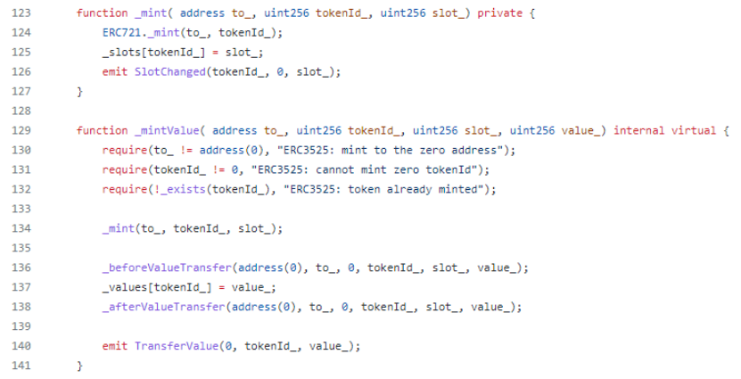
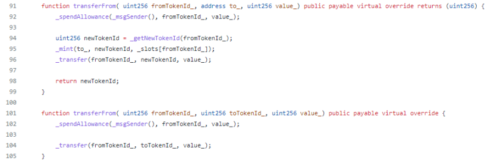
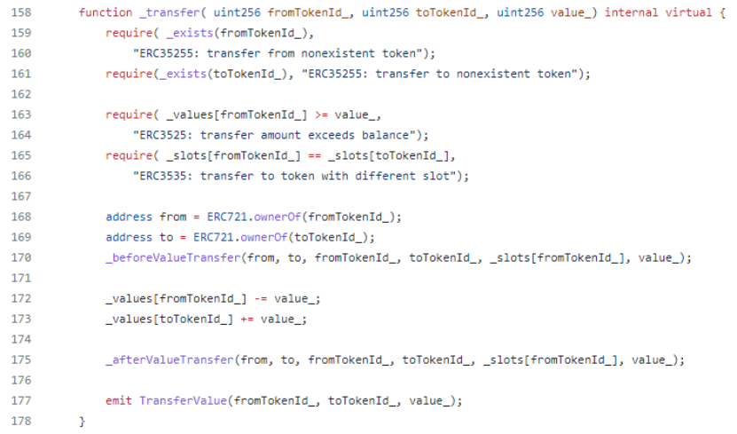
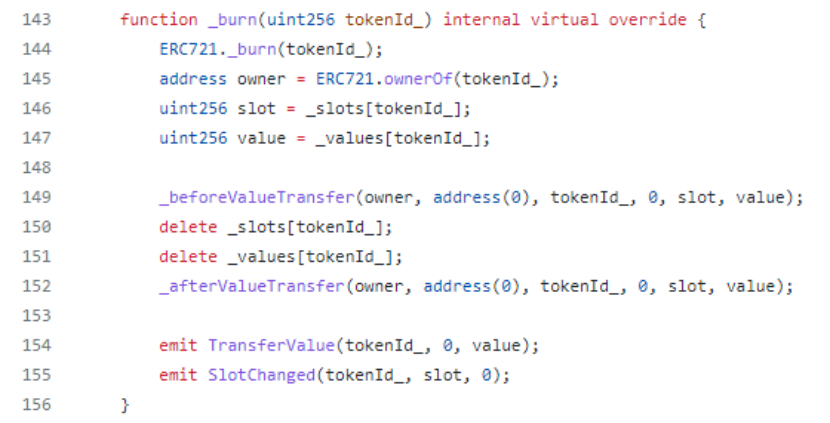
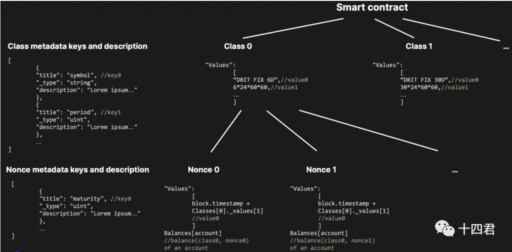
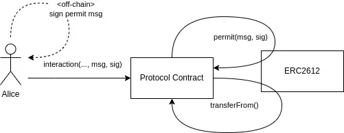
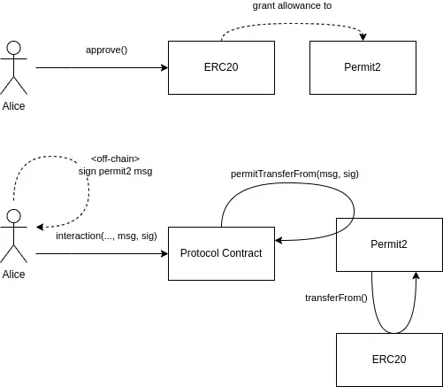
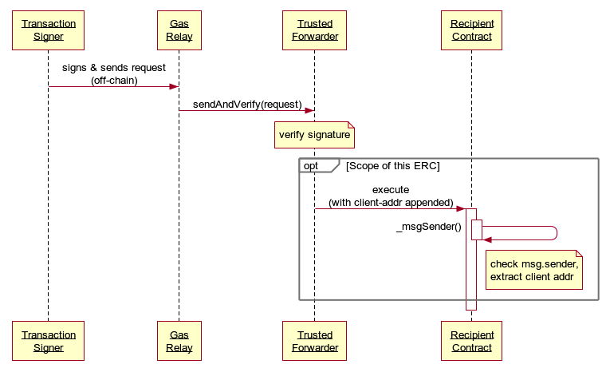

# Ethereum Improvement Proposals (EIP) 以太坊改进协议


ERC 肯定是 EIP， 反之不是


# Ethereum Request for Comment (以太坊版的意见征求稿)

用以记录以太坊上应用级的各种开发标准和协议(application-level standards and conventions).


## 参考

https://eips.ethereum.org/erc

https://github.com/ethereum/EIPs


## ERC-20


```
								
function name() public view returns (string)      																【可选】 返回令牌的名称 - 例如"MyToken"
																
function symbol() public view returns (string)    																【可选】 返回令牌的符号。例如"HIX"
																
function decimals() public view returns (uint8)   																【可选】 返回令牌使用的小数位数 - 例如8，表示将令牌数量除以100000000以获得其用户表示
								
function totalSupply() public view returns (uint256) 															返回总代币供应量
								
function balanceOf(address _owner) public view returns (uint256 balance)										返回另一个具有 address 的帐户的帐户余额_owner
								
function transfer(address _to, uint256 _value) public returns (bool success)    								转账
	
function transferFrom(address _from, address _to, uint256 _value) public returns (bool success)  				转被授权的帐

function approve(address _spender, uint256 _value) public returns (bool success) 								批准

function allowance(address _owner, address _spender) public view returns (uint256 remaining)					津贴 (查看被批准的数值)


事件:

event Transfer(address indexed _from, address indexed _to, uint256 _value)

event Approval(address indexed _owner, address indexed _spender, uint256 _value)


```

## EIP-721 (非同质代币, ERC-721)


 【注意】：每个符合ERC721的智能合约必须同时符合ERC721和ERC165。ERC165是智能合约定义自己支持哪些接口的一种方式。


```

event Transfer(address indexed _from, address indexed _to, uint256 indexed _tokenId);
event Approval(address indexed _owner, address indexed _approved, uint256 indexed _tokenId);
event ApprovalForAll(address indexed _owner, address indexed _operator, bool _approved);


######################
#####            #####
#####  必备函数   #####
#####            #####
######################

function balanceOf(address _owner) external view returns (uint256);
function ownerOf(uint256 _tokenId) external view returns (address);
function safeTransferFrom(address _from, address _to, uint256 _tokenId, bytes calldata data) external payable;
function safeTransferFrom(address _from, address _to, uint256 _tokenId) external payable;
function transferFrom(address _from, address _to, uint256 _tokenId) external payable;
function approve(address _approved, uint256 _tokenId) external payable;
function setApprovalForAll(address _operator, bool _approved) external;
function getApproved(uint256 _tokenId) external view returns (address);
function isApprovedForAll(address _owner, address _operator) external view returns(bool);
```


```
// 例子

pragma solidity ^0.4.20;


######################
#####            #####
#####   721合约  #####
#####            #####
######################

interface ERC721 /* is ERC165 */ {
    /// @dev 当任何NFT的所有权更改时（不管哪种方式），就会触发此事件。
    ///  包括在创建时（`from` == 0）和销毁时(`to` == 0), 合约创建时除外。
    event Transfer(address indexed _from, address indexed _to, uint256 indexed _tokenId);

    /// @dev 当更改或确认NFT的授权地址时触发。
    ///  零地址表示没有授权的地址。
    ///  发生 `Transfer` 事件时，同样表示该NFT的授权地址（如果有）被重置为“无”（零地址）。
    event Approval(address indexed _owner, address indexed _approved, uint256 indexed _tokenId);

    /// @dev 所有者启用或禁用操作员时触发。（操作员可管理所有者所持有的NFTs）
    event ApprovalForAll(address indexed _owner, address indexed _operator, bool _approved);

    /// @notice 统计所持有的NFTs数量
    /// @dev NFT 不能分配给零地址，查询零地址同样会异常
    /// @param _owner ： 待查地址
    /// @return 返回数量，也许是0
    function balanceOf(address _owner) external view returns (uint256);

    /// @notice 返回所有者
    /// @dev NFT 不能分配给零地址，查询零地址抛出异常
    /// @param _tokenId NFT 的id
    /// @return 返回所有者地址
    function ownerOf(uint256 _tokenId) external view returns (address);

    /// @notice 将NFT的所有权从一个地址转移到另一个地址
    /// @dev 如果`msg.sender` 不是当前的所有者（或授权者）抛出异常
    /// 如果 `_from` 不是所有者、`_to` 是零地址、`_tokenId` 不是有效id 均抛出异常。
    ///  当转移完成时，函数检查  `_to` 是否是合约，如果是，调用 `_to`的 `onERC721Received` 并且检查返回值是否是 `0x150b7a02` (即：`bytes4(keccak256("onERC721Received(address,address,uint256,bytes)"))`)  如果不是抛出异常。
    /// @param _from ：当前的所有者
    /// @param _to ：新的所有者
    /// @param _tokenId ：要转移的token id.
    /// @param data : 附加额外的参数（没有指定格式），传递给接收者。
    function safeTransferFrom(address _from, address _to, uint256 _tokenId, bytes data) external payable;

    /// @notice 将NFT的所有权从一个地址转移到另一个地址，功能同上，不带data参数。
    function safeTransferFrom(address _from, address _to, uint256 _tokenId) external payable;

    /// @notice 转移所有权 -- 调用者负责确认`_to`是否有能力接收NFTs，否则可能永久丢失。
    /// @dev 如果`msg.sender` 不是当前的所有者（或授权者、操作员）抛出异常
    /// 如果 `_from` 不是所有者、`_to` 是零地址、`_tokenId` 不是有效id 均抛出异常。
    function transferFrom(address _from, address _to, uint256 _tokenId) external payable;

    /// @notice 更改或确认NFT的授权地址
    /// @dev 零地址表示没有授权的地址。
    ///  如果`msg.sender` 不是当前的所有者或操作员
    /// @param _approved 新授权的控制者
    /// @param _tokenId ： token id
    function approve(address _approved, uint256 _tokenId) external payable;

    /// @notice 启用或禁用第三方（操作员）管理 `msg.sender` 所有资产
    /// @dev 触发 ApprovalForAll 事件，合约必须允许每个所有者可以有多个操作员。
    /// @param _operator 要添加到授权操作员列表中的地址
    /// @param _approved True 表示授权, false 表示撤销
    function setApprovalForAll(address _operator, bool _approved) external;

    /// @notice 获取单个NFT的授权地址
    /// @dev 如果 `_tokenId` 无效，抛出异常。
    /// @param _tokenId ：  token id
    /// @return 返回授权地址， 零地址表示没有。
    function getApproved(uint256 _tokenId) external view returns (address);

    /// @notice 查询一个地址是否是另一个地址的授权操作员
    /// @param _owner 所有者
    /// @param _operator 代表所有者的授权操作员
    function isApprovedForAll(address _owner, address _operator) external view returns (bool);
}


######################
#####            #####
#####   165提案  #####
#####            #####
######################


/// 一般要求 721 满足 165
///

interface ERC165 {
    /// @notice 是否合约实现了接口
    /// @param interfaceID  ERC-165定义的接口id
    /// @dev 函数要少于  30,000 gas.
    /// @return 合约实现了 `interfaceID`（不为  0xffffffff）返回`true` ， 否则false.
    function supportsInterface(bytes4 interfaceID) external view returns (bool);
}


/// 【注意】：每个符合ERC721的智能合约必须同时符合ERC721和ERC165。ERC165是智能合约定义自己支持哪些接口的一种方式。


######################
#####            #####
#####   钱包实现  #####
#####            #####
######################


/// 钱包等应用要接受NFT的安全转账，则必须实现如下接口

interface ERC721TokenReceiver {
    /// @notice 处理接收NFT
    /// @dev ERC721智能合约在`transfer`完成后，在接收者地址上调用这个函数。
    /// 函数可以通过revert 拒绝接收。返回非`0x150b7a02` 也同样是拒绝接收。
    /// 注意: 调用这个函数的 msg.sender 是ERC721的合约地址
    /// @param _operator ：调用 `safeTransferFrom` 函数的地址。
    /// @param _from ：之前的NFT拥有者
    /// @param _tokenId ： NFT token id
    /// @param _data ： 附加信息
    /// @return 正确处理时返回 `bytes4(keccak256("onERC721Received(address,address,uint256,bytes)"))`
    function onERC721Received(address _operator, address _from, uint256 _tokenId, bytes _data) external returns(bytes4);
}


/// 【注意】： 由于NFT最早面向艺术品，ERC-721可选Metadata接口“ERC721 Metadata JSON Schema”只指定了 name、description、image三个属性（且不可修改）。但对于游戏而言，这些属性远远不够，因此我们下一节要介绍的另一个NFT标准 EIP-1155 将 name、description、image 属性转移到了URI的json里面，而不规定URI接口返回的JSON Schema。


######################
#####            #####
#####   可选接口  #####
#####            #####
######################

interface ERC721Metadata {
    /// @notice NFTs 集合的名字
    function name() external view returns (string _name);

    /// @notice NFTs 缩写代号
    function symbol() external view returns (string _symbol);

    /// @notice 一个给定资产的唯一的统一资源标识符(URI)
    /// @dev 如果 `_tokenId` 无效，抛出异常. URIs在 RFC 3986 定义，
    /// URIs在 RFC 3986 定义。ERC721 URI 可指向一个符合 "ERC721 URI JSON Schema" 的 JSON 文件。
    function tokenURI(uint256 _tokenId) external view returns (string);
}

/// tokenURI(uint256 _tokenId) 返回的 ERC721 Metadata JSON Schema (只指定了 name、description、image三个属性, 不好拓展， 但是在 EIP-1155 中得到了新的拓展)

{
    "title": "Asset Metadata",
    "type": "object",
    "properties": {
        "name": {
            "type": "string",
            "description": "Identifies the asset to which this NFT represents"
        },
        "description": {
            "type": "string",
            "description": "Describes the asset to which this NFT represents"
        },
        "image": {
            "type": "string",
            "description": "A URI pointing to a resource with mime type image/* representing the asset to which this NFT represents. Consider making any images at a width between 320 and 1080 pixels and aspect ratio between 1.91:1 and 4:5 inclusive."
        }
    }
}


######################
#####            #####
#####   可选接口  #####
#####            #####
######################


/// 枚举接口包含了按索引获取到对应的代币，可以提供NFTs的完整列表，以便NFT可被发现。

interface ERC721Enumerable {

    /// @notice  NFTs 计数
    /// @return  返回合约有效跟踪（所有者不为零地址）的 NFT数量
    function totalSupply() external view returns (uint256);

    /// @notice 枚举索引NFT
    /// @dev 如果 `_index` >= `totalSupply()` 则抛出异常
    /// @param _index 小于 `totalSupply()`的索引号
    /// @return 对应的token id（标准不指定排序方式)
    function tokenByIndex(uint256 _index) external view returns (uint256);

    /// @notice 枚举索引某个所有者的 NFTs
    /// @dev  如果 `_index` >= `balanceOf(_owner)` 或 `_owner` 是零地址，抛出异常
    /// @param _owner 查询的所有者地址
    /// @param _index 小于 `balanceOf(_owner)` 的索引号
    /// @return 对应的token id （标准不指定排序方式)
    function tokenOfOwnerByIndex(address _owner, uint256 _index) external view returns (uint256);
}


```


<span id="EIP-4907" />

## ERC-4907 (租赁NFT协议)  作为 EIP-721 的拓展


和[EIP-5006](EIP-5006)的区别

他作为 ERC-721 的扩展， EIP-4907 增加了一个变量UserInfo，让应用可以查询此NFT当前被租出去的目标地址“user”和出租时间”expires"。如果发现已经超出出租时间，则租赁关系宣告失效。

代码极为简单仅有72行，使用这个标准，就是在原来的ERC721之上新增

1个事件（用于通知链下应用称为事件）

3个方法（用于实现链上数据管理功能）

分别是

UpdateUser 事件：当NFT转移，租赁校色设置时，发出租赁用户改变的通知

setUser 方法：NFT所有者授权者可用，设置此NFTID的出租用户和过期时间

userOf 方法：任何人可用，查询此NFTID的出租用户

userExpires 方法：任何人可用，查询此NFTID的过期时间


传统的 EIP-721 NFT只是通过2个映射 owners 、balances, 即一种字典形式的key-value对应关系的存储结构去记录数据。

```
mapping(uint256 => address)  _owners;// 记录每一个NFTID当前对应的所有者地址
mapping(address => uint256)  _balances; //记录了当前所有者总计持有的NFT数量
```


而 EIP-4907 则是新增了一个数据对象 UserInfo 在所有权的概念之外增加[用户]的维度。

```
struct UserInfo {
        address user;   // 用户地址
        uint64 expires; //用户到期时间
}
```


主要函数：


```

function setUser(uint256 tokenId, address user, uint64 expires) public virtual{

  require(_isApprovedOrOwner(msg.sender, tokenId),"ERC721: transfer caller is not owner nor approved");

  UserInfo storage info =  _users[tokenId];//新增存储登记信息

  info.user = user;   
  info.expires = expires;

  emit UpdateUser(tokenId,user,expires); //发出事件通知链下应用
}


function userOf(uint256 tokenId)public view virtual returns(address){


  if( uint256(_users[tokenId].expires) >=  block.timestamp){ 

    //执行此函数，在未到期的情况下，返回此ID的当前用户地址
    return  _users[tokenId].user; 
  } else {

    //到期情况下，则返回0地址，意未占用
    return address(0);
  }
}


function userExpires(uint256 tokenId) public view virtual returns(uint256){
        return _users[tokenId].expires; //执行此函数，返回此ID的用户过期时间
}


/// 此外， EIP-4907 对标准交易方法 Transfer 增加了一部分内容，通过 _beforeTokenTransfer 实现，就是强制在进行 Transfer 交易转移后就删除掉这部分对用户的信息 (删掉旧的 user 信息)，并且发出事件通知已经用户失效了。

function _beforeTokenTransfer(address from,address to,uint256 tokenId
) internal virtual override{
        super._beforeTokenTransfer(from, to, tokenId);
        //当交易不是自己转自己的情况下，如果有设置“用户”则删除他
        if (from != to && _users[tokenId].user != address(0)) {
            delete _users[tokenId];// 删除用户信息
            emit UpdateUser(tokenId, address(0), 0);// 发出事件通知已删除
        }
}

```


## EIP-5006 (租赁NFT)  针对 [EIP-1155](#EIP-1155) 的NFT租赁标准


和[EIP-4907](EIP-4907)的区别

EIP-5006 的核心价值则是将进一步强化围绕用户创作应用场景上所有权和使用权的分离，明确NFT扩大应用价值的方向。


该标准是EIP-1155的扩展。它提出了一个额外的角色 ( user)，可以授予代表user资产的地址而不是owner.


```

/ SPDX-License-Identifier: CC0-1.0

pragma solidity ^0.8.0;

interface IERC5006 {


    struct UserRecord {
        uint256 tokenId;
        address owner;
        uint64 amount;
        address user;
        uint64 expiry;
    }
    
    /**
     * @dev Emitted when permission for `user` to use `amount` of `tokenId` token owned by `owner`
     * until `expiry` are given.
     */
    event CreateUserRecord(
        uint256 recordId,
        uint256 tokenId,
        uint64  amount,
        address owner,
        address user,
        uint64  expiry
    );

    /**
     * @dev Emitted when record of `recordId` are deleted. 
     */
    event DeleteUserRecord(uint256 recordId);

    /**
     * @dev Returns the usable amount of `tokenId` tokens  by `account`.
     */
    function usableBalanceOf(address account, uint256 tokenId)
        external
        view
        returns (uint256);

    /**
     * @dev Returns the amount of frozen tokens of token type `id` by `account`.
     */
    function frozenBalanceOf(address account, uint256 tokenId)
        external
        view
        returns (uint256);

    /**
     * @dev Returns the `UserRecord` of `recordId`.
     */
    function userRecordOf(uint256 recordId)
        external
        view
        returns (UserRecord memory);

    /**
     * @dev Gives permission to `user` to use `amount` of `tokenId` token owned by `owner` until `expiry`.
     *
     * Emits a {CreateUserRecord} event.
     *
     * Requirements:
     *
     * - If the caller is not `owner`, it must be have been approved to spend ``owner``'s tokens
     * via {setApprovalForAll}.
     * - `owner` must have a balance of tokens of type `id` of at least `amount`.
     * - `user` cannot be the zero address.
     * - `amount` must be greater than 0.
     * - `expiry` must after the block timestamp.
     */
    function createUserRecord(
        address owner,
        address user,
        uint256 tokenId,
        uint64 amount,
        uint64 expiry
    ) external returns (uint256);

    /**
     * @dev Atomically delete `record` of `recordId` by the caller.
     *
     * Emits a {DeleteUserRecord} event.
     *
     * Requirements:
     *
     * - the caller must have allowance.
     */
    function deleteUserRecord(uint256 recordId) external;
}


为了使用，提供了4个接口来管理1155的租赁关系

setUser：设置某个NFT-id下的某个所有者，设置多少个token数量给某个用户

balanceOfUser ：查询哪个NFT-ID的哪个用户租赁到多少

balanceOfUserFromOwner：查询某个NFT-ID的某所有者下的某个用户租赁到多少个

frozenAmountOfOwner：查询某个NFT-ID的所有者其持有的token，已经被租出去多少个了（要冻结掉防止重复出租）


```


EIP-4907 的核心价值是为链上 [原生租赁] 提供了技术支撑，实现了 NFT 的所有权和使用权的分离，是解决NFT流动性短缺问题的重要基础设施。

EIP-5006 的核心价值则是将进一步强化围绕 [用户创作应用场景上] 所有权和使用权的分离，明确NFT扩大应用价值的方向，将会涌现更多丰富的玩法、应用场景和衍生品。


## EIP-5058 (可锁定的 NFT代币) 该协议海贼审核中，不建议使用


本质上他是 ERC721 的拓展，让项目方可以对NFT资产，执行 [锁定] 而不是转移，他新增函数setLockApprovalForAll()以及lockApprove()，这样一来在锁定期结束之前被锁定的 NFT 不能转移。


>有些类似 ERC-721R 提案 (可退款的 NFT) 的做法一样，先将 资金锁定。


```

// SPDX-License-Identifier: CC0-1.0

pragma solidity ^0.8.8;

/**
 * @dev EIP-721 Non-Fungible Token Standard, optional lockable extension
 * ERC721 Token that can be locked for a certain period and cannot be transferred.
 * This is designed for a non-escrow staking contract that comes later to lock a user's NFT
 * while still letting them keep it in their wallet.
 * This extension can ensure the security of user tokens during the staking period.
 * If the nft lending protocol is compatible with this extension, the trouble caused by the NFT
 * airdrop can be avoided, because the airdrop is still in the user's wallet
 */
interface IERC5058 {
    /**
     * @dev Emitted when `tokenId` token is locked by `operator` from `from`.
     */
    event Locked(address indexed operator, address indexed from, uint256 indexed tokenId, uint256 expired);

    /**
     * @dev Emitted when `tokenId` token is unlocked by `operator` from `from`.
     */
    event Unlocked(address indexed operator, address indexed from, uint256 indexed tokenId);

    /**
     * @dev Emitted when `owner` enables `approved` to lock the `tokenId` token.
     */
    event LockApproval(address indexed owner, address indexed approved, uint256 indexed tokenId);

    /**
     * @dev Emitted when `owner` enables or disables (`approved`) `operator` to lock all of its tokens.
     */
    event LockApprovalForAll(address indexed owner, address indexed operator, bool approved);

    /**
     * @dev Returns the locker who is locking the `tokenId` token.
     *
     * Requirements:
     *
     * - `tokenId` must exist.
     */
    function lockerOf(uint256 tokenId) external view returns (address locker);

    /**
     * @dev Lock `tokenId` token until the block number is greater than `expired` to be unlocked.
     *
     * Requirements:
     *
     * - `tokenId` token must be owned by `owner`.
     * - `expired` must be greater than block.number
     * - If the caller is not `owner`, it must be approved to lock this token
     * by either {lockApprove} or {setLockApprovalForAll}.
     *
     * Emits a {Locked} event.
     */
    function lock(uint256 tokenId, uint256 expired) external;

    /**
     * @dev Unlock `tokenId` token.
     *
     * Requirements:
     *
     * - `tokenId` token must be owned by `owner`.
     * - the caller must be the operator who locks the token by {lock}
     *
     * Emits a {Unlocked} event.
     */
    function unlock(uint256 tokenId) external;

    /**
     * @dev Gives permission to `to` to lock `tokenId` token.
     *
     * Requirements:
     *
     * - The caller must own the token or be an approved lock operator.
     * - `tokenId` must exist.
     *
     * Emits an {LockApproval} event.
     */
    function lockApprove(address to, uint256 tokenId) external;

    /**
     * @dev Approve or remove `operator` as an lock operator for the caller.
     * Operators can call {lock} for any token owned by the caller.
     *
     * Requirements:
     *
     * - The `operator` cannot be the caller.
     *
     * Emits an {LockApprovalForAll} event.
     */
    function setLockApprovalForAll(address operator, bool approved) external;

    /**
     * @dev Returns the account lock approved for `tokenId` token.
     *
     * Requirements:
     *
     * - `tokenId` must exist.
     */
    function getLockApproved(uint256 tokenId) external view returns (address operator);

    /**
     * @dev Returns if the `operator` is allowed to lock all of the assets of `owner`.
     *
     * See {setLockApprovalForAll}
     */
    function isLockApprovedForAll(address owner, address operator) external view returns (bool);

    /**
     * @dev Returns if the `tokenId` token is locked.
     */
    function isLocked(uint256 tokenId) external view returns (bool);

    /**
     * @dev Returns the `tokenId` token lock expired time.
     */
    function lockExpiredTime(uint256 tokenId) external view returns (uint256);
}

```


用户授权项目方：lockApprove（许可锁定单个NFT），setLockApprovalForAll（许可锁定该地址下全部NFT）

项目方合约调用：lockFrom（锁定用户的NFT），unlockFrom（解锁用户的NFT）


设定锁定期：

    项目方（第三方）锁定 NFT 时，

    需要指定锁定过期的区块高度，该高度必须大于当前区块高度。

    锁到期后，NFT 自动释放，才可以进行转移。


## EIP-2981 (NFT 版税标准)


该标准允许合约（例如支持ERC-721和ERC-1155接口的 NFT）在每次出售或转售 NFT 时发出要支付给 [NFT 创建者] 或 [权利持有人] 的特许权使用费金额。这适用于希望支持艺术家和其他 NFT 创作者持续资助的 NFT 市场。

特许权使用费必须是自愿的，因为 transferFrom() 包括钱包之间的 NFT 转移在内的转移机制并不总是意味着发生了销售。

市场和个人通过检索特许权使用费支付信息来实施此标准 royaltyInfo()，它指定为给定的销售价格向哪个地址支付多少。支付和通知接收者的确切机制将在未来的 EIP 中定义。该 ERC 应被视为 NFT 版税支付进一步创新的最小、节省 gas 的构建块。


EIP-2981 合约必须支持 EIP-165 


```
pragma solidity ^0.6.0;
import "./IERC165.sol";

///
/// @dev Interface for the NFT Royalty Standard
///
interface IERC2981 is IERC165 {

    /// ERC165 bytes to add to interface array - set in parent contract
    /// implementing this standard
    ///
    /// bytes4(keccak256("royaltyInfo(uint256,uint256)")) == 0x2a55205a
    /// bytes4 private constant _INTERFACE_ID_ERC2981 = 0x2a55205a;
    /// _registerInterface(_INTERFACE_ID_ERC2981);

    /// @notice Called with the sale price to determine how much royalty
    //          is owed and to whom.
    /// @param _tokenId - the NFT asset queried for royalty information
    /// @param _salePrice - the sale price of the NFT asset specified by _tokenId
    /// @return receiver - address of who should be sent the royalty payment
    /// @return royaltyAmount - the royalty payment amount for _salePrice
    function royaltyInfo(
        uint256 _tokenId,
        uint256 _salePrice
    ) external view returns (
        address receiver,
        uint256 royaltyAmount
    );
}

interface IERC165 {
    /// @notice Query if a contract implements an interface
    /// @param interfaceID The interface identifier, as specified in ERC-165
    /// @dev Interface identification is specified in ERC-165. This function
    ///  uses less than 30,000 gas.
    /// @return `true` if the contract implements `interfaceID` and
    ///  `interfaceID` is not 0xffffffff, `false` otherwise
    function supportsInterface(bytes4 interfaceID) external view returns (bool);
}


/// 必须检查是否实现了  'royaltyInfo(uint256,uint256)'

/// bytes4(keccak256("royaltyInfo(uint256,uint256)")) == 0x2a55205a

bytes4 private constant _INTERFACE_ID_ERC2981 = 0x2a55205a;

function checkRoyalties(address _contract) internal returns (bool) {
    (bool success) = IERC165(_contract).supportsInterface(_INTERFACE_ID_ERC2981);
    return success;
 }


```


**EIP-2981 是可选的**

不可能知道哪些 [ NFT 转移] 是销售的结果，哪些只是钱包移动或合并他们的 NFT。因此，我们不能强制每个转账功能（例如transferFrom()在 ERC-721 中）都涉及特许权使用费，因为并非每个转账都是需要此类付款的销售。我们相信 NFT 市场生态系统将自愿实施这一版税支付标准，为艺术家/创作者提供持续的资金。NFT 购买者在做出 NFT 购买决定时会将特许权使用费作为评估因素。


## ERC-1820 (伪自省注册表合约)  比对 ERC-165 和 ERC-672

ERC1820标准向后兼容 ERC165, ERC1820标准定义了一个通用注册表合约，任何地址（合约或普通用户帐户）都可以注册它支持的接口以及哪个智能合约负责接口实现。

ERC1820标准定义智能合约和普通用户帐户可以向注册表发布其实现了哪些功能（普通用户帐户通过代理合约实现）

任何人都可以查询此注册表，询问哪个地址是否实现了给定的接口以及哪个智能合约处理实现逻辑。

ERC1820注册表合约可以部署在任何链上，并在所有链上的地址是相同的。

接口的后28个字节都为0的话，会认为是 ERC-165 接口，并且注册表将转发到合约以查看是否实现了接口。

此合约还充当 ERC-165 缓存，以减少 gas 消耗。


在以太坊上有很多方法定义伪自省，ERC165不能由普通用户帐户使用。 ERC672 则使用了反向 ENS，反向 ENS 有两个问题：增加了不必要的复杂度，其次，ENS 是由多签控制的中心化合约。 从理论上讲，这种多签能够修改系统。

ERC-1820 标准比 ERC-672 简单得多，并且完全去中心化。

此标准还为所有链提供一个唯一（相同的）地址。从而解决了解决不同链的查找注册表地址的问题。


```

pragma solidity 0.5.3;
// IV is value needed to have a vanity address starting with '0x1820'.
// IV: 53759

/// @dev 如果合约为其他的地址实现了接口， 则必须实现这个接口。
interface ERC1820ImplementerInterface {
    /// @notice 指示合约是否为地址 “addr” 实现接口 “interfaceHash”。
    /// @param interfaceHash 接口名称的 keccak256 哈希值
    /// @param addr 为哪一个地址实现接口
    /// @return 只有当合约为地址'addr'实现'interfaceHash'时返回 ERC1820_ACCEPT_MAGIC
    function canImplementInterfaceForAddress(bytes32 interfaceHash, address addr) external view returns(bytes32);
}


/// @title ERC1820 伪自省注册表合约
/// @notice 该合约是ERC1820注册表的官方实现。
contract ERC1820Registry {
    
    /// @notice ERC165 无效 ID.
    bytes4 constant internal INVALID_ID = 0xffffffff;
    /// @notice ERC165 的 supportsInterface 接口ID (= `bytes4(keccak256('supportsInterface(bytes4)'))`).
    bytes4 constant internal ERC165ID = 0x01ffc9a7;
    /// @notice 如果合约代表某个其他地址实现接口，则返回Magic值。
    bytes32 constant internal ERC1820_ACCEPT_MAGIC = keccak256(abi.encodePacked("ERC1820_ACCEPT_MAGIC"));

    /// @notice 映射地址 及 接口 到对应的实现合约地址
    mapping(address => mapping(bytes32 => address)) internal interfaces;
   
    /// @notice 映射地址 到 管理者
    mapping(address => address) internal managers;
    
    /// @notice 每个地址 和 ERC-165 接口的flag，指示是否被缓存。
    mapping(address => mapping(bytes4 => bool)) internal erc165Cached;

    /// @notice 表示合约implementer是'addr'的'interfaceHash'的'实现者'。
    event InterfaceImplementerSet(address indexed addr, bytes32 indexed interfaceHash, address indexed implementer);
    
    /// @notice 表示'newManager'是'addr'的新管理者的地址。
    event ManagerChanged(address indexed addr, address indexed newManager);

    /// @notice 查询地址是否实现了接口以及通过哪个合约实现的。
    /// @param _addr 查询地址（如果'_addr'是零地址，则假定为'msg.sender'）。
    /// @param _interfaceHash 查询接口，它是接口名称字符串的 keccak256 哈希值
    /// 例如: 'web3.utils.keccak256("ERC777TokensRecipient")' 表示 'ERC777TokensRecipient' 接口.
    /// @return 返回实现者的地址，没有实现返回 ‘0’
    function getInterfaceImplementer(address _addr, bytes32 _interfaceHash) external view returns (address) {
        address addr = _addr == address(0) ? msg.sender : _addr;
        if (isERC165Interface(_interfaceHash)) {
            bytes4 erc165InterfaceHash = bytes4(_interfaceHash);
            return implementsERC165Interface(addr, erc165InterfaceHash) ? addr : address(0);
        }
        return interfaces[addr][_interfaceHash];
    }

    /// @notice 设置某个地址的接口由哪个合约实现，需要由管理员来设置。（每个地址是他自己的管理员，直到设置了一个新的地址）。
    /// @param _addr 待设置的关联接口的地址（如果'_addr'是零地址，则假定为'msg.sender'）
    /// @param _interfaceHash 接口，它是接口名称字符串的 keccak256 哈希值
    /// 例如: 'web3.utils.keccak256("ERC777TokensRecipient")' 表示 'ERC777TokensRecipient' 接口。
    /// @param _implementer 为地址'_addr'实现了 '_interfaceHash'接口的合约地址
    function setInterfaceImplementer(address _addr, bytes32 _interfaceHash, address _implementer) external {
        address addr = _addr == address(0) ? msg.sender : _addr;
        require(getManager(addr) == msg.sender, "Not the manager");

        require(!isERC165Interface(_interfaceHash), "Must not be an ERC165 hash");
        if (_implementer != address(0) && _implementer != msg.sender) {
            require(
                ERC1820ImplementerInterface(_implementer)
                    .canImplementInterfaceForAddress(_interfaceHash, addr) == ERC1820_ACCEPT_MAGIC,
                "Does not implement the interface"
            );
        }
        interfaces[addr][_interfaceHash] = _implementer;
        emit InterfaceImplementerSet(addr, _interfaceHash, _implementer);
    }

    /// @notice 为地址_addr 设置新的管理员地址_newManager， 新的管理员能给'_addr' 调用 'setInterfaceImplementer' 设置是实现者。
    ///  (传 '0x0' 为地址_addr 重置管理员)

    function setManager(address _addr, address _newManager) external {
        require(getManager(_addr) == msg.sender, "Not the manager");
        managers[_addr] = _newManager == _addr ? address(0) : _newManager;
        emit ManagerChanged(_addr, _newManager);
    }

    /// @notice 获取地址 _addr的管理员
    function getManager(address _addr) public view returns(address) {
        // By default the manager of an address is the same address
        if (managers[_addr] == address(0)) {
            return _addr;
        } else {
            return managers[_addr];
        }
    }

    /// @notice 计算给定名称的接口的keccak256哈希值。
    function interfaceHash(string calldata _interfaceName) external pure returns(bytes32) {
        return keccak256(abi.encodePacked(_interfaceName));
    }

    /* --- ERC165 相关方法 --- */

    /// @notice 更新合约是否实现了ERC165接口的缓存。
    function updateERC165Cache(address _contract, bytes4 _interfaceId) external {
        interfaces[_contract][_interfaceId] = implementsERC165InterfaceNoCache(
            _contract, _interfaceId) ? _contract : address(0);
        erc165Cached[_contract][_interfaceId] = true;
    }

    /// @notice 检查合约是否实现ERC165接口。
    //  如果未缓存结果，则对合约地址进行查找。 如果结果未缓存或缓存已过期，则必须通过使用合约地址调用“updateERC165Cache”手动更新缓存。
    /// @param _contract 要检查的合约地址。
    /// @param _interfaceId 要检查ERC165接口。
    /// @return True 如果合约实现了接口返回 true, 否则false.
    function implementsERC165Interface(address _contract, bytes4 _interfaceId) public view returns (bool) {
        if (!erc165Cached[_contract][_interfaceId]) {
            return implementsERC165InterfaceNoCache(_contract, _interfaceId);
        }
        return interfaces[_contract][_interfaceId] == _contract;
    }

    /// @notice 在不使用或更新缓存的情况下检查合约是否实现ERC165接口。
    /// @param _contract 要检查的合约地址。
    /// @param _interfaceId 要检查ERC165接口。
    /// @return True 如果合约实现了接口返回 true, 否则false.
    function implementsERC165InterfaceNoCache(address _contract, bytes4 _interfaceId) public view returns (bool) {
        uint256 success;
        uint256 result;

        (success, result) = noThrowCall(_contract, ERC165ID);
        if (success == 0 || result == 0) {
            return false;
        }

        (success, result) = noThrowCall(_contract, INVALID_ID);
        if (success == 0 || result != 0) {
            return false;
        }

        (success, result) = noThrowCall(_contract, _interfaceId);
        if (success == 1 && result == 1) {
            return true;
        }
        return false;
    }

    /// @notice 检查_interfaceHash 是否是ERC165接口（以28个零结尾）。
    /// @param _interfaceHash 要检查接口 hash。
    /// @return  如果 '_interfaceHash'是ERC165接口返回 True, 否则返回false
    function isERC165Interface(bytes32 _interfaceHash) internal pure returns (bool) {
        return _interfaceHash & 0x00000000FFFFFFFFFFFFFFFFFFFFFFFFFFFFFFFFFFFFFFFFFFFFFFFFFFFFFFFF == 0;
    }

    /// @dev 调用合约接口，如果函数不存在也不抛出异常。
    function noThrowCall(address _contract, bytes4 _interfaceId)
        internal view returns (uint256 success, uint256 result)
    {
        bytes4 erc165ID = ERC165ID;

        assembly {
            let x := mload(0x40)               // Find empty storage location using "free memory pointer"
            mstore(x, erc165ID)                // Place signature at beginning of empty storage
            mstore(add(x, 0x04), _interfaceId) // Place first argument directly next to signature

            success := staticcall(
                30000,                         // 30k gas
                _contract,                     // To addr
                x,                             // Inputs are stored at location x
                0x24,                          // Inputs are 36 (4 + 32) bytes long
                x,                             // Store output over input (saves space)
                0x20                           // Outputs are 32 bytes long
            )

            result := mload(x)                 // Load the result
        }
    }
}
```


<span id="EIP-777" />

## EIP-777 (ERC-777, ERC-20 的高级拓展)  配合 [EIP-1820](#EIP-1820) 用， EIP-1820 从 EIP-777 抽出来的


**必须搭配 EIP-1820 使用，详细查看 [补充](#EIP-777的补充) 部分**


<span style="background: red;">ERC777标准，ERC777是ERC20的加强版，旨在加强用户的控制权限，具体有：</span>

1. 随交易发送可以附带描述数据，以供某些业务场景使用
2. 设置一些转账限制，如: 黑名单
3. 支持一些高级交易


如：操作员（operators） 可以代表另一个地址（合约或普通账户）发送代币， 以及 send/receive 加入了钩子函数（hooks ）让代币持有者可以有更多的控制。


1. 使用和发送以太相同的理念发送token，方法为：send(dest, value, data).

2. 合约和普通地址都可以通过注册 `tokensToSend` hook函数来控制和拒绝发送哪些 token（拒绝发送通过在 hook 函数 `tokensToSend` 里 revert 来实现）。

3. 合约和普通地址都可以通过注册 `tokensReceived` hook函数来控制和拒绝接受哪些 token（拒绝接受通过在 hook 函数 `tokensReceived` 里 revert 来实现）。

4. `tokensReceived` 可以通过 hook 函数可以做到在一个交易里完成发送代币和**通知合约接受代币**，而不像 ERC20 必须通过两次调用（approve/transferFrom）来完成。

5. 持有者可以"授权"和"撤销"操作员（operators: 可以代表持有者发送代币）。 这些操作员通常是（去中心化）交易所、支票处理机或自动支付系统。

6. 每个代币交易都包含 data 和 operatorData 字段， 可以分别 传递来自 **持有者**和**操作员**的数据。


**可以通过部署实现 `tokensReceived 的代理合约` 来兼容没有实现 `tokensReceived 函数` 的地址。**


```
interface ERC777Token {
    function name() external view returns (string memory);
    function symbol() external view returns (string memory);
    function totalSupply() external view returns (uint256);
    function balanceOf(address holder) external view returns (uint256);
    function granularity() external view returns (uint256);


    // 获取代币合约默认的操作员列表。
    //
	//注意: 如果代币合约没有默认操作员, 必须返回空列表。
    function defaultOperators() external view returns (address[] memory);
    function isOperatorFor(
        address operator,
        address holder
    ) external view returns (bool);
    function authorizeOperator(address operator) external;
    function revokeOperator(address operator) external;

    // 持有者自己转账
    function send(address to, uint256 amount, bytes calldata data) external;

    // 操作员 (被授权的) 代替持有者转账
    function operatorSend(
        address from,
        address to,
        uint256 amount,
        bytes calldata data,
        bytes calldata operatorData
    ) external;

    // ##########################################################################
	// ##########################################################################
    //
	// ERC-777 中故意没有定义 mint 函数，用意是不希望限制ERC777标准的使用，因为铸币通常特定于特定的代币。
    //
    // ##########################################################################
    // ##########################################################################
    function burn(uint256 amount, bytes calldata data) external;
    function operatorBurn(
        address from,
        uint256 amount,
        bytes calldata data,
        bytes calldata operatorData
    ) external;

    event Sent(
        address indexed operator,
        address indexed from,
        address indexed to,
        uint256 amount,
        bytes data,
        bytes operatorData
    );

    // 虽然 没定义 mint 函数，但是还是支持 用户需要 [铸币] 需求的
    event Minted(
        address indexed operator,
        address indexed to,
        uint256 amount,
        bytes data,
        bytes operatorData
    );
    event Burned(
        address indexed operator,
        address indexed from,
        uint256 amount,
        bytes data,
        bytes operatorData
    );

    // 操作员是可以代表持有者发送和销毁代币的账号地址。
    //
	// 当地址成为持有者的操作员时，需要触发 AuthorizedOperator 事件。触发事件时操作员是第 一个参数，持有者是第二个参数。
    event AuthorizedOperator(
        address indexed operator,
        address indexed holder
    );

    // 撤销操作员时需要触发 RevokedOperator 事件。触发事件时操作员是第一个参数，持有者是第二个参数。
    event RevokedOperator(address indexed operator, address indexed holder);

    // 注意: 持有者可以有多个操作员。
}


合约需要用自己的地址通过 ERC1820 标准注册 ERC777Token 接口。

注册方法是调用 `ERC1820 注册表合约` 的 setInterfaceImplementer 方法，参数 _addr 及 _implementer 均是合约的地址，_interfaceHash 是 ERC777Token 的 keccak256 哈希值， 即0xac7fbab5f54a3ca8194167523c6753bfeb96a445279294b6125b68cce2177054

如果合约有一个开关来启用或禁用ERC777功能，每次触发开关时，代币合约必须相应地通过 ERC1820 注册或取消注册 ERC777Token 接口。

取消注册使用代币合约地址作为参数 _addr 、ERC777Token 的keccak256哈希作为接口哈希及'0x0作为实现者参数_implementer调用函数setInterfaceImplementer`， 有关详细信息，请参阅ERC1820中的为接口设置实现地址

当和代币合约进行交互时，所有的数量和余额都是无符号整型 uint256 类型 。总是以18次方存储（ decimals 只能是 18），0.5个代币存储为 500,000,000,000,000,000 (0.5×1018) ERC20内部处理也是一样（不过decimals可为其他值），最小单位相当于 wei, 用户看见的币相当于 ether。


interface ERC777TokensSender {

	// 通知（或请求）从持有人地址发送或销毁 amount 数量的代币。
	//
	// 注意: 请勿在发送 (或 ERC20 transfer 函数)或 burn 函数之外调用。
    function tokensToSend(
        address operator,
        address from,
        address to,
        uint256 amount,
        bytes calldata userData,
        bytes calldata operatorData
    ) external;
}

调用 `tokensToSend 钩子函数` 用于通知持有者 (持有者来实现) 余额减少（如发送和销毁）。

任何希望收到代币通知的地址（普通地址或合约）都会从需要按 ERC1820 注册及实现 ERC777TokensSender 接口，描述如下：

通过调用 ERC1820 注册表合约上的 setInterfaceImplementer 函数来完成的，其中持有者地址为地址参数，ERC777TokensSender 的 keccak256哈希值（0x29ddb589b1fb5fc7cf394961c1adf5f8c6454761adf795e67fe149f658abe895）作为接口哈希参数，以及实现ERC777TokensSender的合约作为实现者参数。

注意: 普通地址可以用一个实现的合约（代表普通地址来执行）地址注册，合约可以用自己的地址也可以用另一个地址注册，只要其实现了对应的接口。


interface ERC777TokensRecipient {

	// 用于通知接受代币。
	//
	// 注意: 请勿在发送 (或 ERC20 transfer 函数)或 mint 函数之外调用。
    function tokensReceived(
        address operator,
        address from,
        address to,
        uint256 amount,
        bytes calldata data,
        bytes calldata operatorData
    ) external;
}


调用 `tokensReceived 钩子函数` 用于通知接收者 (接收者来实现) 余额增加了（如发送和铸币）。

任何希望收到代币通知的地址（普通地址或合约）都会从需要按ERC1820注册及实现 ERC777TokensRecipient 接口，描述如下：

通过调用 ERC1820 注册表合约上的 setInterfaceImplementer 函数来完成的，其中接收者地址为地址参数，ERC777TokensRecipient 的 keccak256哈希值（0xb281fc8c12954d22544db45de3159a39272895b169a852b314f9cc762e44c53b）作为接口哈希参数，以及实现ERC777TokensRecipient的合约作为实现者参数。

注意: 普通地址可以用一个实现的合约（代表普通地址来执行）地址注册，合约可以用自己的地址也可以用另一个地址注册，只要其实现了对应的接口。


与 ERC-20 相比，ERC-777 提供了以下改进。

hook 

钩子是智能合约代码中描述的一个函数。 钩子将会在代币通过合约发送或者接收时调用。 这将允许智能合约对进出的通证做出互动。

** 钩子是使用 ERC-1820 标准注册及发现利用的 **


```

<span id="EIP-777的补充" />

### **补充**

1. <span style="background: red;" >ERC777 合约必须要通过 ERC1820 注册 ERC777Token 接口，这样任何人都可以查询合约是否是 ERC777 标准的合约，注册方法是 : 调用 ERC1820 注册合约的 setInterfaceImplementer 方法，参数 addr 及 implementer 均是合约的地址，interfaceHash 是 ERC777Token 的 keccak256 哈希值（0xac7fbab5…177054）</span>

2. <span style="background: skyblue;" >如果 ERC777 要实现 ERC20 标准，还必须通过 ERC1820 注册 ERC20Token 接口</span>


## EIP-1400 安全令牌标准


提供了一套标准接口，用于发行/赎回证券型代币、管理其所有权和转让限制，并向代币持有者提供透明度，让他们了解代币余额的不同子集在转让限制、权利和义务方面的表现。


## EIP-1410   部分可替代代币标准  (该标准属于 ERC-1400 ( #1411 ) 与安全令牌相关的标准集)


## EIP-1594 核心安全令牌标准 (该标准属于 ERC-1400 ( #1411 ) 与安全令牌相关的标准集)


提供一个标准来支持将数据链下注入到传输/发行/赎回中，并能够检查传输的有效性以区别于它的执行。


**canTransfer / canTransferFrom 可以转移/可以转移自**

```
function canTransfer(address _to, uint256 _value, bytes _data) external view returns (byte, bytes32);

function canTransferFrom(address _from, address _to, uint256 _value, bytes _data) external view returns (byte, bytes32);

// canTransfer 假设代币的发送者是 msg.sender ，将通过 transfer 或 transferWithData 执行，而 canTransferFrom 允许指定代币的发送者，转账将通过 transferFrom 或 transferFromWithData 。
```


**transferWithData / transferFromWithData**

```

// 
function transferWithData(address _to, uint256 _value, bytes _data) external;

function transferFromWithData(address _from, address _to, uint256 _value, bytes _data) external;
```

**isIssuable**   安全令牌发行者可以指定令牌的发行已经完成（即不能铸造或发行新令牌）

```
function isIssuable() external view returns (bool);
```


**issue**  必须调用此函数来增加总供应量

```
function issue(address _tokenHolder, uint256 _value, bytes _data) external;
```

**redeem** 允许代币持有者赎回代币


```
function redeem(uint256 _value, bytes _data) external;
```

**redeemFrom**

```
function redeemFrom(address _tokenHolder, uint256 _value, bytes _data) external;
```


**完整的示例**

```
/// @title IERC1594 Security Token Standard
/// @dev See https://github.com/SecurityTokenStandard/EIP-Spec

interface IERC1594 is IERC20 {

    // Transfers
    function transferWithData(address _to, uint256 _value, bytes _data) external;
    function transferFromWithData(address _from, address _to, uint256 _value, bytes _data) external;

    // Token Issuance
    function isIssuable() external view returns (bool);
    function issue(address _tokenHolder, uint256 _value, bytes _data) external;

    // Token Redemption
    function redeem(uint256 _value, bytes _data) external;
    function redeemFrom(address _tokenHolder, uint256 _value, bytes _data) external;

    // Transfer Validity
    function canTransfer(address _to, uint256 _value, bytes _data) external view returns (bool, byte, bytes32);
    function canTransferFrom(address _from, address _to, uint256 _value, bytes _data) external view returns (bool, byte, bytes32);

    // Issuance / Redemption Events
    event Issued(address indexed _operator, address indexed _to, uint256 _value, bytes _data);
    event Redeemed(address indexed _operator, address indexed _from, uint256 _value, bytes _data);

}
```


## EIP1644 控制器令牌操作标准  (该标准属于 ERC-1400 ( #1411 ) 与安全令牌相关的标准集)


## EIP-1724 (zkERC20: Confidential Token Standard, 加密通证标准)


## EIP-5805  (授权投票 通证)


## EIP-55 (混合大小写校验和地址编码)


## EIP-1167  (最小代理合约： 节省Gas部署合约)


```

pragma solidity ^0.8.0;
library Clones {
   

    // @implementation: 被用来做复制 (未使用构造函数做初始化)的合约实例地址
    // @instance: 被复制部署的 新合约实例地址
    function clone(address implementation) internal returns (address instance) {
        <!-- assembly {
            let ptr := mload(0x40)
            mstore(ptr, 0x3d602d80600a3d3981f3363d3d373d3d3d363d73000000000000000000000000)
            mstore(add(ptr, 0x14), shl(0x60, implementation))
            mstore(add(ptr, 0x28), 0x5af43d82803e903d91602b57fd5bf30000000000000000000000000000000000)
            instance := create(0, ptr, 0x37)
        } -->
        assembly {
          let clone := mload(0x40)
          mstore(clone, 0x3d602d80600a3d3981f3363d3d373d3d3d363d73000000000000000000000000)
          mstore(add(clone, 0x14), bytes20(implementation))
          mstore(add(clone, 0x28), 0x5af43d82803e903d91602b57fd5bf30000000000000000000000000000000000)
          instance := create(0, clone, 0x37)
        }
        require(instance != address(0), "ERC1167: create failed");
    }
    ///....
}

```


## EIP-2470 (单例工厂, 使用 create2 和 initcode 的合约部署工厂标准)


**优点** 

多链下可以使用相同钱包地址 (兼容EVM和ECDSA的链)


**用途**

一些 DApp 需要一个且仅一个合约实例，它在任何链上都具有相同的地址


**和 EIP-1820/EIP-2429 部署区别**


和 EIP-1820 和 EIP-2429 一样使用 `nick 部署方式` 部署合约

[https://eips.ethereum.org/EIPS/eip-2470]


**代码**


```

pragma solidity 0.6.2;


/**
 * @title Singleton Factory (EIP-2470)
 * @notice Exposes CREATE2 (EIP-1014) to deploy bytecode on deterministic addresses based on initialization code and salt.
 * @author Ricardo Guilherme Schmidt (Status Research & Development GmbH)
 */
contract SingletonFactory {
    /**
     * @notice Deploys `_initCode` using `_salt` for defining the deterministic address.
     * @param _initCode Initialization code.
     * @param _salt Arbitrary value to modify resulting address.
     * @return createdContract Created contract address.
     */
    function deploy(bytes memory _initCode, bytes32 _salt)
        public
        returns (address payable createdContract)
    {
        assembly {
            createdContract := create2(0, add(_initCode, 0x20), mload(_initCode), _salt)
        }
    }
}
// IV is a value changed to generate the vanity address.
// IV: 6583047


/// 任何链上必须使用下列字节码部署

0xf9016c8085174876e8008303c4d88080b90154608060405234801561001057600080fd5b50610134806100206000396000f3fe6080604052348015600f57600080fd5b506004361060285760003560e01c80634af63f0214602d575b600080fd5b60cf60048036036040811015604157600080fd5b810190602081018135640100000000811115605b57600080fd5b820183602082011115606c57600080fd5b80359060200191846001830284011164010000000083111715608d57600080fd5b91908080601f016020809104026020016040519081016040528093929190818152602001838380828437600092019190915250929550509135925060eb915050565b604080516001600160a01b039092168252519081900360200190f35b6000818351602085016000f5939250505056fea26469706673582212206b44f8a82cb6b156bfcc3dc6aadd6df4eefd204bc928a4397fd15dacf6d5320564736f6c634300060200331b83247000822470


```


## EIP-1014 (瘦 create2, 指令 create2)


## EIP-173 (合约所有权标准)


```sol
/// @title ERC-173 Contract Ownership Standard
///  Note: the ERC-165 identifier for this interface is 0x7f5828d0
interface ERC173 /* is ERC165 */ {
    /// @dev This emits when ownership of a contract changes.    
    event OwnershipTransferred(address indexed previousOwner, address indexed newOwner);

    /// @notice Get the address of the owner    
    /// @return The address of the owner.
    function owner() view external returns(address);
    
    /// @notice Set the address of the new owner of the contract
    /// @dev Set _newOwner to address(0) to renounce any ownership.
    /// @param _newOwner The address of the new owner of the contract    
    function transferOwnership(address _newOwner) external; 
}

interface ERC165 {
    /// @notice Query if a contract implements an interface
    /// @param interfaceID The interface identifier, as specified in ERC-165
    /// @dev Interface identification is specified in ERC-165. 
    /// @return `true` if the contract implements `interfaceID` and
    ///  `interfaceID` is not 0xffffffff, `false` otherwise
    function supportsInterface(bytes4 interfaceID) external view returns (bool);
}
```


## ERC-165  (标准接口检测)


这个提案创建一个标准方法以发布和检测智能合约实现了哪些接口。

接口如何识别。
合约如何发布实现的接口。
如何检测合约是否实现了 ERC-165。
如何检测合约是否实现了某个接口。


```
以下Solidity 代码示例演示如何计算接口标识符：

pragma solidity ^0.4.20;

interface Solidity101 {
    function hello() external pure;
    function world(int) external pure;
}

contract Selector {
    function calculateSelector() public pure returns (bytes4) {
        Solidity101 i;
        return i.hello.selector ^ i.world.selector;
    }
}

注意: 接口不允许可选函数，因此接口标识符不包含它们。


兼容 ERC-165的合约应该实现以下接口（ ERC165.sol）：

pragma solidity ^0.4.20;

interface ERC165 {
    /// @notice 查询一个合约时候实现了一个接口
    /// @param interfaceID  参数：接口ID, 参考上面的定义
    /// @return true 如果函数实现了 interfaceID (interfaceID 不为 0xffffffff )返回true, 否则为 false
    function supportsInterface(bytes4 interfaceID) external view returns (bool);
}


这个接口的接口ID 为 0x01ffc9a7， 可以使用 bytes4(keccak256('supportsInterface(bytes4)')); 或者 i.supportsInterface.selector 得到；


因此，合约实现 supportsInterface 函数将返回：

true ：当接口ID interfaceID 是 0x01ffc9a7 (EIP165 标准接口)返回 true
false ：当 interfaceID 是 0xffffffff 返回 false
true ：任何合约实现了接口的 interfaceID 都返回 true
false ：其他的都返回 false。


检测合约是否实现了 ERC-165

在合约地址上使用附加数据（input data）0x01ffc9a701ffc9a700000000000000000000000000000000000000000000000000000000 和 gas 30,000 进行STATICCALL调用，相当于 contract.supportsInterface(0x01ffc9a7)。

如果调用失败或返回false , 说明合约不兼容ERC-165标准
如果返回true，则使用输入数据0x01ffc9a7ffffffff000000000000000000000000000000000000000000000000000000000000进行第二次调用，相当于 contract.supportsInterface(0xffffffff)。
如果第二次调用失败或返回true，则目标合约不会实现ERC-165。
否则它实现了ERC-165。


示例：


pragma solidity ^0.4.20;

import "./ERC165.sol";

interface Simpson {
    function is2D() external returns (bool);
    function skinColor() external returns (string);
}

contract Homer is ERC165, Simpson {
    function supportsInterface(bytes4 interfaceID) external view returns (bool) {
        return
          interfaceID == this.supportsInterface.selector || // 证明实现了 ERC165
          interfaceID == this.is2D.selector
                         ^ this.skinColor.selector; // 证明实现了 Simpson
    }

    function is2D() external returns (bool){}
    function skinColor() external returns (string){}
}

```


## EIP-4626  (代币化资金库标准) ERC-4626


EIP-4626 提供了一种将代币投资到投资池 ( 通常称为金库 ) 的标准方法。

主要针对 Vault 进行优化，旨在将所有的 DeFi Vault 标准化，统一变成 ERC-20 形式的交易合约，提供铸造、 存取、查询余额等功能;降低 Vault 的工作量，提高运作效率。

允许为代表单个基础EIP-20 代币份额的代币化保险库实施标准 API。该标准是 EIP-20 代币的扩展，提供了存取代币和读取余额的基本功能。


**动机**

当前的 Vault 缺乏标准化，借贷、聚合器等利息代币有着不一样的实施细节，这使得许多协议在聚合器或插件层的集成变得困难，协议开发者需要实现自己的适配器，这一过程容易出错并且浪费开发资源。


**做法**

所有的 ERC-4626 代币 Vault 都必须先实现 ERC-20 来作为股权代币。 如果一个 Vault 是不可转账的，它需要为 transfer 和 transferFrom 方法实现回滚 Revert 操作。 和 ERC-20 代币有关的操作如 balanceOf、 transfer、totalSupply 将在 Vault 的股份上进行操作，这代表了对 Vault 基础持有量对一小部分的所有权需求。

所有的 ERC-4626 代币 Vault 必须实现 ERC-20 的元数据拓展功能，name 和 symbol 需要反映出底层代币的相关数据。


**方法**


```
asset
totalAssets
convertToShares
convertToAssets
maxDeposit
previewDeposit：允许用户去模拟在当前区块下存入资产后 Vault 发生的变化
deposit：存入底层资产，铸造股权代币
maxMint
previewMint
mint
maxWithdraw
previewWithdraw
withdraw：烧掉股权代币，取回底层资产
maxRedeem
previewRedeem
redeem
```


**事件**


```
// Deposit

event Deposit(address indexed caller, address indexed owner, uint256 assets, uint256 shares);


// Withdraw

event Withdraw(
        address indexed caller,
        address indexed receiver,
        address indexed owner,
        uint256 assets,
        uint256 shares
);


```


**IMMUTABLES**


```
ERC20 public immutable asset;

constructor(
    ERC20 _asset,
    string memory _name,
    string memory _symbol
) ERC20(_name, _symbol, _asset.decimals()) {
    asset = _asset;
}

```


**主逻辑**


```

// Deposit函数：

function deposit(uint256 assets, address receiver) public virtual returns (uint256 shares) {
    
    // Check for rounding error since we round down in previewDeposit.
    require((shares = previewDeposit(assets)) != 0, "ZERO_SHARES");

    // Need to transfer before minting or ERC777s could reenter.
    asset.safeTransferFrom(msg.sender, address(this), assets);

    _mint(receiver, shares);

    emit Deposit(msg.sender, receiver, assets, shares);

    afterDeposit(assets, shares);
}


// Mint函数：

function mint(uint256 shares, address receiver) public virtual returns (uint256 assets) {
    assets = previewMint(shares); // No need to check for rounding error, previewMint rounds up.

    // Need to transfer before minting or ERC777s could reenter.
    asset.safeTransferFrom(msg.sender, address(this), assets);

    _mint(receiver, shares);

    emit Deposit(msg.sender, receiver, assets, shares);

    afterDeposit(assets, shares);
}


// Withdraw函数：


function withdraw(
    uint256 assets,
    address receiver,
    address owner
) public virtual returns (uint256 shares) {
    
    shares = previewWithdraw(assets); // No need to check for rounding error, previewWithdraw rounds up.

    if (msg.sender != owner) {
        uint256 allowed = allowance[owner][msg.sender]; // Saves gas for limited approvals.

        if (allowed != type(uint256).max) allowance[owner][msg.sender] = allowed - shares;
    }

    beforeWithdraw(assets, shares);

    _burn(owner, shares);

    emit Withdraw(msg.sender, receiver, owner, assets, shares);

    asset.safeTransfer(receiver, assets);
}


// Redeem函数：

function redeem(
    uint256 shares,
    address receiver,
    address owner
) public virtual returns (uint256 assets) {
    
    if (msg.sender != owner) {
        uint256 allowed = allowance[owner][msg.sender]; // Saves gas for limited approvals.

        if (allowed != type(uint256).max) allowance[owner][msg.sender] = allowed - shares;
    }

    // Check for rounding error since we round down in previewRedeem.
    require((assets = previewRedeem(shares)) != 0, "ZERO_ASSETS");

    beforeWithdraw(assets, shares);

    _burn(owner, shares);

    emit Withdraw(msg.sender, receiver, owner, assets, shares);

    asset.safeTransfer(receiver, assets);
}


```


**账户逻辑**


```

function totalAssets() public view virtual returns (uint256);

function convertToShares(uint256 assets) public view returns (uint256) {
    uint256 supply = totalSupply; // Saves an extra SLOAD if totalSupply is non-zero.

    return supply == 0 ? assets : assets.mulDivDown(supply, totalAssets());
}

function convertToAssets(uint256 shares) public view returns (uint256) {
    uint256 supply = totalSupply; // Saves an extra SLOAD if totalSupply is non-zero.

    return supply == 0 ? shares : shares.mulDivDown(totalAssets(), supply);
}

function previewDeposit(uint256 assets) public view virtual returns (uint256) {
    return convertToShares(assets);
}

function previewMint(uint256 shares) public view virtual returns (uint256) {
    uint256 supply = totalSupply; // Saves an extra SLOAD if totalSupply is non-zero.

    return supply == 0 ? shares : shares.mulDivUp(totalAssets(), supply);
}

function previewWithdraw(uint256 assets) public view virtual returns (uint256) {
    uint256 supply = totalSupply; // Saves an extra SLOAD if totalSupply is non-zero.

    return supply == 0 ? assets : assets.mulDivUp(supply, totalAssets());
}

function previewRedeem(uint256 shares) public view virtual returns (uint256) {
    return convertToAssets(shares);
}

/*///////////////////////////////////////////////////////////////
                 DEPOSIT/WITHDRAWAL LIMIT LOGIC
//////////////////////////////////////////////////////////////*/

function maxDeposit(address) public view virtual returns (uint256) {
    return type(uint256).max;
}

function maxMint(address) public view virtual returns (uint256) {
    return type(uint256).max;
}

function maxWithdraw(address owner) public view virtual returns (uint256) {
    return convertToAssets(balanceOf[owner]);
}

function maxRedeem(address owner) public view virtual returns (uint256) {
    return balanceOf[owner];
}

```


**钩子逻辑**

```

function beforeWithdraw(uint256 assets, uint256 shares) internal virtual {}

function afterDeposit(uint256 assets, uint256 shares) internal virtual {}

```


Vault 的接口是为聚合器设计的。


<span id="EIP-1155" />

## EIP-1155 (ERC-1155, 多代币标准, 多重通证标准)

【注意】： 实现ERC-1155标准的智能合约必须实现ERC-165标准中的supportsInterface接口函数，并当其参数interfaceID传入值为0xd9b67a26时，返回true

```
pragma solidity ^0.5.9;

/**
 @title ERC-1155多代币标准
 @dev 详见 https://learnblockchain.cn/docs/eips/eip-1155.html
 注意：此接口的ERC-165标识符为 0xd9b67a26。
*/
interface ERC1155 /* is ERC165 */ {

    /**
        @dev 当代币被转移时，无论是零值转移还是铸造或销毁，必须发出“TransferSingle”或“TransferBatch”事件（请参见标准的“安全转移规则”部分）。
        _operator参数必须是已获准进行转移的账户/合约的地址（应为msg.sender）。
        _from参数必须是减少余额的持有者的地址。
        _to参数必须是增加余额的收件人的地址。
        _id参数必须是正在转移的代币类型。
        _value参数必须是持有者余额减少的代币数量，并与接收方余额增加的代币数量相匹配。
        在铸造/创建代币时，_from参数必须设置为“0x0”（即零地址）。
        在销毁代币时，_to参数必须设置为“0x0”（即零地址）。
    */
    event TransferSingle(address indexed _operator, address indexed _from, address indexed _to, uint256 _id, uint256 _value);

    /**
        @dev 当代币被转移时，无论是零值转移还是铸造或销毁，必须发出“TransferSingle”或“TransferBatch”事件（请参见标准的“安全转移规则”部分）。
        _operator参数必须是已获准进行转移的账户/合约的地址（应为msg.sender）。
        _from参数必须是减少余额的持有者的地址。
        _to参数必须是增加余额的收件人的地址。
        _ids参数必须是正在转移的代币列表。
        _values参数必须是持有者余额减少的代币数量列表（与_ids参数的列表和顺序匹配），并与接收方余额增加的代币数量相匹配。
        在铸造/创建代币时，_from参数必须设置为“0x0”（即零地址）。
        在销毁代币时，_to参数必须设置为“0x0”（即零地址）。
    */
    event TransferBatch(address indexed _operator, address indexed _from, address indexed _to, uint256[] _ids, uint256[] _values);

    /**
        @dev 必须在启用或禁用第二方/操作员地址代表所有者地址管理所有代币时发出（没有事件意味着禁用）。
    */
    event ApprovalForAll(address indexed _owner, address indexed _operator, bool _approved);

    /**
    @dev 当令牌ID的URI更新时，必须发出。
    URI在RFC 3986中定义。
    URI必须指向符合“ERC-1155元数据URI JSON模式”的JSON文件。
    */
    event URI(string _value, uint256 indexed _id);

    /**
        @notice 将指定的 _id 中的 _value 数量从 _from 地址转移到 _to 地址（包含安全调用）。
        @dev 调用者必须被授权管理从 _from 账户中转移的代币（请参见标准中的“Approval”部分）。
        如果 _to 是零地址，必须引发错误。
        如果持有者对于代币 _id 的余额低于发送的 _value，必须引发错误。
        在任何其他错误情况下，都必须引发错误。
        必须发出 TransferSingle 事件以反映余额变化（请参见标准中的“安全转移规则”部分）。
        在满足上述条件之后，此函数必须检查 _to 是否为智能合约（例如代码大小>0）。 如果是，它必须在 _to 上调用 onERC1155Received     并相应地处理（请参见标准中的“安全转移规则”部分）。
        @param _from 源地址
        @param _to 目标地址
        @param _id 代币类型的 ID
        @param _value 转移数量
        @param _data 没有特定格式的附加数据，必须在调用 _to 上的 onERC1155Received 时不改变地发送
    */
    function safeTransferFrom(address _from, address _to, uint256 _id, uint256 _value, bytes calldata _data) external;

    /**
        @notice 将指定的 _ids 中的 _values 数量的代币从 _from 地址转移到 _to 地址（包含安全调用）。
        @dev 调用者必须被授权管理从 _from 账户中转移的代币（请参见标准中的“Approval”部分）。
        如果 _to 是零地址，必须引发错误。
        如果 _ids 的长度与 _values 的长度不同，必须引发错误。
        如果 _ids 中任何代币的持有者的余额低于发送到接收者的相应金额 _values，必须引发错误。
        在任何其他错误情况下，都必须引发错误。
        必须发出 TransferSingle 或 TransferBatch 事件以反映所有余额变化（请参见标准中的“安全转移规则”部分）。
        余额变化和事件必须遵循数组的顺序（_ids[0]/_values[0] 在 _ids[1]/_values[1] 之前，依此类推）。
        在满足批量转移的上述条件之后，此函数必须检查 _to 是否为智能合约（例如代码大小>0）。 如果是，它必须在 _to 上调用相应的 ERC1155TokenReceiver      钩子，并相应地处理（请参见标准中的“安全转移规则”部分）。
        @param _from 源地址
        @param _to 目标地址
        @param _ids 每种代币的 ID（顺序和长度必须与 _values 数组匹配）
        @param _values 每种代币的转移金额（顺序和长度必须与 _ids 数组匹配）
        @param _data 没有特定格式的附加数据，必须在调用 _to 上的 ERC1155TokenReceiver 钩子时不改变地发送
    */
    function safeBatchTransferFrom(address _from, address _to, uint256[] calldata _ids, uint256[] calldata _values, bytes calldata _data) external;

    /**
        @notice 获取账户的代币余额。
        @param _owner 代币持有者的地址
        @param _id 代币的ID
        @return _owner 持有的该代币类型的余额
    */
    function balanceOf(address _owner, uint256 _id) external view returns (uint256);

    /**
        @notice 获取多个账户/代币对的余额
        @param _owners 代币持有者的地址
        @param _ids 代币的ID
        @return _owners 持有的所请求代币类型的余额（即每个（持有者，ID）对应的余额）
    */
    function balanceOfBatch(address[] calldata _owners, uint256[] calldata _ids) external view returns (uint256[] memory);

    /**
        @notice 启用或禁用第三方（"操作员"）管理调用者所有代币的批准。
        @dev 如果成功，必须发出ApprovalForAll事件。
        @param _operator 要添加到已授权操作员集合中的地址
        @param _approved 如果授权则为True，撤销授权则为False
    */
    function setApprovalForAll(address _operator, bool _approved) external;

    /**
        @notice 查询操作员是否已被授权管理特定账户的代币。
        @param _owner 代币所有者的地址
        @param _operator 授权的操作员地址
        @return 如果操作员已获授权则返回true，否则返回false
    */
    function isApprovedForAll(address _owner, address _operator) external view returns (bool);
}


/// ERC-1155通证接收者:
///
/// ERC-1155通证接受者 必须实现 ERC1155TokenReceiver 接口中所有定义的函数。更多细节请参看 "Safe Transfer Rules"。
/// ERC-1155通证接收者 必须实现 ERC-165 标准中的 supportsInterface 接口函数，并支持 ERC1155TokenReceiver 接口。更多细节请参看 "ERC1155TokenReceiver ERC-165 rules"。


/**
注意：该接口的 ERC-165 标识符为 0x4e2312e0 。
*/
interface ERC1155TokenReceiver {
    
    /**
        @notice 处理单个 ERC1155 代币类型的接收。
        @dev 一个符合 ERC1155 标准的智能合约在 safeTransferFrom 函数中更新了代币余额之后，必须调用接收代币的合约的该函数。
        如果该函数接受该转移，则必须返回 bytes4(keccak256("onERC1155Received(address,address,uint256,uint256,bytes)"))（即 0xf23a6e61）。
        如果该函数拒绝该转移，则必须回滚。
        返回任何不是规定的 keccak256 生成值的其他值都必须由调用方回滚交易。
        @param _operator 触发转移的地址（即 msg.sender）
        @param _from 先前拥有代币的地址
        @param _id 被转移代币的 ID
        @param _value 被转移代币的数量
        @param _data 没有指定格式的附加数据
        @return bytes4(keccak256("onERC1155Received(address,address,uint256,uint256,bytes)"))
    */
    function onERC1155Received(address _operator, address _from, uint256 _id, uint256 _value, bytes calldata _data) external returns(bytes4);

    /**
        @notice 处理多个 ERC1155 代币类型的接收。
        @dev 一个符合 ERC1155 标准的智能合约在 safeBatchTransferFrom 函数中更新了代币余额之后，必须调用接收代币的合约的该函数。
        如果该函数接受该转移，则必须返回 bytes4(keccak256("onERC1155BatchReceived(address,address,uint256[],uint256[],bytes)"))（即 0xbc197c81）。
        如果该函数拒绝该转移，则必须回滚。
        返回任何不是规定的 keccak256 生成值的其他值都必须由调用方回滚交易。
        @param _operator 触发批量转移的地址（即 msg.sender）
        @param _from 先前拥有代币的地址
        @param _ids 包含每个被转移代币的 ID 的数组（顺序和长度必须与 _values 数组匹配）
        @param _values 包含每个被转移代币数量的数组（顺序和长度必须与 _ids 数组匹配）
        @param _data 没有指定格式的附加数据
        @return bytes4(keccak256("onERC1155BatchReceived(address,address,uint256[],uint256[],bytes)"))
    */
    function onERC1155BatchReceived(address _operator, address _from, uint256[] calldata _ids, uint256[] calldata _values, bytes calldata _data) external returns(bytes4);
}


#################################
######                     ######
###### Safe Transfer Rules ######
######                     ######
#################################

当涉及ERC1155TokenReceiver中的接口函数时，标准函数 safeTransferFrom 和 safeBatchTransferFrom 的执行方式严格遵循下列规则:  


场景1：接收者不是智能合约

onERC1155Received 和 onERC1155BatchReceived 不应该被外部账户（Externally Owned Account简称EOA）调用。 【只能是合约接收】。


场景2：交易不是挖矿或转账

onERC1155Received 和 onERC1155BatchReceived 不应该在除挖矿或转账之外的其它操作中被调用。


场景3：作为接收者的合约没有实现ERC1155TokenReceiver接口中相应的函数

该笔交易必须被回滚并给出下面的警告信息 "如果交易的通证是用其它合约标准实现的并且通证的实现代码中包含标准和非标准函数，则该交易可以遵循该通证的合约标准而不是ERC1155标准。详细信息请参看 [Compatibility with other standards]。"


场景4：接收合约实现了ERC1155TokenReceiver中相应的接口函数但返回一个未知值。

该笔交易必须被回滚。


场景5：接收合约实现了ERC1155TokenReceiver中相应的接口函数但抛出错误。

该笔交易必须被回滚。


场景6：接收合约实现了ERC1155TokenReceiver接口函数，并且接收者有且仅有一个账户的余额发生了变化（比如safeTransferFrom被调用）。


 - 转账交易中账户余额的更新 必须在 ERC1155TokenReceiver 接口函数在接收合约处被调用 之前 完成。
 - 该笔转账的事件必须在 ERC1155TokenReceiver 接口函数在接收合约处 被调用前 触发，并且事件要反映账户余额的变化。
 - onERC1155Received 或 onERC1155BatchReceived 必须在 接收合约中 被调用。
 - onERC1155Received 必须在接收合约中被调用并遵循其调用规则。 关于调用 onERC1155Received 必须遵循的规则，更多细节请参看“onERC1155Received rules”。
 - onERC1155BatchReceived 或许（并非一定）会在接收合约中被调用，一旦被调用则必须遵循其调用规则。 关于调用onERC1155BatchReceived必须遵循的规则，更多细节请参看“onERC1155BatchReceived rules”。


场景7：接收合约实现了ERC1155TokenReceiver接口函数，并且接收者有多个账户余额发生了变化（比如 safeBatchTransferFrom 被调用）。

 - 转账交易中所有账户余额 的更新必须在 ERC1155TokenReceiver 接口函数在接收合约中被调用 之前 完成。
 - 所有的转账事件必须在 ERC1155TokenReceiver 接口函数在接收合约中被调用前触发，并且事件要反映账户的余额变化。
 - 对每一个账户余额的变动，onERC1155Received 或 onERC1155BatchReceived 都必须在 接收合约中 被调用。 对每一个接口函数的返回 魔值（return magic value）必须进行检查和处理，并遵循 "onERC1155Received rules" 和 "onERC1155BatchReceived rules" 中的规则。
 - onERC1155BatchReceived 必须在接收合约处被调用并遵循其调用规则。 关于调用onERC1155BatchReceived必须遵循的规则，更多细节请参看“onERC1155BatchReceived rules”。
 - onERC1155Received 或许（并非一定）会在接收合约处被调用，如调用则必须遵循其调用规则。 关于调用onERC1155Received必须遵循的规则，更多细节请参看“onERC1155Received rules”。


场景8：你写了一个智能合约，实现了ERC1155TokenReceiver接口函数的功能，你调用onERC1155Received或onERC1155BatchReceived或两个都调用，把该合约通证转账到另一个地址。

 - 该转账将被视为已经接收，并继续调用 safeTransferFrom 或 safeBatchTransferFrom。 该转账成功完成后，被调用的接收合约中的接口函数所产生的keccak256值必须被返回。
 - 参数“_data”可以（并非必须）被用于新的场景。
 - 如果该转账失败，则交易可以（并非必须）被回滚。 在此场景下，如果合约设计者希望合约仍然保留对该通证的所有权，则通证所有权可以（并非必须）仍然为合约所有。


场景9：用户通过非标准API函数转账通证。所谓的非标准API函数是指除 safeTransferFrom 和 safeBatchTransferFrom 以外的API函数。

 - 在此场景中，转账交易里所有发生的账户余额变化和触发的事件消息都必须遵循标准API被调用时所遵循的规则。 即用户仍然可以通过标准函数查询余额，并且所查询到的结果和调用 TransferSingle 及 TransferBatch 事件得到的结果一样。
 - 如果接收者是 智能合约，ERC1155TokenReceiver 接口函数仍然必须被调用，且返回值必须与调用标准函数时一样。 当接收者是 智能合约，但该合约并未实现 ERC1155TokenReceiver 接口函数时，safeTransferFrom 或 safeBatchTransferFrom 一定会回滚交易。但对非标准函数而言，它可能（并非一定）会继续执行后续的操作而不回滚交易。 更多细节请参看“Implementation specific transfer API rules”。


/// 上述各个规则请细看 "https://u.naturaldao.io/be/chapter4/4.7%20EIP-1155%20%E5%A4%9A%E9%87%8D%E9%80%9A%E8%AF%81%E6%A0%87%E5%87%86" 和 "https://eips.ethereum.org/EIPS/eip-1155"。


##################################################
######                                      ######
######  ERC1155TokenReceiver ERC-165 rules  ######
######                                      ######
##################################################


function supportsInterface(bytes4 interfaceID) external view returns (bool) {
    return  interfaceID == 0x01ffc9a7 ||    // ERC-165 support (i.e. `bytes4(keccak256('supportsInterface(bytes4)'))`).
            interfaceID == 0x4e2312e0;      // ERC-1155 `ERC1155TokenReceiver` support (i.e. `bytes4(keccak256("onERC1155Received(address,address,uint256,uint256,bytes)")) ^ bytes4(keccak256("onERC1155BatchReceived(address,address,uint256[],uint256[],bytes)"))`).
}


/// 各个接口的 methodId 

bytes4 constant public ERC1155_ERC165 = 0xd9b67a26; 
// ERC-165 identifier for the main token standard.

bytes4 constant public ERC1155_ERC165_TOKENRECEIVER = 0x4e2312e0; 
// ERC-165 identifier for the `ERC1155TokenReceiver` support (i.e. `bytes4(keccak256("onERC1155Received(address,address,uint256,uint256,bytes)")) ^ bytes4(keccak256("onERC1155BatchReceived(address,address,uint256[],uint256[],bytes)"))`).

bytes4 constant public ERC1155_ACCEPTED = 0xf23a6e61; 
// Return value from `onERC1155Received` call if a contract accepts receipt (i.e `bytes4(keccak256("onERC1155Received(address,address,uint256,uint256,bytes)"))`).

bytes4 constant public ERC1155_BATCH_ACCEPTED = 0xbc197c81; 
// Return value from `onERC1155BatchReceived` call if a contract accepts receipt (i.e `bytes4(keccak256("onERC1155BatchReceived(address,address,uint256[],uint256[],bytes)"))`).


/**
    Note: The ERC-165 identifier for this interface is 0x0e89341c.
*/
interface ERC1155Metadata_URI {
    /**
        @notice A distinct Uniform Resource Identifier (URI) for a given token.
        @dev URIs are defined in RFC 3986.
        The URI MUST point to a JSON file that conforms to the "ERC-1155 Metadata URI JSON Schema".
        @return URI string
    */
    function uri(uint256 _id) external view returns (string memory);
}


uint256 baseTokenNFT = 12345 << 128;
uint128 indexNFT = 50;

uint256 baseTokenFT = 54321 << 128;

balanceOf(baseTokenNFT, msg.sender); // 获取非同质代币集合 12345 的基础代币余额（如果实现方便的话，这也可以用于获取用户在该代币集合中的所有余额）。

balanceOf(baseTokenNFT + indexNFT, msg.sender); // 获取非同质代币集合 12345 中索引为 50 的代币余额（如果用户拥有该非同质代币，则应该为 1，否则为 0）。

balanceOf(baseTokenFT, msg.sender); // 获取同质代币 54321 的余额。


```

## EIP-3523 (半同质代币, SFT semi-fungible tokens)


半同质代币将具有 ERC-20 的定量特征和 ERC-721 的定性属性。与ERC-721标准相比，主要增加的是 `mapping(uint256 => uint256) internal _values` 和 `mapping(uint256 => uint256) internal _slots` 之间新的映射关系，分别代表 `代币数量` 和 `资产类型`。主要区别在于`铸造`、`转移`和`销毁`功能。


## EIP-3525 (半同质化token ERC3525)   一种介于 ERC20 和 ERC721 的产物


定义一个规范，其中具有相同 SLOT 和不同 ID 的 EIP-721 兼容令牌是可替代的。


```
EIP-3525 是一个以太坊改进提案（Ethereum Improvement Proposal，简称 EIP），提出了一种新的代币标准，用于支持半同质化令牌，即在代币中允许每个代币具有不同的属性和值。这个标准可以被任何遵循它的智能合约实现，从而支持半同质化代币的发行和交易。
```


这是半同质代币的标准。本文档中描述的智能合约接口集定义了 EIP-721 兼容令牌标准。该标准引入了一个 <ID, SLOT, VALUE> 三重标量模型，代表代币的半同质化结构。它还引入了新的转移模型以及反映代币半同质化性质的批准模型。

- Token 包含一个 EIP-721 等效 ID 属性，以将其自身标识为一个普遍唯一的实体，以便 Token 可以在地址之间转移并被批准以 EIP-721 兼容的方式运行。

- Token还包含一个 value 属性，代表token的量化性质。 “价值”属性的含义与 EIP-20 代币的“余额”属性非常相似。每个令牌都有一个“插槽”属性，<span style="background: red;">确保具有相同插槽的两个令牌的值被视为可替代的</span>，从而为令牌的值属性添加可替代性。

该 EIP 引入了新的半同质性代币转移模型，包括<span style="background: red;">同一插槽的两个代币之间的价值 (类似 ERC20)</span>转移以及<span style="background: red;">从一个代币到一个地址的价值转移 (实则是根据 fromTokenId 生成 newTokenId 给该地址铸造 ERC721 并将 newToken 的 slot 设置成和 fromToken 的slot 一致)</span>。


**ERC20 和 ERC721 的缺点**

两者都有明显的缺点。例如，EIP-20 要求用户为每个单独的数据结构或可自定义属性的组合创建单独的 EIP-20 合约。实际上，这会导致需要创建大量的 EIP-20 合约。另一方面，EIP-721 代币不提供量化特征，大大削弱了它们的可计算性、流动性和可管理性。例如，如果要使用 EIP-721 创建金融工具，如债券、保险单或归属计划，则没有标准接口可供我们控制其中的价值，例如，无法转移一部分代币所代表的合约中的权益。


**每个符合 EIP-3525 的合约都必须实现 EIP-3525、EIP-721 和 EIP-165 接口**

```
pragma solidity ^0.8.0;

/**
 * @title EIP-3525 半同质化令牌标准
 * 注意：该接口在 EIP-165 中的标识符为 0xd5358140。
 */
interface IERC3525 /* is IERC165, IERC721 */ {
    /**
     * @dev 当一个代币的价值被转移到另一个相同插槽的代币时，必须触发此事件，包括零值转移（_value == 0）以及在创建代币时（`_fromTokenId` == 0）或销毁代币时（`_toTokenId` == 0）的转移。
     * @param _fromTokenId 转移价值的代币ID
     * @param _toTokenId 转移价值的目标代币ID
     * @param _value 转移的价值
     */
    event TransferValue(uint256 indexed _fromTokenId, uint256 indexed _toTokenId, uint256 _value);

    /**
     * @dev 当代币的批准值被设置或更改时，必须触发此事件。
     * @param _tokenId 要批准的代币ID
     * @param _operator 被批准的操作者
     * @param _value `_operator` 允许管理的最大值
     */
    event ApprovalValue(uint256 indexed _tokenId, address indexed _operator, uint256 _value);
    
    /**
     * @dev 当代币的插槽被设置或更改时，必须触发此事件。
     * @param _tokenId 插槽被设置或更改的代币ID
     * @param _oldSlot 代币之前的插槽
     * @param _newSlot 代币更新后的插槽
     */
    event SlotChanged(uint256 indexed _tokenId, uint256 indexed _oldSlot, uint256 indexed _newSlot);

    /**
     * @notice 获取代币价值使用的小数位数 - 例如，6 表示代币的用户价值表示可以通过将其除以 1,000,000 来计算。
     *  考虑到与第三方钱包的兼容性，此函数被定义为 `valueDecimals()` 而不是 `decimals()`，以避免与 EIP-20 代币冲突。
     * @return 价值的小数位数
     */
    function valueDecimals() external view returns (uint8);

    /**
     * @notice 获取代币的价值。
     * @param _tokenId 要查询余额的代币
     * @return `_tokenId` 的价值
     */
    function balanceOf(uint256 _tokenId) external view returns (uint256);

    /**
     * @notice 获取代币的插槽。
     * @param _tokenId 代币的标识符
     * @return 代币的插槽
     */
    function slotOf(uint256 _tokenId) external view returns (uint256);

    /**
     * @notice 允许操作者管理代币的价值，最大值为 `_value`。
     * @dev 除非调用者是当前所有者、授权操作者或 `_tokenId` 的批准地址，否则必须回滚。
     *  必须触发 ApprovalValue 事件。
     * @param _tokenId 要批准的代币
     * @param _operator 要批准的操作者
     * @param _value `_operator` 允许管理的 `_tokenId` 的最大值
     */
    function approve(
        uint256 _tokenId,
        address _operator,
        uint256 _value
    ) external payable;

    /**
     * @notice 获取操作者被允许管理的代币的最大价值。
     * @param _tokenId 要查询津贴的代币
     * @param _operator 操作者的地址
     * @return `_operator` 允许管理的 `_tokenId` 的当前批准价值
     */
    function allowance(uint256 _tokenId, address _operator) external view returns (uint256);

    /**
     * @notice 从一个指定的代币向另一个具有相同插槽的指定代币转移价值。
     * @dev 调用者必须是当前所有者、已授权的操作者或已被批准整个 `_fromTokenId` 或其部分的操作者。
     *  如果 `_fromTokenId` 或 `_toTokenId` 是零代币 ID 或不存在，则必须失败。
     *  如果 `_fromTokenId` 和 `_toTokenId` 的插槽不匹配，则必须失败。
     *  如果 `_value` 超过 `_fromTokenId` 的余额或其授权给操作者的余额，则必须失败。
     *  必须发出 `TransferValue` 事件。
     * @param _fromTokenId 要从中转移价值的代币
     * @param _toTokenId 要将价值转移至的代币
     * @param _value 转移的价值
     */
    function transferFrom(
        uint256 _fromTokenId,
        uint256 _toTokenId,
        uint256 _value
    ) external payable;


    /**
     * @notice 将指定令牌中的价值转移至一个地址。调用者应确认 _to 能够接收 EIP-3525 令牌。
     * @dev 该函数必须为 _to 创建具有相同 slot 的新的 EIP-3525 令牌，或找到已由 _to 拥有的具有相同 slot 的现有令牌，以接收转移的价值。
     * 如果 _fromTokenId 是零令牌 id 或不存在，则必须回滚。
     * 如果 _to 是零地址，则必须回滚。
     * 如果 _value 超过 _fromTokenId 的余额或其对操作员的授权，则必须回滚。
     * 必须发出 Transfer 和 TransferValue 事件。
     * @param _fromTokenId 要从中转移价值的令牌
     * @param _to 要转移价值的地址
     * @param _value 转移的价值
     * @return 接收转移价值的令牌的 ID
    */
    function transferFrom(
        uint256 _fromTokenId,
        address _to,
        uint256 _value
    ) external payable returns (uint256);
}
```


**槽的枚举扩展是可选的。这允许您的合约发布其完整的 SLOT 列表并使它们可被发现**


```
pragma solidity ^0.8.0;

/**
 *@title EIP-3525 可选扩展标准，用于支持 slot 枚举
 *@dev 用于任何想要支持同一 slot 内 token 和 slot 枚举的合约接口。
 *Note: 该接口的 EIP-165 标识符为 0x3b741b9e。
*/
interface IERC3525SlotEnumerable is IERC3525 /* , IERC721Enumerable */ {

    /**
     *@notice 获取合约中存储的槽位总数。
     *@return 槽位总数
    */
    function slotCount() external view returns (uint256);

    /**
     * @notice 获取合约存储的所有 slot 中指定索引处的 slot。
     * @param _index slot 列表中的索引
     * @return 所有 slot 中索引为 `_index` 的 slot。
     */
    function slotByIndex(uint256 _index) external view returns (uint256);

    /**
     *@notice 获取特定 slot 下存储的 token 总量。
     *@param _slot 查询该 slot 下的 token 供应量
     *@return 特定 _slot 下的 token 总量
    */
    function tokenSupplyInSlot(uint256 _slot) external view returns (uint256);

    /**
     * @notice 获取所有属于同一槽位的所有代币中指定索引的代币ID。
     * @param _slot 要查询代币的槽位
     * @param _index 槽位代币列表中的索引
     * @return `_slot` 槽位所有代币中位于索引 `_index` 的代币ID。
     */
    function tokenInSlotByIndex(uint256 _slot, uint256 _index) external view returns (uint256);
}
```


**插槽级别批准是可选的。这允许任何想要支持插槽批准的合约，这允许运营商使用相同的插槽管理一个人的代币。**


```
pragma solidity ^0.8.0;

/**
 *@title EIP-3525 半同质化代币标准，用于支持对槽位级别授权的可选扩展
 *@dev 该接口适用于希望支持槽位级别授权的任何合约，使操作员能够管理具有相同槽位的代币。
 *请参见 https://eips.ethereum.org/EIPS/eip-3525
 *注意：该接口的 EIP-165 标识符为 0xb688be58。
*/
interface IERC3525SlotApprovable is IERC3525 {
    /**
     * @dev 当一个操作者被授权或取消授权管理 `_owner` 拥有的所有具有相同 slot 的代币时，必须发出此事件。
     * @param _owner 被授权的地址
     * @param _slot 被授权的 slot，所有属于 `_owner` 且具有此 slot 的代币都被授权
     * @param _operator 被授权或取消授权的操作者
     * @param _approved 表示 `_operator` 是否被授权
     */
    event ApprovalForSlot(address indexed _owner, uint256 indexed _slot, address indexed _operator, bool _approved);

    /**
     * @notice 批准或取消批准一个操作者来管理 _owner 拥有的具有指定 slot 的所有代币。
     * @dev 调用者应为 _owner 或已通过 setApprovalForAll 授权的操作者。
     * 该函数必须触发 ApprovalSlot 事件。
     * @param _owner 拥有 EIP-3525 代币的地址
     * @param _slot 要查询批准的代币的 slot
     * @param _operator 要查询批准的地址
     * @param _approved 表示 _operator 是否被批准
    */
    function setApprovalForSlot(
        address _owner,
        uint256 _slot,
        address _operator,
        bool _approved
    ) external payable;

    /**
     * @notice 查询 _operator 是否被授权管理 _owner 持有的指定 _slot 下的所有代币。
     * @param _owner 拥有 EIP-3525 代币的地址
     * @param _slot 查询授权的代币槽位
     * @param _operator 查询授权的地址
     * @return 如果 _operator 被授权管理 _owner 持有的所有 _slot 下的代币，返回 true，否则返回 false。
    */
    function isApprovedForSlot(
        address _owner,
        uint256 _slot,
        address _operator
    ) external view returns (bool);
}
```

**EIP-3525 令牌接收器**


```
pragma solidity ^0.8.0;

/**
 * @title EIP-3525 token receiver interface
 * @title EIP-3525 令牌接收接口
 * @dev 此接口用于支持合约接收来自任意地址或 EIP-3525 代币的转账信息。
 * 请注意，此接口的 EIP-165 标识符为 0x009ce20b 。
*/
interface IERC3525Receiver {
    /**
     * @notice 处理接收 EIP-3525 代币价值的收据。
     * @dev EIP-3525 智能合约必须检查接收方合约是否实现了此函数，如果接收方合约实现了此函数，
     *  则 EIP-3525 合约必须在价值转移之后（即 `transferFrom(uint256,uint256,uint256,bytes)`）调用此函数。
     *  如果转移被接受，此函数必须返回 0x009ce20b（即 `bytes4(keccak256('onERC3525Received(address,uint256,uint256,uint256,bytes)'))`）。
     *  如果转移被拒绝，此函数必须引发异常或返回除 0x009ce20b 之外的任何值。
     * @param _operator 触发转移的地址
     * @param _fromTokenId 要从中转移价值的代币 ID
     * @param _toTokenId 要将价值转移至的代币 ID
     * @param _value 转移的价值
     * @param _data 没有指定格式的附加数据
     * @return `bytes4(keccak256('onERC3525Received(address,uint256,uint256,uint256,bytes)'))`，
     *  除非转移被拒绝。
     */
    function onERC3525Received(address _operator, uint256 _fromTokenId, uint256 _toTokenId, uint256 _value, bytes calldata _data) external returns (bytes4);

}
```


**新的转账模型**


1. ID到ID的价值转移
2. ID到地址的价值转移


```
// 第一个允许在同一槽中将值从一个令牌（由 _fromTokenId 指定）转移到另一个令牌（由 _toTokenId 指定），导致从源令牌的值中减去 _value 并添加到目标令牌的值；
//
function transferFrom(uint256 _fromTokenId, uint256 _toTokenId, uint256 _value) external payable;


// 第二个允许从一个代币（由 _fromTokenId 指定）转移到一个地址（由 _to 指定），该值实际上转移到该地址拥有的代币，并且应该返回目标代币的 id .进一步的解释可以在这个方法的“设计决策”部分找到。
//    
function transferFrom(uint256 _fromTokenId, address _to, uint256 _value) external payable returns (uint256 toTokenId_);
```


### **规则**

#### **approving 规则**

本EIP提供四种审批功能，分别表示不同级别的审批，分别为全级审批、槽位级审批、token ID级审批和价值级审批。

1. **全级审批**: `setApprovalForAll` ，与 EIP-721 兼容，应该表示完全批准级别，这意味着授权操作员能够管理所有者拥有的所有代币，包括它们的价值。
2. **槽位级审批**: `setApprovalForSlot` （可选）应该表示批准的插槽级别，这意味着授权操作员能够管理所有者拥有的具有指定插槽的所有令牌，包括它们的值。
3. **ID级审批**: `approve` 与 EIP-721 兼容的令牌 ID 级别 approve 函数应该指示授权操作员只能管理所有者拥有的指定令牌 ID，包括其 value 价值。
4. **价值级审批**: `approve` 值级别 approve 函数 (兼容 ERC20)，应该表明授权操作员能够管理所有者拥有的指定代币的指定最大值。

**对于任何批准功能，调用者必须是所有者或已获得更高级别的权限。**

#### **transferFrom 规则**

**`transferFrom(uint256 _fromTokenId, uint256 _toTokenId, uint256 _value)` 函数应该根据以下规则指示从一个代币到另一个代币的价值转移：**

- 必须恢复，除非 msg.sender 是 `_fromTokenId` 的所有者、授权操作员或已批准整个令牌或至少 `_value` 的操作员。
- 如果 `_fromTokenId` 或 `_toTokenId` 为零标记 ID 或不存在，则必须还原。
- 如果 `_fromTokenId` 和 `_toTokenId` 的插槽不匹配，则必须还原。
- 如果 `_value` 超过了 `_fromTokenId` 的值或其对操作员的允许，则必须恢复。
- 如果 `_toTokenId` 的所有者是智能合约，则必须检查 `onERC3525Received` 函数，如果该函数存在，则必须在价值转移后调用此函数，如果结果不等于 `0x009ce20b`，则必须返回；
- 必须发出 `TransferValue` 事件。


**`transferFrom(uint256 _fromTokenId, address _to, uint256 _value)` 函数将值从一个代币 ID 转移到一个地址，应该遵循以下规则：**

- 必须找到地址 `_to` 拥有的 EIP-3525 代币，或者创建一个新的 EIP-3525 代币，与 `_fromTokenId` 的槽相同，以接收传输的值。
- 必须恢复，除非 msg.sender 是 `_fromTokenId` 的所有者、授权操作员或已批准整个令牌或至少 `_value` 的操作员。
- 如果 `_fromTokenId` 为零令牌 ID 或不存在，则必须还原。
- 如果 `_to` 是零地址，则必须还原。
- 如果 `_value` 超过了 `_fromTokenId` 的值或其对操作员的允许，则必须恢复。
- 如果 `_to` 地址是智能合约，则必须检查 onERC3525Received 函数，如果该函数存在，则必须在值传输后调用该函数，如果结果不等于 `0x009ce20b`，则必须返回；
- 必须发出 Transfer 和 TransferValue 事件。


**Metadata Extensions 元数据扩展**

EIP-3525 元数据扩展是兼容的 EIP-721 元数据扩展。

这个可选接口可以用 EIP-165 标准接口检测来识别。

```
pragma solidity ^0.8.0;

/**
 * @title EIP-3525半同质化代币标准，元数据的可选扩展
 * @dev 任何希望支持查询EIP-3525合约中统一资源标识符(URI)及指定槽位的合约的接口。
 * 由于智能合约中存储的数据比存储在集中式系统中的数据更可靠，因此建议元数据（包括“contractURI”、“slotURI”和“tokenURI”）直接以JSON格式返回，
 * 而不是以指向存储在集中式系统中的任何资源的URL返回。
 * 参见：https://eips.ethereum.org/EIPS/eip-3525
 * 注意：此接口的EIP-165标识符为 `0xe1600902`
*/
interface IERC3525Metadata is
    IERC3525 /* , IERC721Metadata */
{
    /**
     * @notice 返回当前EIP-3525合约的统一资源标识符（URI）。
     * @dev 此函数应返回以JSON格式呈现的此合约的URI，以头部“data:application/json;”开头。
     * 参见：https://eips.ethereum.org/EIPS/eip-3525 了解合约URI的JSON模式。
     * @return 当前EIP-3525合约的JSON格式化URI
    */
    function contractURI() external view returns (string memory);

    /**
     * @notice 返回指定槽位的统一资源标识符（URI）。
     * @dev 此函数应返回以JSON格式呈现的_slot的URI，以头部“data:application/json;”开头。
     * 参见：https://eips.ethereum.org/EIPS/eip-3525 了解槽位URI的JSON模式。
     * @return _slot 的JSON格式化URI
    */
    function slotURI(uint256 _slot) external view returns (string memory);
}
```


**EIP-3525 元数据 URI JSON 架构**

```
/////////////////////////////
///                       ///
/// contractURI() 的返回  ///
///                      ///
////////////////////////////

{
  "title": "Contract Metadata",
  "type": "object",
  "properties": {
    "name": {
      "type": "string",
      "description": "Contract Name"
    },
    "description": {
      "type": "string",
      "description": "Describes the contract"
    },
    "image": {
      "type": "string",
      "description": "Optional. Either a base64 encoded imgae data or a URI pointing to a resource with mime type image/* representing what this contract represents."
    },
    "external_link": {
      "type": "string",
      "description": "Optional. A URI pointing to an external resource."
    },
    "valueDecimals": {
      "type": "integer",
      "description": "The number of decimal places that the balance should display - e.g. 18, means to divide the token value by 1000000000000000000 to get its user representation."
    }
  }
}


///////////////////////
///                 ///
/// slotURI(uint)  ///
///                ///
//////////////////////


{
  "title": "Slot Metadata",
  "type": "object",
  "properties": {
    "name": {
      "type": "string",
      "description": "Identifies the asset category to which this slot represents"
    },
    "description": {
      "type": "string",
      "description": "Describes the asset category to which this slot represents"
    },
    "image": {
      "type": "string",
      "description": "Optional. Either a base64 encoded imgae data or a URI pointing to a resource with mime type image/* representing the asset category to which this slot represents."
    },
    "properties": {
      "type": "array",
      "description": "Each item of `properties` SHOULD be organized in object format, including name, description, value, order (optional), display_type (optional), etc."
      "items": {
        "type": "object",
        "properties": {
          "name": {
            "type": "string",
            "description": "The name of this property."
          },
          "description": {
            "type": "string",
            "description": "Describes this property."
          }
          "value": {
            "description": "The value of this property, which may be a string or a number."
          },
          "is_intrinsic": {
            "type": "boolean",
            "description": "According to the definition of `slot`, one of the best practice to generate the value of a slot is utilizing the `keccak256` algorithm to calculate the hash value of multi properties. In this scenario, the `properties` field should contain all the properties that are used to calculate the value of `slot`, and if a property is used in the calculation, is_intrinsic must be TRUE."
          },
          "order": {
            "type": "integer",
            "description": "Optional, related to the value of is_intrinsic. If is_intrinsic is TRUE, it must be the order of this property appeared in the calculation method of the slot."
          },
          "display_type": {
            "type": "string",
            "description": "Optional. Specifies in what form this property should be displayed."
          }
        }
      }
    }
  }
}


///////////////////////
///                 ///
/// tokenURI(uint)  ///
///                 ///
///////////////////////

{
  "title": "Token Metadata",
  "type": "object",
  "properties": {
    "name": {
      "type": "string",
      "description": "Identifies the asset to which this token represents"
    },
    "description": {
      "type": "string",
      "description": "Describes the asset to which this token represents"
    },
    "image": {
      "type": "string",
      "description": "Either a base64 encoded imgae data or a URI pointing to a resource with mime type image/* representing the asset to which this token represents."
    },
    "balance": {
      "type": "integer",
      "description": "THe value held by this token."
    },
    "slot": {
      "type": "integer",
      "description": "The id of the slot that this token belongs to."
    },
    "properties": {
      "type": "object",
      "description": "Arbitrary properties. Values may be strings, numbers, objects or arrays. Optional, you can use the same schema as the properties section of EIP-3525 Metadata JSON Schema for slotURI(uint) if you need a better description attribute."
    }
  }
}

```


### 原因

**元数据生成** 

该代币标准旨在表示最适合金融工具而非收藏品或游戏内物品的半同质化资产。为了数字资产的最大透明度和安全性，我们强烈建议所有实现都应直接从合约代码生成元数据，而不是给出链下服务器 URL。


#### **策略：从代币到地址的价值转移**

<span style="background: red;">代币的“价值”是代币的属性，与地址无关，因此将价值转移到地址实际上是将其转移到该地址拥有的代币，而不是地址本身。</span>

将价值从代币转移到地址的过程可以按如下方式完成：（1）为接收者的地址创建一个新代币，（2）将价值从“源代币”转移到“新代币”。因此该方法并不完全独立于 ID 到 ID 的传输方法，可以看作是包装上述过程的语法糖。

在一种特殊情况下，如果目标地址拥有一个或多个与“源代币”具有相同槽值的“代币”，则该方法将有如下替代实现： (1) 找到地址拥有的一个具有相同槽值的“代币源代币”，（2）将值转移到找到的“代币”。

上述两种实现都应视为符合该标准。

**决定： 通知/接受机制而不是“安全传输”**

EIP-721和后来的一些代币标准引入了 `SafeTransfer` 模型，为了更好地控制代币转移时的“安全”，这种机制将不同转移模式（安全/不安全）的选择权留给了发送者，可能会导致一些<span style="background: red;">潜在的风险问题</span>：

1. 在大多数情况下，发送方不知道如何在两种传输方式（安全/不安全）之间进行选择。
2. 如果发送方调用 `safeTransferFrom` 方法，如果接收方合约没有实现回调函数，传输可能会失败，即使该合约能够毫无问题地接收和操作令牌。


对于 EIP-3525 标准来说:

1. 不需要额外的 `safeTransferFrom` 方法，所有调用者只需要调用一种转账；
2. 所有 EIP-3525 合约必须检查接收者合约上是否存在 `onERC3525Received` 并在存在时调用该函数；
3. 任何智能合约都可以实现 `onERC3525Received` 功能，目的是在收到值后得到通知；如果传输被接受，此函数必须返回 `0x009ce20b`(即 `bytes4(keccak256('onERC3525Received(address,uint256,uint256,uint256,bytes)'))`)，如果传输被拒绝，则返回任何其他值。


这种通知/接受机制有一个特殊情况：由于 EIP-3525 允许从一个地址向自身转移价值 **自己转给自己**，当实现 `onERC3525Received` 的智能合约向自身转移价值时， `onERC3525Received` 也会被调用。这允许合约在自我价值转移和从其他地址接收价值之间实施不同的接受规则。


#### **决策：不同审批模型之间的关系**


为了与 EIP-721 的语义兼容以及代币价值操纵的灵活性，定义一些批准级别之间的关系:

1. 批准 id 将导致批准的操作员能够从该 id 部分转移值；这将简化 id 的**价值审批**。但是，对代币总价值的批准不应导致获得批准的运营商能够转移代币实体。
2. `setApprovalForAll` 将导致从任何代币部分转移价值的能力，以及批准从任何代币向第三方部分转移价值的能力；这将简化地址拥有的所有代币的**价值转移和批准**。


### **与 EIP-721 的区别**

半同质代币将具有 ERC-20 的定量特征和 ERC-721 的定性属性。与ERC-721标准相比，主要增加的是 `mapping(uint256 => uint256) internal _values // tokenId => value` 和 `mapping(uint256 => uint256) internal _slots // tokenId => slot`之间新的映射关系，分别代表**代币数量**和**资产类型**。主要区别在于铸造、转移和销毁功能。

**关于 mint**

`mint` 函数传入三个参数，分别是address to_、uint256 tokenId_和uint256 slot_。该函数首先调用ERC721的mint函数来铸造token，之后将资产类型存入_slots映射关系中。

还有一个 `mintValue` 函数，先调用铸币函数，然后将铸币数量存入_values映射关系。通过这种方式，ERC721 代币被赋予数量和资产类型属性。



**关于 transfer**

SFT 的交易与其他代币类似。不同的是，SFT 双方的交易目标都在 tokenId 中。

转账有两种情况，

1. 第一种是当目标地址为**地址**时，为目标地址进行铸币，然后将双方的tokenId和交易数量传入函数；

2. 第二种是当交易对象是**tokenId**时，直接调用transfer函数。



`_transfer()` 函数会先做一些条件判断，然后根据_values映射关系进行相应的增减来进行交易



**关于 burn**

`burn` 函数首先调用ERC721标准_burn函数烧录相应的token，然后清除tokenId对应的_slots到_values的映射关系。





### 总结

 EIP-3525 标准保留了 `ERC721代币` 的描述性属性和 `ERC20代币` 的量化属性，允许<span style="background: red;">相同代币类型（槽）</span>之间的交易、拆分和合并，实现可替代代币的拆分。


## EIP-3475 (ERC-3475, 抽象存储债券)


ERC-3475 不但延伸了 ERC-20, ERC-721, ERC-1155，並額外增加了一些功能，除了將債券會用到的資訊、功能直接寫進這個 token 標準，也提供token更多的玩法。


**摘要**

1. 现有的 token 标准无法实现具有多个赎回数据的债券发行。
2. 该 EIP 使每个债券类别 ID 能够代表一个新的可配置 token 类型，并且对应于每个类别，相应的债券随机数代表 `发行条件` 或 uint256 中的任何其他形式的数据。债券类别的每个随机数都可以有其元数据、供应和其他赎回条件。
3. EIP 创建的债券也可以根据发行/赎回条件进行批量处理，以提高 gas 成本和 UX 方面的效率。最后，根据该标准创建的债券可以在二级市场上进行分割和交换。


**动力**

当前的 LP（流动性提供者）代币是简单的 EIP-20 代币，没有复杂的数据结构。 <span style="background: red;"> 为了让更复杂的 `奖励` 和 `兑换` 逻辑存储在链上，我们需要一个新的代币标准：</span>


1. 支持多个令牌 ID
2. 可以存储链上 metadata
3. 不需要固定的存储模式
4. 省 gas
5. 该EIP允许创建任何具有相同接口的义务
6. 将使任何第 3 方钱包应用程序或交易所能够读取这些代币的余额和赎回条件
7. 这些债券也可以批量作为可交易工具


**解读**

債券是投資人借錢給政府或公司的憑證，通常債券的發行方(政府/公司)會跟投資人約定給付利息的方式與到期返還的金額。
其實債券跟定存很像，差別在於你放錢的地方從銀行變成政府/銀行/一般企業，而且債券的利率較高、可以在次級市場交易。

- 对于传统债券来说，投资人需要承担：信用风险、利率风险


1. 信用风险： 如果發行機構信用變差，投資人會擔心該機構還不出本金，這時會紛紛出手賣出，該機構債券價格就會變低。
2. 利率风险： 如果市場利率高於債券票面利率，這時投資人會去投資市場，而不购买債券，債券價格就會下跌；反之如果市場利率低於債券票面利率，買債券反而賺錢，這時投資人會去投資債券，債券價格就會上漲。


- 信用成本

債券都是金融行業的重要組成。然而，其低風險的特性也決定了只有政府、通過債券管理部門審查的公司才能發行，這部分是在降低風險以及建立信任。

在貸款過程中增加中間商和監管會導致高額費用，而且手續處理的時間可能達到幾週之久。簡而言之，高額的費用以及冗長的時間是這個機制的信任成本，使債券的發展受到極大的限制。


**ERC20 作为债券的缺点**

1. 因為 ERC-20 本身只能定义九個最基本的函数，而債券的到期日、票面利率等等資訊無法寫入，因此要部署新的智能合約，增加负担
2. 不同类型的债券必須写出不同智能合約 (一种债券一个 ERC20 合约)，而每個開發團隊寫的智能合約也會不同，多樣性太多就容易產生漏洞，若有不慎就會被駭，造成投資者血虧
3. 在送出交易時要花更多 gas fee


**规范**


银行：在获得必要的流动性后发行、赎回或销毁债券的实体。通常，具有池管理员访问权限的单个实体。

```
pragma solidity ^0.8.0;

/**
 * @param _from 参数是将减少余额的债券持有人的地址。
 * @param _to 参数是将增加余额的债券接收方的地址。
 * @param _transactions 是在下面的理论部分中定义的 Transaction[] calldata 结构，类型为 ['classId'，'nonceId'，'_amountBonds']。
 * @dev transferFrom 必须具有 isApprovedFor(_from, _to, _transactions[i].classId) 批准，以便为给定的 classId（即对于所有 nonce 相应的 Transaction 元组）将 _from  * 地址转移到 _to 地址。
 * 
 * 例如：
 * function transferFrom(0x2d03B6C79B75eE7aB35298878D05fe36DC1fE8Ef, 0x82a55a613429Aeb3D01fbE6841bE1AcA4fFD5b2B, [IERC3475.Transaction(1,14,500)]); 
 * 从 _from 地址向 _to 地址转移，类型为 class 1 和 nonce 42 的 500000000 债券。
*/
function transferFrom(address _from, address _to, Transaction[] calldata _transactions) external;

/**
 *
 * @dev 允许仅传输分配给 _to 地址的债券类型和 nonce，使用 allowance() 函数。
 * @param _from 参数是将减少余额的持有人的地址。
 * @param _to 参数是将增加余额的接收方的地址。
 * @param _transactions 是在下面的 rationale 部分中定义的 Transaction[] calldata 结构。
 * @dev transferAllowanceFrom 必须具备 `allowance(_from, msg.sender, _transactions[i].classId, _transactions[i].nonceId)` 批准（其中 i 循环范围为 [0 ... Transaction.length - 1]）
 * 
 * 例如：
 * function transferAllowanceFrom(0x2d03B6C79B75eE7aB35298878D05fe36DC1fE8Ef, 0x82a55a613429Aeb3D01fbE6841bE1AcA4fFD5b2B, [IERC3475.Transaction(1,14,500)]);
 *
 * 从 _from 地址向 _to 地址转移，类型为 class 1 和 nonce 42 的 500000000 债券。
*/
function transferAllowanceFrom(address _from,address _to, Transaction[] calldata _transactions) public ;

/**
 * 发行
 * @dev 允许向地址发行任意数量的债券类型（由参数中的Transaction元组定义）。
 * @dev 必须由单一实体（例如具有与_depositor 地址的流动性池的角色基础可拥有合同进行集成）发行。
 * @param _to 参数是将要发行债券的地址。
 * @param _transactions 是Transaction[] calldata（即要发行的债券类别，债券随机数和要发行的债券数量的数组）。
 * @dev transferAllowanceFrom 必须具有 `allowance（_from，msg.sender，_transactions [i] .classId，_transactions [i] .nonceId`）（其中i循环为[0 ...Transaction.length-1] * ）。
 * 
 * 例如：issue（0x2d03B6C79B75eE7aB35298878D05fe36DC1fE8Ef，[IERC3475.Transaction（1，14，500）]）;
 * 
 * 发行一个类别为0的债券，向地址0x2d03B6C79B75eE7aB35298878D05fe36DC1fE8Ef发行1000个，具有随机数5。
*/
function issue(address _to, Transaction[] calldata _transaction) external; 

/**
 * 从地址中赎回债券
 * @dev 调用此函数需要限制为债券发行方合约。
 * @param _from 是要赎回债券的地址。
 * @param _transactions 是  Transaction[] calldata 结构体（即包含（债券类别、nonce 和数量）的元组数组）。
 * @dev 对于给定的债券类别和 nonce，赎回函数必须在达到一定成熟条件后才能执行（可以是结束时间、总活跃流动性等）。
 * @dev 此外，应该只能由银行或二级市场交易商合约调用。
 * 例如：
 * redeem(0x2d03B6C79B75eE7aB35298878D05fe36DC1fE8Ef, [IERC3475.Transaction(1,14,500)]); 
 * 
 * 表示“从钱包地址（0x2d03B6C79B75eE7aB35298878D05fe36DC1fE8Ef）赎回500000000个类别为1、nonce为42的债券。”
*/

function redeem(address _from, Transaction[] calldata _transactions) external; 

/**
 * 销毁
 * @dev 允许作废债券（或将给定的债券转移到地址(0)）。
 * @dev 给定类别和 nonce 的燃烧函数必须仅由控制合约调用。
 * @param _from 将燃烧其债券的持有者地址。
 * @param _transactions 是 Transaction[] calldata 结构体（即一组债券的（类别、nonce 和数量）的元组数组），进一步在理论上定义。
 * @dev 给定类别和 nonce 的燃烧函数必须在成熟条件（可以是结束时间、总活跃流动性等）满足后才能执行。
 * @dev 此外，它应该仅由银行或二级市场制造商合约调用。
 * 例如：
 * burn(0x82a55a613429Aeb3D01fbE6841bE1AcA4fFD5b2B,[IERC3475.Transaction(1,14,500)]);
 * 
 * 表示销毁 地址 0x82a55a613429Aeb3D01fbE6841bE1AcA4fFD5b2B 持有的类别为1、nonce为14、数量为500的债券。
*/
function burn(address _from, Transaction[] calldata _transactions) external; 

/**
 * 批准
 * @dev 允许 _spender 从 msg.sender 中提取 _amount 和类型（classId 和 nonceId）的债券。
 * @dev 如果再次调用此函数，则用该金额覆盖当前的授权金额。
 * @dev approve() 应该仅由银行或账户所有者调用。
 * @param _spender 参数是已被授权转移债券的用户地址。
 * @param _transactions 是 Transaction[] calldata 结构体（即一组债券的（类别、nonce 和数量）的元组数组），进一步在理论上定义。
 * 例如：
 * approve(0x82a55a613429Aeb3D01fbE6841bE1AcA4fFD5b2B,[IERC3475.Transaction(1,14,500)]);
 * 
 * 表示 授权 地址 0x82a55a613429Aeb3D01fbE6841bE1AcA4fFD5b2B 管理类别为1、nonce为14、数量为500的债券。
*/

function approve(address _spender, Transaction[] calldata _transactions) external;

/**
 * 
 * @dev 启用或禁用授权第三方（“操作者”）管理调用者债券中给定类别的所有债券。
 * @dev 如果再次调用此函数，则用新的值覆盖当前的授权。
 * @dev approve() 应仅由银行或账户所有者调用。
 * @param _operator 是要添加到已授权操作者集合的地址。
 *
 * @param classId 是债券的类别 ID。
 *
 * @param _approved 如果操作者已被授权（基于提供的条件），则为 true，否则为 false，表示授权已被撤销。
 * @dev 合约必须定义有关设置授权条件的内部函数，并且仅可由银行或所有者调用。
 *
 * 例如：setApprovalFor(0x82a55a613429Aeb3D01fbE6841bE1AcA4fFD5b2B,0,true);
 *
 * 表示 授权地址 0x82a55a613429Aeb3D01fbE6841bE1AcA4fFD5b2B 转移所有 nonce 的类别为 0 的所有 nonce 的所有债券。
*/
function setApprovalFor(address _operator, uint256 classId, bool _approved) external returns(bool approved);

/**
 * 查看总发行量
 * @dev 这里的总供应量包括已销毁和已赎回的供应量。
 * @param classId 是债券对应的类别ID。
 * @param nonceId 是给定债券类别的nonce ID。
 * @return 债券的供应量
 * 例如：
 * totalSupply(0, 1);
 * 查找类别ID为0、债券nonce为1的债券的总供应量。
*/
function totalSupply(uint256 classId, uint256 nonceId) external view returns (uint256);

/**
 * 查询被赎回的供应量
 * @dev 返回由(classId,nonceId)标识的债券的赎回供应量。
 * @param classId 是债券对应的类别ID。
 * @param nonceId 是给定债券类别的nonce ID。
 * @return 债券的赎回供应量。
*/
function redeemedSupply(uint256 classId, uint256 nonceId) external view returns (uint256);

/**
 * 查询还处于活动的供应量
 * @dev 返回由(classId,nonceId)定义的债券的活动供应量。
 * @param classId 是债券对应的类别ID。
 * @param nonceId 是给定债券类别的nonce ID。 @param nonceId 是给定的
 * @return 未赎回的、活跃的供应量。
*/
function activeSupply(uint256 classId, uint256 nonceId) external view returns (uint256);

/**
 * 查询被销毁的供应量
 * @dev 返回由(classId,nonceId)定义的债券的销毁供应量。
 * @param classId 是债券对应的类别ID。
 * @param nonceId 是给定债券类别的nonce ID。
 * @return 返回给定类别ID和nonce ID的债券中已经被销毁的债券供应量。
*/
function burnedSupply(uint256 classId, uint256 nonceId) external view returns (uint256);

/**
 * 查询某账户的指定class和nonce下的token余额
 * @dev 返回地址 '_account' 拥有的给定类别ID和nonce ID的债券（非引用）的余额。
 * @param classId 是债券对应的类别ID。
 * @param nonceId 是给定债券类别的nonce ID。
 * @param _account 要确定其余额的所有者地址。
 * @dev 这也包括已赎回的债券。
*/
function balanceOf(address _account, uint256 classId, uint256 nonceId) external view returns (uint256);

/**
 * @dev 返回class的JSON元数据。
 * @dev 元数据应遵循稍后在 metadata.md 中解释的一组结构。
 * @param metadataId 是给定债券类别信息的索引ID。
 * @return 非ces的JSON元数据。 - 例如 [title, type, description]。
*/
function classMetadata(uint256 metadataId) external view returns (Metadata memory);

/**
 * @dev 返回nonce的JSON元数据。
 * @dev 元数据应遵循稍后在 metadata.md 中解释的一组结构。
 * @param classId 是债券对应的类别ID。
 * @param nonceId 是给定债券类别的nonce ID。
 * @param metadataId 是给定元数据信息的JSON存储的索引。更多详细信息在metadata.md中定义。
 * @returns 非ces的JSON元数据。 - 例如 [title, type, description]。
*/
function nonceMetadata(uint256 classId, uint256 metadataId) external view returns (Metadata memory);

/**
 * @dev 允许任何人读取给定债券类别 classId 的值（存储在结构体 Values 中）。
 * @dev 这些值应遵循元数据中解释的一组结构，同时对应于给定元数据结构的正确映射。
 * @param classId 是债券的相应类别ID。
 * @param metadataId 是给定所有值的元数据信息的JSON存储的索引。
 * @returns 类别元数据的值。- 例如 [string, uint, address]。
*/
function classValues(uint256 classId, uint256 metadataId) external view returns (Values memory);

/**
 * @dev 允许任何人读取给定债券(nonceId,classId)的值（存储在不同类别的结构值中）。
 * @dev 这些值应该遵循在 metadata.md 中解释的一组结构，同时对应于给定元数据结构的正确映射。
 * @param classId 是债券的相应类别 Id。
 * @param metadataId 是所有给定元数据值的元数据 JSON 存储的索引。
 * @returns 类别元数据的值。-例如 [string, uint, address]。
*/
function nonceValues(uint256 classId, uint256 nonceId, uint256 metadataId) external view returns (Values memory);

/**
 * @dev 返回参数以确定债券成熟的当前状态。
 * @dev 赎回条件应通过一个或多个内部函数来定义。
 * @param classId 是债券的相应 classId。
 * @param nonceId 是给定债券类别的 nonceId。
 * @returns progressAchieved 定义债券当前状态的度量（可能与流动性百分比、时间等相关）。
 * @returns progressRemaining 定义剩余时间/剩余进度的度量。
*/
function getProgress(uint256 classId, uint256 nonceId) external view returns (uint256 progressAchieved, uint256 progressRemaining);

/**
 * @dev 授权给 _spender 以便于 _owner 为所有被标识为(classId, nonceId)的债券设置授权额度。
 * @param _owner 债券所有人的地址（也是 msg.sender）。
 * @param _spender 被授权从_owner持有的(classId, nonceId)的债券中支出的地址。
 * @param classId 债券的相应 classId。
 * @param nonceId 给定债券类别的 nonceId。
 * @notice 返回 _amount，该金额代表 _spender 仍被授权从 _owner 提取的金额。
*/
function allowance(address _owner, address _spender, uint256 classId, uint256 nonceId) external returns(uint256);

/**
 * 判断操作者是否可以操作持有者所有 token 权限
 * @dev 返回布尔值true，如果地址_operator被授权管理账户的债券类。
 * @notice 查询特定所有者的操作者的批准状态。
 * @dev _owner 是债券的所有者。
 * @dev _operator是EOA /合约，其在此批准中对债券类别的批准状态正在检查。
 * @returns 如果已批准操作员，则为“true”，如果未批准，则为“false”。
*/
function isApprovedFor(address _owner, address _operator) external view returns (bool);


/**

Issue
@notice 当发行债券时，Issue事件必须被触发。这不应包括零价值的发行。
@dev 这不应包括零价值的发行。
@dev 当操作者（即银行地址）合约向给定实体发行债券时，必须触发Issue。
例如：emit Issue(_operator, 0x2d03B6C79B75eE7aB35298878D05fe36DC1fE8Ef,[IERC3475.Transaction(1,14,500)]);
由地址（operator）发行500个债券（nonce14，class1）到地址0x2d03B6C79B75eE7aB35298878D05fe36DC1fE8Ef。
*/

event Issue(address indexed _operator, address indexed _to, Transaction[] _transactions); 

/**

Redeem
@notice 当债券被赎回时，必须触发Redeem事件。这不应包括零价值赎回。
@param _redeemer 赎回债券的地址。
@param _bondOwner 拥有被赎回债券的地址。
@param _transaction 一个包含赎回债券的交易的结构体，包括bond的classId、nonceId和数量。
@dev Redeem事件应在操作者（即银行地址）合约赎回债券给定实体时触发。
例如：emit Redeem(0x2d03B6C79B75eE7aB35298878D05fe36DC1fE8Ef,0x492Af743654549b12b1B807a9E0e8F397E44236E,[IERC3475.Transaction(1,14,500)]);
表示0x2d03B6C79B75eE7aB35298878D05fe36DC1fE8Ef正在赎回0x492Af743654549b12b1B807a9E0e8F397E44236E拥有的500个class 1、nonce 14的债券。
*/

event Redeem(address indexed _operator, address indexed _from, Transaction[] _transactions);


/**

Burn.
@dev Burn 必须在银行合约通过质押（或无效化）赎回债券时触发。
@dev Burn 必须在债券被销毁时触发。这不应包括零价值销毁。
e.g : emit Burn(0x2d03B6C79B75eE7aB35298878D05fe36DC1fE8Ef,0x492Af743654549b12b1B807a9E0e8F397E44236E,[IERC3475.Transaction(1,14,500)]);
当操作者 0x2d03B6C79B75eE7aB35298878D05fe36DC1fE8Ef 销毁类别为1、nonce为14、拥有者为0x492Af743654549b12b1B807a9E0e8F397E44236E的500个债券时，触发事件。
*/

event burn(address _operator, address _owner, Transaction[] _transactions);

/**

Transfer（转账）
@dev 当债券通过地址(operator)从所有者地址(_from)转移到地址(_to)时，以 _transactions 结构数组定义的参数传输的债券被转移，会触发此事件。
@dev 当债券转移时，必须触发 Transfer 事件。这不应包括零价值转移。
@dev 不应该通过 _from '0x0' 触发 Transfer 事件（使用 event Issued 代替）。
e.g. emit Transfer(0x2d03B6C79B75eE7aB35298878D05fe36DC1fE8Ef, 0x492Af743654549b12b1B807a9E0e8F397E44236E, _to, [IERC3475.Transaction(1,14,500)]);
从地址 0x2d03B6C79B75eE7aB35298878D05fe36DC1fE8Ef 转移数量为 500 的债券，类型为 (Class 1 and Nonce 14)，从所有者 0x492Af743654549b12b1B807a9E0e8F397E44236E 转移到地址(_to)。
*/

event Transfer(address indexed _operator, address indexed _from, address indexed _to, Transaction[] _transactions);

/**

ApprovalFor
@dev 当地址_owner批准地址_operator转移其债券时，触发此事件。
@notice 当债券持有者批准一个_operator时，必须触发Approval。这不应包括零值批准。
eg: emit ApprovalFor(0x2d03B6C79B75eE7aB35298878D05fe36DC1fE8Ef, 0x492Af743654549b12b1B807a9E0e8F397E44236E, true);
这表示0x2d03B6C79B75eE7aB35298878D05fe36DC1fE8Ef授权0x492Af743654549b12b1B807a9E0e8F397E44236E转移其债券。
*/

event ApprovalFor(address indexed _owner, address indexed _operator, bool _approved);
```

**Metadata 元数据**


债券类或随机数的元数据存储为 JSON 对象数组


1. description 元数据

定义了有关存储在 `随机数/类` 元数据结构中的数据性质的附加信息。它们是使用此处解释的结构化定义的。然后，参与债券市场的各个实体的前端将使用它来解释符合其管辖范围的数据。
```
[
    {
        "title": "defining the title information",
        "_type": "explaining the type of the title information added",
        "description": "little description about the information stored in  the bond",
    }
]


示例：在债券中添加详细信息，描述债券发行地的 当地管辖权：

{
"title": "localisation",
"_type": "string",
"description": "jurisdiction law codes compatibility"
"values": ["fr ", "de", "ch"]
}
```

2. nonce 元数据

索引信息的关键值是“类”字段。以下是规则：

  - 标题可以是任何由元数据描述区分的字母数字类型（尽管它可能取决于某些司法管辖区）。
  - 标题不应该是空的。

元数据的一些具体示例可以是债券的本地化、管辖详细信息等。


```
[   
    {   
    "title": "maturity",
    "_type": "uint",
    "description": "Lorem ipsum...",
    "values": [0, 0, 0]
    }
]
```

3. class 元数据

该结构定义了类信息的详细信息（符号、风险信息等）。

```
[ 
    {   
    "title": "symbol",
    "_type": "string",
    "description": "Lorem ipsum...",
    "values": ["Class symbol 1", "Class symbol 2", "Class symbol 3"],
    },
    {   
    "title": "issuer",
    "_type": "string",
    "description": "Lorem ipsum...",
    "values": ["Issuer name 1", "Issuer name 2", "Issuer name 3"],
    },

    {   
    "title": "issuer_address",
    "_type": "address",
    "description": "Lorem ipsum...",
    "values":["Address 1.", "Address 2", "Address 3"]
    },

    {   
    "title": "class_type",
    "_type": "string",
    "description": "Lorem ipsum...",
    "values": ["Class Type 1", "Class Type 2", "Class Type 3"]
    },

    {   
    "title": "token_address",
    "_type": "address",
    "description": "Lorem ipsum...",
    "values":["Address 1.", "Address 2", "Address 3"]
    },

    {   
    "title": "period",
    "_type": "uint",
    "description": "Lorem ipsum...",
    "values": [0, 0, 0]
    }
]
```

**解码元数据**

首先，分析元数据的函数（即 ClassMetadata 和 NonceMetadata ）将被相应的前端用来解码债券的信息。


这是通过定义键（应该是索引）来读取存储为 JSON 对象的相应信息来覆盖函数 classValues 和 nonceValues 的函数接口来完成的。


**一些结构定义**


1. nonce： 個 nonce 並不是我們熟知的 transaction 流水號，而是如下圖所示，其中 `_values` 又是一個用到 IERC3475.Values 結構的 mapping，真的包含很多資訊。


```
// nonce 结构的定义
struct Nonce {
    // 存储与日期（发行和到期日）相对应的值。
    mapping(uint256 => IERC3475.Values) _values;
    //  和 ERC20 定义的 _balances 一致 
    mapping(address => uint256) _balances;
    // 和 ERC20 定义的 _allowances 一致
    mapping(address => mapping(address => uint256)) _allowances;

    uint256 _activeSupply;      // 目前可用的总流通量
    uint256 _burnedSupply;      // 被销毁的总量
    uint256 _redeemedSupply;    // 被赎回的总量
}
```

2. value：

```
struct Values {
    string stringValue;
    uint256 uintValue;
    address addressValue;
    bool boolValue;
}
```

#### 总结

475中每个债务合同就是一个 Class 0，一个合约可以发行多个合同，类似 NFT 的 ID，每个 class 都管理有多个数据，记录合同的名字、缩写、说明等文本化信息，每个信息还能进一步拆分出类型以及数值，比如合同金额、合同时间、交割人、交割物、公证机构单位、营业执照编号等。



ERC-3475 是一个非常高度自定义的，能够支持几乎任意信息表示的一种标准集合，而他的主要功绩也是对这样链上存储高度自定义合同之下，如何更好的节约 Gas 和支持批量转移等常规功能上做了优化。他与 4907 类似只是做了数据协议的定义，并未承担其中交割金额的管理、存储租赁的强制限制。只是定义了很完善的类型 让任何人都可以出具合约的一套标准。

其特点汇总而言是：

1. 专为合同定义的标准，且链上去中心化存储
2. 高度优化存储与链上转移成本，易于拓展 AMM 等债务关系转移

## EIP-3712 (多种批量 同质通证标准)   弥补ERC20 和 ERC1155 的不足之处，使得其适合多同质化通证进行授权与交易等应用场景
 

## EIP-223 (token标准 ERC-223, 貌似没被通过？？还是没被记录在案？？？)


## EIP-677 (transferAndCall Token Standard ERC-677, 貌似没被通过？？还是没被记录在案？？？)  比 EIP-20 的 transfer 多一个 data 字段， chainlink 使用做预言机 回调合约 方式

```
function transferAndCall(address _to, uint _value, bytes _data)
    public
    returns (bool success)
{
    super.transfer(_to, _value);
    Transfer(msg.sender, _to, _value, _data);
    if (isContract(_to)) {
      contractFallback(_to, _value, _data);
    }
    return true;
}
```


## EIP-827 (token标准 ERC-20的拓展 ERC-827, 貌似没被通过？？还是没被记录在案？？？)


## EIP-998 (可组合的 NFT，composable NFTs， CNFT)


它的结构设计是一个标准化延伸可以让任何一个NFT可以拥有其他NFT或FT。转移CNFT时，就是转移CNFT所拥有的整个层级结构和所属关系。简单来说就是ERC-998可以包含多个ERC-721和ERC-20形式的代币。

ERC998ERC721 top-down:必须实现ERC721的接⼝

ERC998ERC20 bottom-up:必须实现ERC20的接⼝

ERC165标准必须适⽤用于所使⽤用的每个ERC998接⼝


## EIP-5192 (最小化 灵魂绑定 NFTs)

```
// SPDX-License-Identifier: CC0-1.0
pragma solidity ^0.8.0;

interface IERC5192 {
  /// @notice Emitted when the locking status is changed to locked.
  /// @dev If a token is minted and the status is locked, this event should be emitted.
  /// @param tokenId The identifier for a token.
  event Locked(uint256 tokenId);

  /// @notice Emitted when the locking status is changed to unlocked.
  /// @dev If a token is minted and the status is unlocked, this event should be emitted.
  /// @param tokenId The identifier for a token.
  event Unlocked(uint256 tokenId);

  /// @notice Returns the locking status of an Soulbound Token
  /// @dev SBTs assigned to zero address are considered invalid, and queries
  /// about them do throw.
  /// @param tokenId The identifier for an SBT.
  function locked(uint256 tokenId) external view returns (bool);
}
```


## EIP-5496 (多权限管理 NFT 扩展)


## EIP-4973 (账户绑定代币)

## EIP-672 (ERC-672, 逆向 ENS 伪自省)


```
pragma solidity ^0.4.18;

interface IENS {
    function owner(bytes32 _node) public constant returns(address);
    function resolver(bytes32 _node) public constant returns(address);
    function ttl(bytes32 _node) public constant returns(uint64);
    function setOwner(bytes32 _node, address _owner) public;
    function setSubnodeOwner(bytes32 _node, bytes32 _label, address _owner) public;
    function setResolver(bytes32 _node, address _resolver) public;
    function setTTL(bytes32 _node, uint64 _ttl) public;
}

interface IReverseRegistrar {
    function claimWithResolver(address _owner, address _resolver) public returns (bytes32 node);
}

interface IPublicResolver {
    function addr(bytes32 _node) public constant returns (address ret);
    function setAddr(bytes32 _node, address _addr) public;
}

// [functionSig or interfaceId].[address].addr.reverse

// Base contract for any contract that uses EnsPseudoIntrospection
contract EIP672 {
    address constant ENS_MAIN = 0x314159265dD8dbb310642f98f50C066173C1259b;
    address constant ENS_ROPSTEM = 0x112234455C3a32FD11230C42E7Bccd4A84e02010;
    address constant ENS_RINKEBY = 0xe7410170f87102DF0055eB195163A03B7F2Bff4A;
    address constant ENS_SIMULATOR = 0x8cDE56336E289c028C8f7CF5c20283fF02272182;
    bytes32 constant public REVERSE_ROOT_NODE = keccak256(keccak256(bytes32(0), keccak256('reverse')), keccak256('addr'));
    bytes32 constant public PUBLICRESOLVE_ROOT_NODE = keccak256(keccak256(bytes32(0), keccak256('eth')), keccak256('resolver'));
    IENS public ens;

    function EIP672() public {
      if (isContract(ENS_MAIN)) {
        ens = IENS(ENS_MAIN);
      } else if (isContract(ENS_ROPSTEM)) {
        ens = IENS(ENS_ROPSTEM);
      } else if (isContract(ENS_RINKEBY)) {
        ens = IENS(ENS_RINKEBY);
      } else if (isContract(ENS_SIMULATOR)) {
        ens = IENS(ENS_SIMULATOR);
      } else {
        assert(false);
      }

      IReverseRegistrar reverseRegistrar = IReverseRegistrar(ens.owner(REVERSE_ROOT_NODE));

      IPublicResolver resolver = IPublicResolver(ens.resolver(PUBLICRESOLVE_ROOT_NODE));
      IPublicResolver publicResolver = IPublicResolver(resolver.addr(PUBLICRESOLVE_ROOT_NODE));

      reverseRegistrar.claimWithResolver(
        address(this),
        address(publicResolver));
    }

    function setInterfaceImplementation(string ifaceLabel, address impl) internal {

        bytes32 node = rootNodeForAddress(address(this));
        bytes32 ifaceLabelHash = keccak256(ifaceLabel);
        bytes32 ifaceNode = keccak256(node, ifaceLabelHash);

        ens.setSubnodeOwner(node, ifaceLabelHash, address(this));

        IPublicResolver resolver = IPublicResolver(ens.resolver(PUBLICRESOLVE_ROOT_NODE));
        IPublicResolver publicResolver = IPublicResolver(resolver.addr(PUBLICRESOLVE_ROOT_NODE));

        ens.setResolver(ifaceNode, publicResolver);
        publicResolver.setAddr(ifaceNode, impl);
    }

    function interfaceAddr(address addr, string ifaceLabel) internal constant returns(address) {
        bytes32 node = rootNodeForAddress(address(addr));
        bytes32 ifaceNode = keccak256(node, keccak256(ifaceLabel));
        IPublicResolver resolver = IPublicResolver(ens.resolver(ifaceNode));
        if (address(resolver) == 0) return 0;
        return resolver.addr(ifaceNode);
    }

    function rootNodeForAddress(address addr) internal constant returns (bytes32) {
        return keccak256(REVERSE_ROOT_NODE, keccak256HexAddress(addr));
    }

    function keccak256HexAddress(address addr) private constant returns (bytes32 ret) {
        addr; ret; // Stop warning us about unused variables
        assembly {
            let lookup := 0x3031323334353637383961626364656600000000000000000000000000000000
            let i := 40
        loop:
            i := sub(i, 1)
            mstore8(i, byte(and(addr, 0xf), lookup))
            addr := div(addr, 0x10)
            i := sub(i, 1)
            mstore8(i, byte(and(addr, 0xf), lookup))
            addr := div(addr, 0x10)
            jumpi(loop, i)
            ret := keccak256(0, 40)
        }
    }

    /// @dev Internal function to determine if an address is a contract
    /// @param _addr The address being queried
    /// @return True if `_addr` is a contract
    function isContract(address _addr) constant internal returns(bool) {
        uint size;
        if (_addr == 0) return false;
        assembly {
            size := extcodesize(_addr)
        }
        return size>0;
    }
}
```


## EIP-191（关于如何在以太坊合约中处理签名数据） 为了与普通的交易信息区分开，EIP-191定义了presigned message标准

```

0x19 <1 byte version> <version specific data> <data to sign>


注意： 选择0x19作为开始字段的原因是普通的交易信息采用RLP编码，而RLP编码中的0x19开头只能是代表一个值：0x19本身，无法去对后续信息编码。从而与普通的RLP编码的普通交易区分开。


对于目前的Presigned message来讲，一共有三种不同的实现版本：

| Version | Type    | EIP Desc | 
|   ---   |   ---   |   ---   | 
| 0x00    | EIP-191 | Data with intended validator | 
| 0x01    | EIP-712 | Structured data | 
| 0x45    | EIP-191 | personal_sign message | 


对于version type = 0x00, 中存放的是32位的验证者地址

对于version type = 0x45, 在中，将 \x19Ethereum Signed Message:\n+len(message) 添加到了的前面，然后在进行哈希，签名。 如，ethereum 中对 Hash 进行签名时会用到为： "\x19Ethereum Signed Message:\n32"

【注意】： 该前缀在 EIP-191 中引入，作为区分用于以太坊智能合约和其他加密平台的签名的一种方式。通过添加特定于以太坊的前缀，消息（带有前缀）会产生不同的签名，仅特定于以太坊。但是，如果没有特定于平台的前缀，则生成的签名对于所有平台都是相同的，这可能会导致签名重放攻击。


在 Gnosis safe 中，我们主要关注version type = 0x01, 即EIP-712的实现：

而 Gnosis safe 中的 checkNSignatures() 函数，中就有  "ecrecover(keccak256(abi.encodePacked("\x19Ethereum Signed Message:\n32", dataHash)), v - 4, r, s);", 这一行使用的是 version type = 0x45；
其中 dataHash 使用的是 version type = 0x01 (EIP-712的实现)；

dataHash = keccak256(txHashData),
txHashData = abi.encodePacked(bytes1(0x19), bytes1(0x01), domainSeparator(), bytes32 safeTxHash =
            keccak256(
                abi.encode(
                    SAFE_TX_TYPEHASH,
                    to,
                    value,
                    keccak256(data),
                    operation,
                    safeTxGas,
                    baseGas,
                    gasPrice,
                    gasToken,
                    refundReceiver,
                    _nonce
                )
            ));

```


## EIP-712 大对象签名 (结构化数据的签名/验证)


**EIP-712 确保生成的签名仅对代币合约的这个特定实例有效，并且不能在具有不同链 ID 的不同网络上重放。**


EIP712Domain
顾名思义，是一个与域相关的结构体，总共包含五个字段：

name，合约或者协议的名称
version，合约的版本
chainId，合约部署的链 Id，一般使用 block.chainid，即当前链 Id
verifyingContract，签名的合约地址，一般使用 address(this)，即当前合约
salt，随机数盐，一般不常用


**domainSeparator 域对象**

domainSeparator 是 EIP712 中非常重要的概念，它的作用主要是保证不同的合约和链上的签名是不同的、隔离的。 


EIP712DOMAIN_TYPEHASH 是 EIP712 类型的Hash， 

```
// 标准
bytes32 constant EIP712DOMAIN_TYPEHASH = keccak256(
    "EIP712Domain(string name,string version,uint256 chainId,address verifyingContract)"
);
```

DOMAIN_SEPARATOR 是  EIP712Domain 数据的哈希值，即：

```
DOMAIN_SEPARATOR = keccak256(
    abi.encode(
        EIP712DOMAIN_TYPEHASH,
        keccak256(name，即合约名称),
        keccak256(version，即合约版本),
        chainId,
        verifyingContract
    )
);
```

**EIP712最终的可签名的hash生成公式**

encode(domainSeparator : bytes32, message : Struct) = "x19x01" ‖ domainSeparator ‖ hashStruct(message)


**hashStruct函数的定义为：**

hashStruct(s : Struct) = keccak256(typeHash ‖ encodeData(s))


## EIP-2098 紧凑签名表示


## EIP-1271 合约校验签名方法 (合约签名/验证)


```
外部拥有账户 (EOA) 可以使用其关联的私钥签署消息，但目前合约不能。我们为任何合约提出了一种标准方法来验证 【代表给定合约】 的签名是否有效。这可以通过在isValidSignature(hash, signature)签名合约上实现一个函数来实现，可以调用该函数来验证签名

```

**EIP1271的流程:**


1. 合约钱包拥有者使用自己的私钥进行签名;
2. 向目标合约提交合约钱包拥有者的签名
3. 目标合约使用此签名向合约钱包进行isValidSignature方法。
4. 合约钱包中的isValidSignature方法会检查签名是否属于合约拥有者。如果属于，合约钱包返回 0x1626ba7e  [其实就是 `bytes4(keccak256("isValidSignature(bytes32,bytes)")` 的值]，否则返回 0xffffffff
5. 目标合约接受返回值，通过签名正误决定下一步操作


和 EIP-712 的区别是，限定了 (如：钱包合约)合约的签名交由 特定的用户EOA 代做，校验签名则需要  (如：钱包合约)合约来做。


**代码示例**


```


用户合约：


function callERC1271isValidSignature(
    address _addr,
    bytes32 _hash,
    bytes calldata _signature
) external view {

    // 将 交易签名的校验交给 钱包合约 (证明该交易确实是 钱包合约 发出的)
    bytes4 result = IERC1271Wallet(_addr).isValidSignature(_hash, _signature);
    require(result == 0x1626ba7e, "INVALID_SIGNATURE");
}


钱包合约：


function isValidSignature(
    bytes32 _hash,
    bytes calldata _signature
) external override view returns (bytes4) {
    // Validate signatures
    if (recoverSigner(_hash, _signature) == owner) {
        return 0x1626ba7e;
    } else {
        return 0xffffffff;
    }
}

其中对于 recoverSigner 需要根据具体的签名类型由用户自行编写，较为简单的方法是使用 ecrecover，(用户自行实现自己的钱包合约逻辑)


EIP-1271 合约


contract ERC1271 {

  // bytes4(keccak256("isValidSignature(bytes32,bytes)")
  bytes4 constant internal MAGICVALUE = 0x1626ba7e;

  /**
   * @dev Should return whether the signature provided is valid for the provided hash
   * @param _hash      Hash of the data to be signed
   * @param _signature Signature byte array associated with _hash
   *
   * MUST return the bytes4 magic value 0x1626ba7e when function passes.
   * MUST NOT modify state (using STATICCALL for solc < 0.5, view modifier for solc > 0.5)
   * MUST allow external calls
   */ 
  function isValidSignature(
    bytes32 _hash, 
    bytes memory _signature)
    public
    view 
    returns (bytes4 magicValue);
}


```


## EIP-6492 (预部署合同签名验证，EIP-1271 的拓展，针对还未部署的合约使用 EIP-1271 的功能)

**就是在 signature 的内容上做文章**


合约可以通过 ERC-1271 签署可验证消息。但是，如果合约尚未部署，则无法进行 ERC-1271 验证，因为您无法在该合约上调用 isValidSignature 函数。 特别是在 EIP-4337 中，直到第一个 UserOp 被挖出后，账户才会被部署。通常这很好，因为我们可以使用`反事实地址` (create2 生成的地址) 接收资产，而无需先部署帐户。但是假设将该地址对接到 Dapp 中时，在 还未部署的 EIP-4337 钱包地址被 Dapp 通过 `code` 来判断是否为一个合约时，发现其没有  `code`，这时候就会被当做一个 EOA 处理，从而拒绝钱包的签名 (假如使用了还未部署的钱包的未来 owner 的 EOA 做的签名)，那么签名校验将被拒绝，它不知道通过 ERC-1271 验证我的签名，因为 EIP-4337 的钱包还没有被部署。


**规范**

相对于 EIP-1271 我们使用相同的 isValidSignature 函数，但我们添加了一个新的包装器签名格式，签署合约可以在部署之前使用，以便支持验证。

**如果检测到包装签名格式，签名验证器必须在试图调用isValidSignature之前执行合同部署。**

通过检查签名是否以 magicBytes 结尾（必须定义为 0x6492649264926492649264926492649264926492649264926492649264926492 ）来检测包装器格式。建议将此 ERC 与 CREATE2 合约一起使用，因为它们的部署地址始终是可预测的。


**签名侧**


1. 如果部署了合约，则生成一个正常的 ERC-1271 签名。
2. 如果合约尚未部署，则将签名包裹如下： `concat(abi.encode((create2Factory, factoryCalldata, originalERC1271Signature), (address, bytes, bytes)), magicBytes)`。

注意，我们传递的是 `factoryCalldata` 而不是 salt 和 bytecode 。我们这样做是为了使验证符合任何工厂接口。我们不需要根据 create2Factory / salt / bytecode 计算地址，因为 ERC-1271 验证假定我们已经知道我们正在验证签名的帐户地址。


**校验侧**


必须按以下顺序执行完整的签名验证：

1. 检查签名是否以 `魔术字节` 结尾，在这种情况下，对多调用合约执行 eth_call ，它将首先使用 factoryCalldata 调用工厂，如果尚未部署则部署合约；然后，像往常一样使用展开的签名调用 EIP-1271 的 contract.isValidSignature()。
2. 检查地址是否有合约代码。如果是这样，通过调用 isValidSignature 照常执行 ERC-1271 验证。
3. 如果该地址没有合约代码，请尝试 ecrecover 验证。


**原因**

包装器格式以 magicBytes 结尾，以 0x92 结尾，这使得如果以 r,s,v 格式打包，它就不可能与有效的 ecrecover 签名发生冲突，因为 0x92 不是有效的 v 的值。为了避免与正常的 ERC-1271 冲突， magicBytes 本身也很长 ( bytes32 )。

其实在 signature 内容中做文章，可以适用于很多签名，不限于 EIP-1271 。

**示例**

```
// As per ERC-1271
interface IERC1271Wallet {
  function isValidSignature(bytes32 hash, bytes calldata signature) external view returns (bytes4 magicValue);
}

error ERC1271Revert(bytes error);
error ERC6492DeployFailed(bytes error);

contract UniversalSigValidator {
  bytes32 private constant ERC6492_DETECTION_SUFFIX = 0x6492649264926492649264926492649264926492649264926492649264926492;
  bytes4 private constant ERC1271_SUCCESS = 0x1626ba7e;

  function isValidSigImpl(
    address _signer,
    bytes32 _hash,
    bytes calldata _signature,
    bool allowSideEffects
  ) public returns (bool) {
    uint contractCodeLen = address(_signer).code.length;
    bytes memory sigToValidate;
    // The order here is striclty defined in https://eips.ethereum.org/EIPS/eip-6492
    // - ERC-6492 suffix check and verification first, while being permissive in case the contract is already deployed; if the contract is deployed we will check the sig against the deployed version, this allows 6492 signatures to still be validated while taking into account potential key rotation
    // - ERC-1271 verification if there's contract code
    // - finally, ecrecover
    bool isCounterfactual = bytes32(_signature[_signature.length-32:_signature.length]) == ERC6492_DETECTION_SUFFIX;
    if (isCounterfactual) {
      address create2Factory;
      bytes memory factoryCalldata;
      (create2Factory, factoryCalldata, sigToValidate) = abi.decode(_signature[0:_signature.length-32], (address, bytes, bytes));

      if (contractCodeLen == 0) {
        (bool success, bytes memory err) = create2Factory.call(factoryCalldata);
        if (!success) revert ERC6492DeployFailed(err);
      }
    } else {
      sigToValidate = _signature;
    }

    // Try ERC-1271 verification
    if (isCounterfactual || contractCodeLen > 0) {
      try IERC1271Wallet(_signer).isValidSignature(_hash, sigToValidate) returns (bytes4 magicValue) {
        bool isValid = magicValue == ERC1271_SUCCESS;

        if (contractCodeLen == 0 && isCounterfactual && !allowSideEffects) {
          // if the call had side effects we need to return the
          // result using a `revert` (to undo the state changes)
          assembly {
           mstore(0, isValid)
           revert(31, 1)
          }
        }

        return isValid;
      } catch (bytes memory err) { revert ERC1271Revert(err); }
    }

    // ecrecover verification
    require(_signature.length == 65, 'SignatureValidator#recoverSigner: invalid signature length');
    bytes32 r = bytes32(_signature[0:32]);
    bytes32 s = bytes32(_signature[32:64]);
    uint8 v = uint8(_signature[64]);
    if (v != 27 && v != 28) {
      revert('SignatureValidator: invalid signature v value');
    }
    return ecrecover(_hash, v, r, s) == _signer;
  }

  function isValidSigWithSideEffects(address _signer, bytes32 _hash, bytes calldata _signature)
    external returns (bool)
  {
    return this.isValidSigImpl(_signer, _hash, _signature, true);
  }

  function isValidSig(address _signer, bytes32 _hash, bytes calldata _signature)
    external returns (bool)
  {
    try this.isValidSigImpl(_signer, _hash, _signature, false) returns (bool isValid) { return isValid; }
    catch (bytes memory error) {
      // in order to avoid side effects from the contract getting deployed, the entire call will revert with a single byte result
      uint len = error.length;
      if (len == 1) return error[0] == 0x01;
      // all other errors are simply forwarded, but in custom formats so that nothing else can revert with a single byte in the call
      else assembly { revert(error, len) }
    }
  }
}

// this is a helper so we can perform validation in a single eth_call without pre-deploying a singleton
contract ValidateSigOffchain {
  constructor (address _signer, bytes32 _hash, bytes memory _signature) {
    UniversalSigValidator validator = new UniversalSigValidator();
    bool isValidSig = validator.isValidSigWithSideEffects(_signer, _hash, _signature);
    assembly {
      mstore(0, isValidSig)
      return(31, 1)
    }
  }
}


// 对于链上校验： (两种方式)

1. UniversalSigValidator.isValidSig(_signer, _hash, _signature) : 返回签名是否有效的布尔值；这是可重入安全的。
2. UniversalSigValidator.isValidSigWithSideEffects(_signer, _hash, _signature) ：这等同于前者——它不是重入安全的，但在某些情况下它更省 gas 。


// 对于链下校验： ValidateSigOffchain 帮助程序允许您在一个 eth_call 中执行通用验证，而无需任何预先部署的合同。


以下是如何使用 ethers 库执行此操作的示例：


const isValidSignature = '0x01' === await provider.call({
  data: ethers.utils.concat([
    validateSigOffchainBytecode,
    (new ethers.utils.AbiCoder()).encode(['address', 'bytes32', 'bytes'], [signer, hash, signature])
  ])
})


```


## EIP-2612（[链下]授权签名） EIP-20 签名批准的许可延期


**相当于让第三者代替用户做 approve，即不需要 msg.sender 做 approve。**

> 为了改善用户体验，签名数据的结构遵循 EIP-712，它已经在主要 RPC 提供商中得到广泛采用。


在 ERC20 中 具备 approve 和之间的相互作用 transferFrom，这使得代币不仅可以在外部拥有账户 (EOA) 之间转移，还可以在特定应用条件下用于其他合约抽象 msg.sender 为令牌访问控制的定义机制。

EIP-2612在ERC-20标准上增加了一个新的函数：**permit，该功能与approve函数相同，[但是将签名作为参数]**。 也就是说，**ERC2612的用户签名操作里面已经包含了approve信息。在合约验证成功后，该合约就可以执行transferFrom操作。**这样就能使用户可以通过在他们的交易中附加一个授权签名（Permit）信息来与应用合约交互，而不需要事先授权。

（主要解决了，可以让 中间业务合约 通过[自己的函数] 或者[链下]拿到 用户的 sign，然后 业务合约去调用 token 合约 的 permit 函数做到 不需要用户去调用 token 合约的 approve 函数，进而可以在业务合约中决定(就在当前交易中调完 permit 后就可以直接调 transferFrom 了，当然也可以不调，只是说已经可以调了) ）

这样的机制是的类似 uniswap 等项目可以不需要用户事先授权，而直接转走代币。

**EIP-2612 使用原理：**



[首先，EIP-2612 代币合约 (EIP-20的拓展)具备 permit()函数]

1. Alice签署一个链下的 "permit(签名授权)" 信息，表示她希望授予一个合约一个（EIP-2612）代币的使用权。
2. Alice提交签署的消息，作为她与所述协议合约(如： uniswap 合约)交互的一部分。
3. 协议合约(如： uniswap 合约)调用代币合约(EIP-2612 token 合约)上的 "permit()" 方法，它会使用签名授权信息和签名，同时授予协议合约一个授权。
4. 协议合约现在有了授权，所以它可以在代币合约上调用transferFrom()，转账由Alice持有的代币。

这解决了典型ERC20 授权方法的两个问题：

1. 用户永远不需要提交一个单独的approve()交易。
2. 不再有悬空授权的必要之恶，因为许可消息授予的是即时授权，通常会立即花费。因此也可以选择一个更合理的授权额度，更重要的是，在签名授权消息可以被使用代币的时间上有一个到期时间。


但是在 EIP-2612 之前推出的代币 (ERC-20) 并不支持签名授权功能，而且并非所有较新的代币都采用该功能，这就是悲催的现实。因此大多数时候，这种方法不可行。所以我们看 permit2() 的实现，其实就是在旧的(不支持 permit() 的 ERC-20 合约和协议合约间加一层 permit2 合约)。




1. Alice在一个ERC20合约 (旧的、不支持permit()的合约)上调用approve()，典型的方式为的Permit2合约授予一个无限的授权。
2. Alice签署一个链下 permit2 消息，该消息表明协议合约(如： uniswap 合约)被允许代表她转账代币。
3. Alice在协议合约(如： uniswap 合约)上调用一个交互函数，将签署的 permit2 消息作为参数传入。
4. 协议合约(如： uniswap 合约)在Permit2合约上调用 permitTransferFrom()，而Permit2合约又使用其授权（在1中授予）在ERC20合约上调用 "transferFrom()"，转账Alice持有的代币。


这样 permit2 合约相当于 为旧有不支持 permit() 的ERC20合约 充当了 permit() 的代理，而 permit2 合约和 ERC20 合约间的交互还是使用旧有的，先 approve() 再 transferFrom() 。
[这种间接性使得Permit2可以将类似于EIP-2612的好处扩展到每一个现有的ERC20代币上。]


**注意：  permit 函数的调用者可以是任意地址。**


代码示意:


```
必须实现 3 个函数：


function permit(address owner, address spender, uint value, uint deadline, uint8 v, bytes32 r, bytes32 s) external
function nonces(address owner) external view returns (uint)
function DOMAIN_SEPARATOR() external view returns (bytes32)


调用 permit(owner, spender, value, deadline, v, r, s) 会将 approval[owner][spender] 设置为 value ，将 nonces[owner] 递增 1，并发出相应的 Approval 事件，当且仅当满足以下条件时：

 1. 当前出块时间小于或等于 deadline  ----- deadline 参数可以设置为 uint(-1) 以创建有效永不过期的 Permit 
 2. owner 不是零地址
 3. nonces[owner] （状态更新前）等于 nonce
 4. r 、 s 和 v 是来自消息的 owner 的有效 secp256k1 签名


signatures = keccak256(abi.encodePacked(
   hex"1901",
   DOMAIN_SEPARATOR,
   keccak256(abi.encode(
            keccak256("Permit(address owner,address spender,uint256 value,uint256 nonce,uint256 deadline)"),
            owner,
            spender,
            value,
            nonce,
            deadline))
))


其中 DOMAIN_SEPARATOR 是根据 EIP-712 定义的。 DOMAIN_SEPARATOR 对合约和链来说应该是唯一的，以防止来自其他域的重放攻击，并满足 EIP-712 的要求，但在其他方面不受约束。 DOMAIN_SEPARATOR 的常见选择是：

DOMAIN_SEPARATOR = keccak256(
    abi.encode(
        keccak256('EIP712Domain(string name,string version,uint256 chainId,address verifyingContract)'),
        keccak256(bytes(name)),
        keccak256(bytes(version)),
        chainid,
        address(this)
));


```

eip 712 结构

```
{
  "types": {
    "EIP712Domain": [
      {
        "name": "name",
        "type": "string"
      },
      {
        "name": "version",
        "type": "string"
      },
      {
        "name": "chainId",
        "type": "uint256"
      },
      {
        "name": "verifyingContract",
        "type": "address"
      }
    ],
    "Permit": [{
      "name": "owner",
      "type": "address"
      },
      {
        "name": "spender",
        "type": "address"
      },
      {
        "name": "value",
        "type": "uint256"
      },
      {
        "name": "nonce",
        "type": "uint256"
      },
      {
        "name": "deadline",
        "type": "uint256"
      }
    ],
    "primaryType": "Permit",
    "domain": {
      "name": erc20name,
      "version": version,
      "chainId": chainid,
      "verifyingContract": tokenAddress
  },
  "message": {
    "owner": owner,
    "spender": spender,
    "value": value,
    "nonce": nonce,
    "deadline": deadline
  }
}}

```


```

如 USDC 代码:

pragma solidity 0.6.12;

import { AbstractFiatTokenV2 } from "./AbstractFiatTokenV2.sol";
import { EIP712Domain } from "./EIP712Domain.sol";
import { EIP712 } from "../util/EIP712.sol";

/**
 * @title EIP-2612
 * @notice Provide internal implementation for gas-abstracted approvals
 */
abstract contract EIP2612 is AbstractFiatTokenV2, EIP712Domain {
    // keccak256("Permit(address owner,address spender,uint256 value,uint256 nonce,uint256 deadline)")
    bytes32
        public constant PERMIT_TYPEHASH = 0x6e71edae12b1b97f4d1f60370fef10105fa2faae0126114a169c64845d6126c9;

    mapping(address => uint256) private _permitNonces;

    /**
     * @notice Nonces for permit
     * @param owner Token owner's address (Authorizer)
     * @return Next nonce
     */
    function nonces(address owner) external view returns (uint256) {
        return _permitNonces[owner];
    }

    /**
     * @notice Verify a signed approval permit and execute if valid
     * @param owner     Token owner's address (Authorizer)
     * @param spender   Spender's address
     * @param value     Amount of allowance
     * @param deadline  The time at which this expires (unix time)
     * @param v         v of the signature
     * @param r         r of the signature
     * @param s         s of the signature
     */
    function _permit(
        address owner,
        address spender,
        uint256 value,
        uint256 deadline,
        uint8 v,
        bytes32 r,
        bytes32 s
    ) internal {
        require(deadline >= now, "FiatTokenV2: permit is expired");

        bytes memory data = abi.encode(
            PERMIT_TYPEHASH,
            owner,
            spender,
            value,
            _permitNonces[owner]++,
            deadline
        );
        require(
            EIP712.recover(DOMAIN_SEPARATOR, v, r, s, data) == owner,
            "EIP2612: invalid signature"
        );

        _approve(owner, spender, value);
    }
}


```


## EIP-3009 授权转账     (EIP-2612 的补充)

一组函数，通过符合 EIP-712 类型的消息签名规范的签名启用元交易和与 ERC-20 令牌合约的原子交互。

**建议**

> 现有规范 EIP-2612 也允许元交易，并且鼓励合约实现两者以实现最大兼容性


**和 EIP-2612 区别**

1. EIP-2612 使用连续的随机数，但它使用随机的 32 字节随机数 (及 nonce)
2. EIP-2612 依赖于 ERC-20 approve / transferFrom （“ERC-20 allowance”）模式


**EIP-2612 的问题**

1. 使用 `连续随机数` 的最大问题是它不允许用户在不冒交易失败风险的情况下一次执行多个交易 (但是 nonce 却只 +1)
2. 矿工可能会以错误的顺序处理交易 (因为矿工可以在接收到 permit 签名后，选择不提交某些交易)


> 如果 gas 价格非常高并且交易经常排队并且长时间未确认，这可能尤其成问题。非顺序随机数允许用户同时创建任意数量的交易。


**目的**

1. 将天然气支付委托给其他人
2. 用代币本身而不是 ETH 支付 gas
3. 在单个原子事务中执行一个或多个令牌传输和其他操作
4. 将 ERC-20 代币转移到另一个地址，并让接收者提交交易 ( 接受者自己提交易 ????)
5. 以最小的开销 批量处理多个事务
6. 创建和执行多个交易，而不必担心由于矿工意外重用随机数或不正确的排序而导致交易失败


**示例**


```


【必须的】


event AuthorizationUsed(
    address indexed authorizer,
    bytes32 indexed nonce
);

// keccak256("TransferWithAuthorization(address from,address to,uint256 value,uint256 validAfter,uint256 validBefore,bytes32 nonce)")
bytes32 public constant TRANSFER_WITH_AUTHORIZATION_TYPEHASH = 0x7c7c6cdb67a18743f49ec6fa9b35f50d52ed05cbed4cc592e13b44501c1a2267;

// keccak256("ReceiveWithAuthorization(address from,address to,uint256 value,uint256 validAfter,uint256 validBefore,bytes32 nonce)")
bytes32 public constant RECEIVE_WITH_AUTHORIZATION_TYPEHASH = 0xd099cc98ef71107a616c4f0f941f04c322d8e254fe26b3c6668db87aae413de8;

/**
 * @notice Returns the state of an authorization
 * @dev Nonces are randomly generated 32-byte data unique to the authorizer's
 * address
 * @param authorizer    Authorizer's address
 * @param nonce         Nonce of the authorization
 * @return True if the nonce is used
 */
function authorizationState(
    address authorizer,
    bytes32 nonce
) external view returns (bool);

/**
 * @notice Execute a transfer with a signed authorization
 * @param from          Payer's address (Authorizer)
 * @param to            Payee's address
 * @param value         Amount to be transferred
 * @param validAfter    The time after which this is valid (unix time)
 * @param validBefore   The time before which this is valid (unix time)
 * @param nonce         Unique nonce
 * @param v             v of the signature
 * @param r             r of the signature
 * @param s             s of the signature
 */
function transferWithAuthorization(
    address from,
    address to,
    uint256 value,
    uint256 validAfter,
    uint256 validBefore,
    bytes32 nonce,
    uint8 v,
    bytes32 r,
    bytes32 s
) external;

/**
 * @notice Receive a transfer with a signed authorization from the payer
 * @dev This has an additional check to ensure that the payee's address matches
 * the caller of this function to prevent front-running attacks. (See security
 * considerations)   
 *
 * 这有一个额外的检查，以确保 to 收款人 的地址与这个函数的 调用者  msg.sender 相匹配，以防止前面的攻击。(见安全考虑)
 *
 * @param from          Payer's address (Authorizer)
 * @param to            Payee's address
 * @param value         Amount to be transferred
 * @param validAfter    The time after which this is valid (unix time)
 * @param validBefore   The time before which this is valid (unix time)
 * @param nonce         Unique nonce
 * @param v             v of the signature
 * @param r             r of the signature
 * @param s             s of the signature
 */
function receiveWithAuthorization(
    address from,
    address to,
    uint256 value,
    uint256 validAfter,
    uint256 validBefore,
    bytes32 nonce,
    uint8 v,
    bytes32 r,
    bytes32 s
) external;


【可选的】

event AuthorizationCanceled(
    address indexed authorizer,
    bytes32 indexed nonce
);

// keccak256("CancelAuthorization(address authorizer,bytes32 nonce)")
bytes32 public constant CANCEL_AUTHORIZATION_TYPEHASH = 0x158b0a9edf7a828aad02f63cd515c68ef2f50ba807396f6d12842833a1597429;

/**
 * @notice Attempt to cancel an authorization
 * @param authorizer    Authorizer's address
 * @param nonce         Nonce of the authorization
 * @param v             v of the signature
 * @param r             r of the signature
 * @param s             s of the signature
 */
function cancelAuthorization(
    address authorizer,
    bytes32 nonce,
    uint8 v,
    bytes32 r,
    bytes32 s
) external;


```


EIP-712 Domain

```
DomainSeparator := Keccak256(ABIEncode(
  Keccak256(
    "EIP712Domain(string name,string version,uint256 chainId,address verifyingContract)"
  ),
  Keccak256("USD Coin"),                      // name
  Keccak256("2"),                             // version
  1,                                          // chainId
  0xa0b86991c6218b36c1d19d4a2e9eb0ce3606eb48  // verifyingContract
))
```


包装 receiveWithAuthorization 调用的智能合约函数可以选择通过接受 receiveWithAuthorization 调用的完整 ABI 编码参数集作为 bytes 类型的单个参数来减少参数数量。 例如：

```
// keccak256("receiveWithAuthorization(address,address,uint256,uint256,uint256,bytes32,uint8,bytes32,bytes32)")[0:4]
bytes4 private constant _RECEIVE_WITH_AUTHORIZATION_SELECTOR = 0xef55bec6;

function deposit(address token, bytes calldata receiveAuthorization)
    external
    nonReentrant
{
    (address from, address to, uint256 amount) = abi.decode(
        receiveAuthorization[0:96],
        (address, address, uint256)  // 32 + 32 + 32 = 96  receiveWithAuthorization() 的前面三个参数
    );
    require(to == address(this), "Recipient is not this contract");

    (bool success, ) = token.call(
        abi.encodePacked(
            _RECEIVE_WITH_AUTHORIZATION_SELECTOR,
            receiveAuthorization
        )
    );
    require(success, "Failed to transfer tokens");

    ...
}
```


**缘由**

有人可能会说交易排序是首选顺序随机数的原因之一。然而，顺序随机数实际上并不能帮助实现元交易的交易排序.

对于原生以太坊交易，当一个 nonce 值过高的交易被提交到网络时，它将保持待处理状态，直到使用较低未使用的 nonce 的交易被确认,
然而，对于元交易，当提交包含过高的连续 nonce 值的交易时，它不会停留在等待状态，而是会立即恢复并失败，从而导致 gas 浪费。
（这也是在 EIP-4337 标准中的 bundler 本地处理 UserOperation 时会出现的问题.）


如：
事实上，矿工还可以重新排序交易并按照他们想要的顺序将它们包含在块中（假设每个交易都由不同的元交易中继器提交到网络）也使得元交易有可能失败，即使随机数使用是正确的。 （例如，用户提交随机数 3、4 和 5，但矿工最终将它们作为 4、5、3 包含在区块中，结果只有 3 个成功）.  [EIP-4337 也存在这个问题]


**Valid After 和 Valid Before 参数**


依赖中继者为您提交交易意味着您可能无法准确控制交易提交的时间。 这些参数允许用户将交易安排为仅在未来或特定截止日期之前有效，从而保护用户免受因提交太晚或太早而可能导致的潜在不良影响。 [类似 EIP-4337] 


**新合约受益于能够直接利用 EIP-3009 来创建原子交易，但现有合约可能仍依赖于传统的 ERC-20 配额模式 ( approve / transferFrom )**


为了向使用 ERC-20 配额模式的现有合约（“母合约”）添加对 EIP-3009 的支持，可以构建一个转发合约（“转发器”），该合约需要授权并执行以下操作：


1. 从授权中提取用户和存款金额
2. 调用 receiveWithAuthorization 将指定资金从用户转移到转发器
3. 批准父合约从转发器处花费资金
4. 调用父合约上的方法，该方法花费了转发器设置的配额
5. 将任何生成的令牌的所有权转移回用户


**示例**


1. 中继器合约

```

interface IDeFiToken {

    function deposit(uint256 amount) external returns (uint256);

    function transfer(address account, uint256 amount)
        external
        returns (bool);
}


contract DepositForwarder {


    // keccak256("receiveWithAuthorization(address,address,uint256,uint256,uint256,bytes32,uint8,bytes32,bytes32)")[0:4]
    bytes4 private constant _RECEIVE_WITH_AUTHORIZATION_SELECTOR = 0xef55bec6;

    IDeFiToken private _parent;
    IERC20 private _token;

    constructor(IDeFiToken parent, IERC20 token) public {
        _parent = parent;
        _token = token;
    }

    function deposit(bytes calldata receiveAuthorization)
        external
        nonReentrant
        returns (uint256)
    {
        (address from, address to, uint256 amount) = abi.decode(
            receiveAuthorization[0:96],
            (address, address, uint256)
        );
        require(to == address(this), "Recipient is not this contract");

        (bool success, ) = address(_token).call(
            abi.encodePacked(
                _RECEIVE_WITH_AUTHORIZATION_SELECTOR,
                receiveAuthorization
            )
        );
        require(success, "Failed to transfer to the forwarder");

        require(
            _token.approve(address(_parent), amount),
            "Failed to set the allowance"
        );

        uint256 tokensMinted = _parent.deposit(amount);
        require(
            _parent.transfer(from, tokensMinted),
            "Failed to transfer the minted tokens"
        );

        uint256 remainder = _token.balanceOf(address(this);
        if (remainder > 0) {
            require(
                _token.transfer(from, remainder),
                "Failed to refund the remainder"
            );
        }

        return tokensMinted;
    }
}

```


2. EIP-3009 实现

```
abstract contract EIP3009 is IERC20Transfer, EIP712Domain {
    

    // keccak256("TransferWithAuthorization(address from,address to,uint256 value,uint256 validAfter,uint256 validBefore,bytes32 nonce)")
    bytes32 public constant TRANSFER_WITH_AUTHORIZATION_TYPEHASH = 0x7c7c6cdb67a18743f49ec6fa9b35f50d52ed05cbed4cc592e13b44501c1a2267;

    // keccak256("ReceiveWithAuthorization(address from,address to,uint256 value,uint256 validAfter,uint256 validBefore,bytes32 nonce)")
    bytes32 public constant RECEIVE_WITH_AUTHORIZATION_TYPEHASH = 0xd099cc98ef71107a616c4f0f941f04c322d8e254fe26b3c6668db87aae413de8;

    mapping(address => mapping(bytes32 => bool)) internal _authorizationStates;

    event AuthorizationUsed(address indexed authorizer, bytes32 indexed nonce);

    string internal constant _INVALID_SIGNATURE_ERROR = "EIP3009: invalid signature";

    function authorizationState(address authorizer, bytes32 nonce)
        external
        view
        returns (bool)
    {
        return _authorizationStates[authorizer][nonce];
    }


    // spender 代替 from 转走 from 的钱给 to， r/s/v 必须和  from 匹配
    function transferWithAuthorization(
        address from,
        address to,
        uint256 value,
        uint256 validAfter,
        uint256 validBefore,
        bytes32 nonce,
        uint8 v,
        bytes32 r,
        bytes32 s
    ) external {
        require(now > validAfter, "EIP3009: authorization is not yet valid");
        require(now < validBefore, "EIP3009: authorization is expired");
        require(
            !_authorizationStates[from][nonce],
            "EIP3009: authorization is used"
        );

        bytes memory data = abi.encode(
            TRANSFER_WITH_AUTHORIZATION_TYPEHASH,
            from,
            to,
            value,
            validAfter,
            validBefore,
            nonce
        );
        require(
            EIP712.recover(DOMAIN_SEPARATOR, v, r, s, data) == from,
            "EIP3009: invalid signature"
        );

        _authorizationStates[from][nonce] = true;
        emit AuthorizationUsed(from, nonce);

        _transfer(from, to, value);
    }


    // spender 代替 from 转走 from 的钱给 to， to 必须为 spender，且 r/s/v 必须和  from 匹配
    function _receiveWithAuthorization(
        address from,
        address to,
        uint256 value,
        uint256 validAfter,
        uint256 validBefore,
        bytes32 nonce,
        uint8 v,
        bytes32 r,
        bytes32 s
    ) internal {

        require(to == msg.sender, "FiatTokenV2: caller must be the payee");  // 这一句很重要
        _requireValidAuthorization(from, nonce, validAfter, validBefore);

        bytes memory data = abi.encode(
            RECEIVE_WITH_AUTHORIZATION_TYPEHASH,
            from,
            to,
            value,
            validAfter,
            validBefore,
            nonce
        );
        require(
            EIP712.recover(DOMAIN_SEPARATOR, v, r, s, data) == from,
            "FiatTokenV2: invalid signature"
        );

        _markAuthorizationAsUsed(from, nonce);
        _transfer(from, to, value);
    }


}

```

3. IERC20Transfer 

```
abstract contract IERC20Transfer {
    function _transfer(
        address sender,
        address recipient,
        uint256 amount
    ) internal virtual;
}

```

4. EIP712Domain 

```

abstract contract EIP712Domain {
    bytes32 public DOMAIN_SEPARATOR;
}

```

5. EIP-712 


```

library EIP712 {


    // keccak256("EIP712Domain(string name,string version,uint256 chainId,address verifyingContract)")
    bytes32 public constant EIP712_DOMAIN_TYPEHASH = 0x8b73c3c69bb8fe3d512ecc4cf759cc79239f7b179b0ffacaa9a75d522b39400f;

    function makeDomainSeparator(string memory name, string memory version)
        internal
        view
        returns (bytes32)
    {
        uint256 chainId;
        assembly {
            chainId := chainid()
        }

        return
            keccak256(
                abi.encode(
                    EIP712_DOMAIN_TYPEHASH,
                    keccak256(bytes(name)),
                    keccak256(bytes(version)),
                    address(this),
                    bytes32(chainId)
                )
            );
    }

    function recover(
        bytes32 domainSeparator,
        uint8 v,
        bytes32 r,
        bytes32 s,
        bytes memory typeHashAndData
    ) internal pure returns (address) {
        bytes32 digest = keccak256(
            abi.encodePacked(
                "\x19\x01",
                domainSeparator,
                keccak256(typeHashAndData)
            )
        );
        address recovered = ecrecover(digest, v, r, s);
        require(recovered != address(0), "EIP712: invalid signature");
        return recovered;
    }
}

```


## EIP-4361（以太坊登录）  使用同一个私钥实现 单点登录 ？？


[详细查看](https://eips.ethereum.org/EIPS/eip-4361)

[spruce 代码参考](https://github.com/spruceid/siwe)

[服务端demo](https://github.com/spruceid/siwe-quickstart/blob/main/02_backend/src/index.js)

目标是为中心化身份提供者提供一种自我托管的替代方案，提高基于以太坊身份验证的链下服务的互操作性，并为钱包供应商提供一致的机器可读消息格式，以实现更好的用户体验和同意管理。


**目的**

在登录当今流行的非区块链服务时，用户通常会使用身份提供商 (IdP)，这些身份提供商是对用户标识符具有最终控制权的中心化实体，例如: 大型互联网公司和电子邮件提供商。这些各方之间的激励措施往往不一致。 `Sign-In with Ethereum` 为希望对自己的数字身份承担更多控制权和责任的用户提供了一种新的自我保管选项。


许多服务已经支持使用消息签名对以太坊帐户进行身份验证的工作流，例如建立基于 cookie 的网络会话，该会话可以管理有关身份验证地址的特权元数据。这是一个标准化登录工作流程并改善现有服务之间互操作性的机会，同时还为钱包供应商提供了一种可靠的方法来将签名请求识别为使用以太坊登录以改进用户体验的请求。


**摘要**

使用以太坊登录描述了以太坊帐户如何通过签署由范围、会话详细信息和安全机制（例如，随机数）参数化的标准消息格式来使用链下服务进行身份验证。

本规范的目标是为集中式身份提供者提供一种自我托管的替代方案，提高基于以太坊身份验证的跨链服务的互操作性，并为钱包供应商提供一致的机器可读消息格式，以实现改进的用户体验和同意管理。


**规范**

1. 标准化的消息内容格式

钱包向用户提供结构化明文消息或等效接口，用于使用 ERC-191 签名数据格式进行签名。然后将签名呈现给依赖方，依赖方检查签名的有效性和消息内容。依赖方可以进一步获取与以太坊地址相关的数据，例如来自以太坊区块链（例如 ENS、账户余额、ERC-20 / ERC-721 / ERC-1155 资产所有权）。


```

消息示例：


service.invalid wants you to sign in with your Ethereum account:
0xC02aaA39b223FE8D0A0e5C4F27eAD9083C756Cc2

I accept the ServiceOrg Terms of Service: https://service.invalid/tos

URI: https://service.invalid/login
Version: 1
Chain ID: 1
Nonce: 32891756
Issued At: 2021-09-30T16:25:24Z
Resources:
- ipfs://bafybeiemxf5abjwjbikoz4mc3a3dla6ual3jsgpdr4cjr3oz3evfyavhwq/
- https://example.com/my-web2-claim.json


用来校验消息的 ABNF 描述：


${domain} wants you to sign in with your Ethereum account:
${address}

${statement}

URI: ${uri}
Version: ${version}
Chain ID: ${chain-id}
Nonce: ${nonce}
Issued At: ${issued-at}
Expiration Time: ${expiration-time}
Not Before: ${not-before}
Request ID: ${request-id}
Resources:
- ${resources[0]}
- ${resources[1]}
...
- ${resources[n]}


```


2. 使用 EIP-191 消息签名

3. 对于外部账户 (EOA)，必须使用 ERC-191 中指定的验证方法。对于合约账户，应该使用 ERC-1271 中指定的验证方法，如果不是，实施者必须明确定义验证方法。

4. 依赖方或钱包可以额外执行 ENS 数据的解析，因为这可以通过显示与 address 相关的人性化信息来改善用户体验。可解析的 ENS 数据包括：名称、头像、其他可解析的资源。

**依赖方**

1. 校验签名

必须检查消息是否符合上述 ABNF，在解析后根据预期的术语值进行检查，并且必须验证其签名。

2. session 创建

会话必须绑定到 address 而不是进一步解析的可以更改的资源。

**钱包**

1. 校验消息

必须检查完整的 message 是否符合上述 ABNF。

2.  验证 domain 绑定

钱包实施者必须在处理签名请求时通过匹配 domain 术语来防止网络钓鱼攻击。例如，当处理以 "service.invalid wants you to sign in..." 开头的消息时，钱包会检查请求是否确实来自 `service.invalid` 。

domain 应该从受信任的数据源（例如浏览器窗口）或通过 WalletConnect (ERC-1328) 会话读取，以便与签名消息内容进行比较。


## EIP-86 里首次提出的 (抽象账户)，其目的是实现 “交易来源和签名的抽象”


## EIP-3074：操作码 AUTH 和 AUTHCALL；EIP 4337 之前的提案


## EIP-2938（账户抽象化）： 抽象账户交易需要增加两个新的操作码：NONCE 和 PAYGAS；账户类型仍然保持现有的两种（外部账户和合约账户）；EIP 4337 之前的提案


```

EOA的签名由三部分组成，R,S,v. 其中V值在EIP-155后的定义为：由{0,1}+27 -> {0,1} + chian_id*2 + 35
r: 0xbde0b9f486b1960454e326375d0b1680243e031fd4fb3f070d9a3ef9871ccfd5
s: 0x7d1a653cffb6321f889169f08e548684e005f2b0c3a6c06fba4c4a68f5e00624 
v: 0x1c
=> 编码后的签名为：
bde0b9f486b1960454e326375d0b1680243e031fd4fb3f070d9a3ef9871ccfd5
7d1a653cffb6321f889169f08e548684e005f2b0c3a6c06fba4c4a68f5e00624
1c


```


## EIP-1127


```


EIP 1127 提议对以太坊虚拟机 (EVM) 进行扩展，以允许创建可以执行复杂算术运算的新操作码。这些操作码旨在实现需要复杂数学计算的高级智能合约和去中心化应用程序 (dApp)。

引入 EIP 1127 是为了解决 EVM 计算能力有限的问题，这可能导致难以在以太坊平台上实施某些类型的智能合约和 dApp。EIP 1127 引入的新操作码将允许开发人员执行更复杂的算术运算，从而可以更轻松地在以太坊上构建更高级、更强大的 dApp。

EIP 1127 仍处于提案阶段，尚未在以太坊区块链上实施。如果它获得批准和实施，它可能会对以太坊生态系统和可以在该平台上构建的 dApp 类型产生重大影响。

```


## EIP-1077  (提供智能合约支付gas的抽象接口) 是一个比 EIP-4337 更早提出的提案


采用 DApp 的主要障碍是需要多个 token 来执行链式操作。允许用户签名消息以显示执行意图，但允许第三方中继器执行消息可以避免此问题，尽管以太坊交易始终需要 ETH，但智能合约可以采用 EIP-191 签名并转发付款激励具有 ETH 的不受信任方执行交易。可以标准化它们的通用格式，以及用户允许以代币支付交易的方式，为应用程序开发人员提供了很大的灵活性，并且可以成为应用程序用户与区块链交互的主要方式。


实现函数：

```

function executeGasRelay(bytes calldata _execData, uint256 _gasPrice, uint256 _gasLimit, address _gasToken, address _gasRelayer, bytes calldata _signature) external;   


function executeGasRelayMsg(uint256 _nonce, bytes memory _execData, uint256 _gasPrice, uint256 _gasLimit, address _gasToken, address _gasRelayer) public pure returns (bytes memory);


function executeGasRelayERC191Msg(uint256 _nonce, bytes memory _execData, uint256 _gasPrice, uint256 _gasLimit, address _gasToken, address _gasRelayer) public view returns (bytes memory);


function lastNonce() public returns (uint nonce);


签名消息需要以下字段：

Nonce：随机数或时间戳；
Execute Data：账户合约要执行的字节码；
Gas Price：gas价格（以所选代币支付）；
Gas Limit：为中继执行预留的gas；
Gas Token：支付gas的代币（以太币为0）；
Gas Relayer：本次调用的gas返还受益人（留0 block.coinbase）


```


**消息签名**


消息必须按照EIP-191标准进行签名，被调用的合约也必须实现EIP-1271，EIP-1271 必须验证签名的消息。

消息必须由正在执行的帐户合约的所有者签名。如果所有者是合约，它必须实现EIP-1271接口并将验证转发给它。


如： 

为了合规，交易必须请求签署一个“messageHash”，它是多个字段的串联。

字段必须构造为此方法：

第一个和第二个字段是为了使其符合EIP-191。

开始交易以byte(0x19)确保签名数据不是有效的以太坊交易。

第二个参数是版本控制字节。

第三个是根据EIP-191版本 0 的验证者地址（账户合约地址） 。

其余参数是 gas 中继的应用程序特定数据：根据 EIP-1344 的chainID 、执行随机数、执行数据、约定的 gas 价格、gas 中继调用的 gas 限制、要偿还的 gas 代币和授权接收奖励的 gas 中继器。


```

EIP-191消息必须构造如下：

keccak256(
    abi.encodePacked(
        byte(0x19), //ERC-191 - the initial 0x19 byte
        byte(0x0), //ERC-191 - the version byte
        address(this), //ERC-191 - version data (validator address)
        chainID,
        bytes4(
            keccak256("executeGasRelay(uint256,bytes,uint256,uint256,address,address)")
        ),
        _nonce, 
        _execData,
        _gasPrice,
        _gasLimit,
        _gasToken,
        _gasRelayer
    )
)

```


## EIP-2771 通过可信转发器接收元交易的合约接口， Recipient合约通过可信Forwarder合约接受元交易 (定义 Recipient 合约接口)


该 EIP 定义了合约级协议，用于Recipient合约通过可信Forwarder合约接受元交易。没有进行任何协议更改。Recipient合同通过附加额外的调用数据发送有效msg.sender (称为 msgSender()) 和msg.data (称为 msgData())。


**几个概念**


1. 交易签名者

>签署交易并将交易发送到 Gas Relay

2. Gas Relay

>接收来自交易签名者的链下签名请求并支付 gas 以将其转化为通过 Trusted Forwarder 的有效交易

3. Trusted ForwarderRecipient

>在转发来自交易签名者的请求之前，受信任的合约可以正确验证签名和随机数

4. Recipient

>通过 Trusted Forwarder 接受元交易的合约





1. 用户先对交易做链下签名
2. 用户将签名好的链下交易发送给  Gas Relay
3. Gas Relay 接收来自交易签名者的链下签名请求并支付 gas 以将其转化为通过 Trusted Forwarder 的有效交易
4. 在转发来自交易签名者的请求之前，受信任的合约 (Trusted Forwarder) 可以正确验证签名和随机数。Trusted Forwarder负责调用Recipient合约，并且必须将[Transaction Signer的地址]（20 字节数据）附加到调用数据的末尾。
5. Trusted Forwarder 将交易转发给 Recipient 合约
6. Recipient 合约然后可以通过执行 3 个操作来提取交易签名者地址：

    - 检查 Gas Relay 是否可信。如何实施不在本提案的范围内。
    - 从调用数据的最后 20 个字节中提取[Transaction Signer的地址]，并将其用作sender交易的原始地址（而不是msg.sender, 因为 msg.sender 是 Gas Relay ）
    - 如果 msg.sender 不是 受信任的Gas Relay（或者如果msg.data短于 20 个字节），则按原样返回原件msg.sender。
(Recipient 必须检查它是否 信任转发方 (Trusted Forwarder) 以防止它提取从不受信任的合约附加的地址数据。这可能导致伪造地址)


```


Recipient 合约必须实现这个功能：

function isTrustedForwarder(address forwarder) external view returns(bool);


如：


contract RecipientExample {

    function purchaseItem(uint256 itemId) external {
        address sender = _msgSender();
        // ... perform the purchase for sender
    }

    address immutable _trustedForwarder;
    constructor(address trustedForwarder) internal {
        _trustedForwarder = trustedForwarder;
    }

    function isTrustedForwarder(address forwarder) public returns(bool) {
        return forwarder == _trustedForwarder;
    }

    function _msgSender() internal view returns (address payable signer) {
        signer = msg.sender;
        if (msg.data.length>=20 && isTrustedForwarder(signer)) {
            assembly {
                signer := shr(96,calldataload(sub(calldatasize(),20)))
            }
        }    
    }

}

```


## EIP-1474  远程过程调用规范 定义 jsonrpc 的返回状态码


## EIP-1167  代理(部署)合约 供了一种低成本克隆合约的方法

```

contract Deployer {


    event InstanceDeployed(address instance);
    
    /**
     * @dev deploy
     *      deploy new contract instance 
     * @param _logic the logic contract address
     * @return address of the new instance
     */
    function deploy(
        address _logic
    ) 
      internal 
      returns (address instance) 
    {
        bytes20 targetBytes = bytes20(_logic);
        assembly {
          let clone := mload(0x40)
          mstore(clone, 0x3d602d80600a3d3981f3363d3d373d3d3d363d73000000000000000000000000)
          mstore(add(clone, 0x14), targetBytes)
          mstore(add(clone, 0x28), 0x5af43d82803e903d91602b57fd5bf30000000000000000000000000000000000)
          instance := create(0, clone, 0x37)
        }
        emit InstanceDeployed(address(instance));
    }

}


/**

执行：

let clone := mload(0x40)
mstore(clone, 0x3d602d80600a3d3981f3363d3d373d3d3d363d73000000000000000000000000)
mstore(add(clone, 0x14), targetBytes)
mstore(add(clone, 0x28), 0x5af43d82803e903d91602b57fd5bf30000000000000000000000000000000000)

将会得到 '0x3d602d80600a3d3981f3363d3d373d3d3d363d73bebebebebebebebebebebebebebebebebebebebe5af43d82803e903d91602b57fd5bf3'

而 instance := create(0, clone, 0x37) 则是将 '0x3d602d80600a3d3981f3363d3d373d3d3d363d73bebebebebebebebebebebebebebebebebebebebe5af43d82803e903d91602b57fd5bf3' 丢到 go-ethereum 的 create() 函数中执行 [通过 opcreate() 进来]， 查看 go-ethereum 的源码可知 create() 如下：


func (evm *EVM) create(caller ContractRef, codeAndHash *codeAndHash, gas uint64, value *big.Int, address common.Address, typ OpCode) ([]byte, common.Address, uint64, error) {
    // Depth check execution. Fail if we're trying to execute above the
    // limit.
    if evm.depth > int(params.CallCreateDepth) {
        return nil, common.Address{}, gas, ErrDepth
    }
    if !evm.Context.CanTransfer(evm.StateDB, caller.Address(), value) {
        return nil, common.Address{}, gas, ErrInsufficientBalance
    }
    nonce := evm.StateDB.GetNonce(caller.Address())
    if nonce+1 < nonce {
        return nil, common.Address{}, gas, ErrNonceUintOverflow
    }
    evm.StateDB.SetNonce(caller.Address(), nonce+1)
    // We add this to the access list _before_ taking a snapshot. Even if the creation fails,
    // the access-list change should not be rolled back
    if evm.chainRules.IsBerlin {
        evm.StateDB.AddAddressToAccessList(address)
    }
    // Ensure there's no existing contract already at the designated address
    contractHash := evm.StateDB.GetCodeHash(address)
    if evm.StateDB.GetNonce(address) != 0 || (contractHash != (common.Hash{}) && contractHash != emptyCodeHash) {
        return nil, common.Address{}, 0, ErrContractAddressCollision
    }
    // Create a new account on the state
    snapshot := evm.StateDB.Snapshot()
    evm.StateDB.CreateAccount(address)
    if evm.chainRules.IsEIP158 {
        evm.StateDB.SetNonce(address, 1)
    }
    evm.Context.Transfer(evm.StateDB, caller.Address(), address, value)

    // Initialise a new contract and set the code that is to be used by the EVM.
    // The contract is a scoped environment for this execution context only.
    contract := NewContract(caller, AccountRef(address), value, gas)
    contract.SetCodeOptionalHash(&address, codeAndHash)

    if evm.Config.Debug {
        if evm.depth == 0 {
            evm.Config.Tracer.CaptureStart(evm, caller.Address(), address, true, codeAndHash.code, gas, value)
        } else {
            evm.Config.Tracer.CaptureEnter(typ, caller.Address(), address, codeAndHash.code, gas, value)
        }
    }

    start := time.Now()


    ///
    ///
    ///
    /// 这一行就是最终执行 '0x3d602d80600a3d3981f3363d3d373d3d3d363d73bebebebebebebebebebebebebebebebebebebebe5af43d82803e903d91602b57fd5bf3' 的入口
    ///
    /// ret 是最后得到的部署完成后的 contract code，但是使用 EIP 1167 得到的其实不是 contract code 而是 一串 runtime code <后续执行该合约都会拉起的 delegatecall 的逻辑>
    /// 
    /// ret 值为 '363d3d373d3d3d363d73bebebebebebebebebebebebebebebebebebebebe5af43d82803e903d91602b57fd5bf3'
    ///
    ret, err := evm.interpreter.Run(contract, nil, false)

    // Check whether the max code size has been exceeded, assign err if the case.
    if err == nil && evm.chainRules.IsEIP158 && len(ret) > params.MaxCodeSize {
        err = ErrMaxCodeSizeExceeded
    }

    // Reject code starting with 0xEF if EIP-3541 is enabled.
    if err == nil && len(ret) >= 1 && ret[0] == 0xEF && evm.chainRules.IsLondon {
        err = ErrInvalidCode
    }

    // if the contract creation ran successfully and no errors were returned
    // calculate the gas required to store the code. If the code could not
    // be stored due to not enough gas set an error and let it be handled
    // by the error checking condition below.
    if err == nil {
        createDataGas := uint64(len(ret)) * params.CreateDataGas
        if contract.UseGas(createDataGas) {
            evm.StateDB.SetCode(address, ret)
        } else {
            err = ErrCodeStoreOutOfGas
        }
    }

    // When an error was returned by the EVM or when setting the creation code
    // above we revert to the snapshot and consume any gas remaining. Additionally
    // when we're in homestead this also counts for code storage gas errors.
    if err != nil && (evm.chainRules.IsHomestead || err != ErrCodeStoreOutOfGas) {
        evm.StateDB.RevertToSnapshot(snapshot)
        if err != ErrExecutionReverted {
            contract.UseGas(contract.Gas)
        }
    }

    if evm.Config.Debug {
        if evm.depth == 0 {
            evm.Config.Tracer.CaptureEnd(ret, gas-contract.Gas, time.Since(start), err)
        } else {
            evm.Config.Tracer.CaptureExit(ret, gas-contract.Gas, err)
        }
    }
    return ret, address, contract.Gas, err
}


通过 create() 将执行 前小段代码 '3d602d80600a3d3981f3',其指令为：

[00]    RETURNDATASIZE  
[01]    PUSH1   2d
[03]    DUP1    
[04]    PUSH1   0a
[06]    RETURNDATASIZE  
[07]    CODECOPY    
[08]    DUP2    
[09]    RETURN   // 这行会结束部署

最终得到 ret 为 '363d3d373d3d3d363d73bebebebebebebebebebebebebebebebebebebebe5af43d82803e903d91602b57fd5bf3', 这里的含义就是，执行这段 code 时都是执行 delegatecall 逻辑，
即 当EVM运行完上述代码后，go-ethereum客户端会把返回的字节码存储到ret变量中，通过evm.StateDB.SetCode(address, ret)将合约地址和合约代码保存到StateDB数据库中，在我们后期进行调用时，仅运行EVM返回的以下字节码 '363d3d373d3d3d363d73bebebebebebebebebebebebebebebebebebebebe5af43d82803e903d91602b57fd5bf3'


【调用】

在后续的调用中每次使用 ret 中的 '363d3d37' 进行获取 用户入参的 calldata ,其中 '363d3d37' 为：

36  CALLDATASIZE    获得calldata的长度  
3d  RETURNDATASIZE  如前文所述，一种向堆栈中推入0的廉价方式   
3d  RETURNDATASIZE  同上  
37  CALLDATACOPY    如前所述复制calldata到内存   


最终把用户的 calldata 复制到 memory 中，然后 '3d3d3d363d73bebebebebebebebebebebebebebebebebebebebe5af4' 为：

3d  RETURNDATASIZE   
3d  RETURNDATASIZE  
3d  RETURNDATASIZE   
36  CALLDATASIZE     
3d  RETURNDATASIZE   
73bebebebebebebebebebebebebebebebebebebebe  PUSH20 bebebebebebebebebebebebebebebebebebebebe 
5a  GAS  
f4  DELEGATECALL  

意思为 进行 delegatecall 调用，被调用的合约为 0xbebebebebebebebebebebebebebebebebebebebe，调用参数为 上述获取的用户 calldata。

最后使用 '3d82803e' 核心操作码为RETURNDATACOPY 读取 delegatecall 的结果 returndata 中的数据到 memory 中。

3d  RETURNDATASIZE  rds success 0   [0-cds]Calldata
82  DUP3    0 rds success 0 [0-cds]Calldata
80  DUP1    0 0 rds success 0   [0-cds]Calldata
3e  RETURNDATACOPY  success 0   [0-rds]Returndata


(辅助操作码为DUPn(其中n∈[1, 16])，其主要为将堆栈中的第n个元素复制并推入堆栈, 如目前堆栈中存在0 1两个元素，使用DUP2后运行完后堆栈为1 0 1，即将第二个元素1复制并推入堆栈)


最最后使用 '903d91602b57fd5bf3' 将结果返回给用户。

|           0x00000024      90             swap1                 0 suc
|           0x00000025      3d             returndatasize        rds 0 suc
|           0x00000026      91             swap2                 success 0 rds
|           0x00000027      602b           push1 0x2b            0x2b success 0 rds
|       ,=< 0x00000029      57             jumpi                 0 rds
|       |   0x0000002a      fd             revert
|       `-> 0x0000002b      5b             jumpdest              0 rds
\           0x0000002c      f3             return


*/


```


## EIP-897 (PROXY) 委托代理

具体的做法是在 proxy 合约中内置 实现(逻辑)合约 地址，然后通过 代理合约的 fallback() 中实现 assambly delegatecall 统一调用 用户入参的  calldata。

缺点：是可能出现 存储变量被覆盖问题。

解决：使用代理合约与逻辑合约继承同一合约以避免逻辑合约地址存储冲突的解决方案。

https://hugo.wongssh.cf/posts/foundry-contract-upgrade-part1/


```
// SPDX-License-Identifier: UNLICENSED
pragma solidity ^0.8.13;

contract ProxyStorage {
    address public otherContractAddress;

    function setOtherAddressStorage(address _otherContract) internal {
        otherContractAddress = _otherContract;
    }
}

contract DataLayout is ProxyStorage {
    uint256 public number;
}

contract NumberStorage is DataLayout { 
    function setNumber(uint256 _uint) public {
        number = _uint;
    }

    function getNumber() public view returns (uint256) {
        return number;
    }
}

contract NumberStorageUp is DataLayout {
    function setNumber(uint256 _uint) public {
        number = _uint;
    }

    function getNumber() public view returns (uint256) {
        return number;
    }

    function addNumber() public {
        number += 1;
    }
}

contract ProxyEasy is ProxyStorage {
    constructor(address _otherContract) {
        setOtherAddress(_otherContract);
    }

    function setOtherAddress(address _otherContract) public {
        super.setOtherAddressStorage(_otherContract);
    }

    fallback() external {
        address _impl = otherContractAddress;

        assembly {
            let ptr := mload(0x40)
            calldatacopy(ptr, 0, calldatasize())
            let result := delegatecall(gas(), _impl, ptr, calldatasize(), 0, 0)
            let size := returndatasize()
            returndatacopy(ptr, 0, size)

            switch result
            case 0 {
                revert(ptr, size)
            }
            default {
                return(ptr, size)
            }
        }
    }
}


```


## EIP-1822 Universal Upgradeable Proxy Standard (UUPS) 通用可升级代理标准

类比EIP-897是使用了一个距0地址非常远的随机地址中存储逻辑合约地址

```
contract Proxy {
    constructor(bytes memory constructData, address contractLogic) public {
        assembly {
            sstore(0xc5f16f0fcc639fa48a6947836d9850f504798523bf8c9a3a87d5876cf622bcf7, contractLogic)
        }
        (bool success, bytes memory _ ) = contractLogic.delegatecall(constructData);
        require(success, "Construction failed");
    }

    fallback() external payable {
        assembly {
            let contractLogic := sload(0xc5f16f0fcc639fa48a6947836d9850f504798523bf8c9a3a87d5876cf622bcf7)
            calldatacopy(0x0, 0x0, calldatasize)
            let success := delegatecall(sub(gas, 10000), contractLogic, 0x0, calldatasize, 0, 0)
            let retSz := returndatasize
            returndatacopy(0, 0, retSz)
            switch success
            case 0 {
                revert(0, retSz)
            }
            default {
                return(0, retSz)
            }
        }
    }
}


/// 另一个标准   Proxiable Contract


contract Proxiable {
    // Code position in storage is keccak256("PROXIABLE") = "0xc5f16f0fcc639fa48a6947836d9850f504798523bf8c9a3a87d5876cf622bcf7"

    function updateCodeAddress(address newAddress) internal {
        require(
            bytes32(
                0xc5f16f0fcc639fa48a6947836d9850f504798523bf8c9a3a87d5876cf622bcf7
            ) == Proxiable(newAddress).proxiableUUID(),
            "Not compatible"
        );
        assembly {
            sstore(
                0xc5f16f0fcc639fa48a6947836d9850f504798523bf8c9a3a87d5876cf622bcf7,
                newAddress
            )
        }
    }

    function proxiableUUID() public pure returns (bytes32) {
        return
            0xc5f16f0fcc639fa48a6947836d9850f504798523bf8c9a3a87d5876cf622bcf7;
    }
}


```


## EIP-1967  代理存储槽  [EIP-1822 UUPS的进一步标准化版本]


一个一致的位置，代理存储它们委托给的逻辑合约的地址，以及其他特定于代理的信息。


由于EIP-1822较为古老，在其文档中仍存在大量的解释性内容由于解释合约运行的原理。但在EIP-1967中，由于其创建时间较晚，合约代理的基本原理已被智能合约开发者所熟知，所以在EIP-1967的文档中没有介绍代理合约的基本原理，主要是对存储槽、事件进行了标准化和解释。


**与 EIP-1822 的不同点：**


1. 使用了 `keccak256('eip1967.proxy.implementation') - 1` 而不是使用 `keccak256("PROXIABLE")`

在EIP-1822中我们一般采用keccak256("PROXIABLE")值，即0xc5f16f0fcc639fa48a6947836d9850f504798523bf8c9a3a87d5876cf622bcf7，该值其实可以有开发者自行决定。

但在EIP-1967中，为了方便区块链浏览器的访问，该地址被标准化为 keccak256('eip1967.proxy.implementation') - 1，即0x360894a13ba1a3210667c828492db98dca3e2076cc3735a920a3ca505d382bbc。

使用 keccak256('eip1967.proxy.implementation') - 1 而不是 keccak256('eip1967.proxy.implementation') 的做法是【避免潜在的攻击】。

首先我们为什么使用 `bytes32 internal constant _IMPLEMENTATION_SLOT = keccak256('eip1967.proxy.implementation');` ? 假设 代理合约<存储所在> 和 逻辑合约中可能出现在同一个 slot 处出现不一样的key，最终可能导致原本在代理合约内部用来存储 逻辑合约实例地址的 slot 被逻辑合约的某个 状态值覆盖了 【原因： slot 一样，而通过 delegatecall 最终导致 代理合约中的 slot 上的值被修改】。EIP-1967 使用了【非结构化存储】选择一个远离 0 slot 的slot存储 逻辑合约地址。然而直接使用 `keccak256('eip1967.proxy.implementation')` 会导致上述问题没有从根源解决，因为假设 代理合约 和 逻辑合约的 代码都是开源的，且 逻辑合约中存在 mapping 类型的属性，我们知道 mapping 的存储 slot 为 `keccak256(key, slot)` 即为 mapping中某个key的存储 slot，而我们知道 mapping 属性的位置slot那么我们可以构造出一个key满足 `keccak256(key, slot) == keccak256('eip1967.proxy.implementation')` 即 构造出 `key, slot == 'eip1967.proxy.implementation'`, 从而最终将 代理合约中存储逻辑合约实例地址的 slot 覆盖。而使用 `keccak256('eip1967.proxy.implementation') - 1`, 则 攻击者需要有 `keccak256('eip1967.proxy.implementation') - 1 == keccak256(X) == keccak256(key, slot)`, 而该等式中的 X 此处无法推算出来 (是个未知数了)，则无法伪造一个满足 `keccak256(X) == keccak256(key, slot)` 的key。


2. 当[信标代理合约]地址不为空时，逻辑合约地址可以为空


ERC标准规定信标代理的地址存储在 `bytes32(uint256(keccak256('eip1967.proxy.beacon')) - 1)` 中，其值为 `0xa3f0ad74e5423aebfd80d3ef4346578335a9a72aeaee59ff6cb3582b35133d50`。


信标代理的作用是[同一逻辑合约]可以实现[多个代理合约]共同代理。**这里类似最小代理合约使用的代理部署的代理架构**


EIP-1967也规定了合约拥有者的地址存储位置(Admin address)，该存储操位于bytes32(uint256(keccak256('eip1967.proxy.admin')) - 1)，即 `0xb53127684a568b3173ae13b9f8a6016e243e63b6e8ee1178d6a717850b5d6103`。


**EIP-1967 的插槽位置：**


|插槽名称|计算公式|值|
|---|---|---|
|逻辑合约地址|bytes32(uint256(keccak256(’eip1967.proxy.implementation’)) - 1)|0x360894a13ba1a3210667c828492db98dca3e2076cc3735a920a3ca505d382bbc|
|信标代理合约地址|bytes32(uint256(keccak256(’eip1967.proxy.beacon’)) - 1)|0xa3f0ad74e5423aebfd80d3ef4346578335a9a72aeaee59ff6cb3582b35133d50|
|代理合约拥有者|bytes32(uint256(keccak256(’eip1967.proxy.admin’)) - 1)|0xb53127684a568b3173ae13b9f8a6016e243e63b6e8ee1178d6a717850b5d6103|


**EIP-1967 的主要事件：**

|事件名称|代码|触发条件|
|---|---|---|
|Upgraded|`event Upgraded(address indexed implementation);`|逻辑合约地址升级|
|BeaconUpgraded|`event BeaconUpgraded(address indexed beacon);`|信标代理合约升级|
|AdminChanged|`event AdminChanged(address previousAdmin, address newAdmin);`|合约拥有者改变|


**EIP-1967 合约图解：**


代理合约的结构




UML




在UML图中，以#开头的函数代表此函数仅能在合约内调用internal; +开头的函数或变量代表public; -开头的函数或变量代表private，即不能在合约外调用; 斜体函数名为抽象函数，即在当前合约内仅注明了函数名，我们需要在继承合约内实现。


## EIP-2535  (钻石模型, 多面代理)   创建可在部署后扩展的模块化智能合约系统


**该标准是对 EIP-1538 的改进。该标准的相同动机适用于该标准。**原来的 EIP-1538 (https://eips.ethereum.org/EIPS/eip-1538) 已经被撤回，不做讨论。


>该提案将钻石标准化，钻石是模块化的智能合约系统，部署后可以升级/扩展，几乎没有大小限制。从技术上讲，菱形是一种具有外部功能的合约，这些功能由称为facets的合约提供。Facets 是单独的、独立的合约，可以共享内部函数、库和状态变量。


动机：

1.无限合同功能的单一地址。

>为合约功能使用单一地址使得部署、测试以及与其他智能合约、软件和用户界面的集成变得更加容易。

2. 合约超过了 24KB 的最大合约大小。

>可能拥有将其保留在单个合约或单个合约地址中的相关功能。钻石没有最大合约大小。

3. 菱形提供了一种组织合约代码和数据的方法。

>可能想要构建一个具有很多功能的合约系统。菱形提供了一种系统的方法来隔离不同的功能并将它们连接在一起，并根据需要以节省气体的方式在它们之间共享数据。

4. 钻石提供了一种升级功能的方法。

>可升级钻石可以升级以添加/替换/删除功能。因为钻石没有最大合同大小，所以随着时间的推移可以添加到钻石的功能数量没有限制。无需重新部署现有功能即可升级钻石。可以添加/替换/移除钻石的某些部分，同时保留其他部分。


5. 钻石可以是不变的。

>可以在以后部署不可变钻石或使可升级钻石不可变。

6. 钻石可以重用已部署的合约。

>链上合约可用于创建钻石，而不是将合约部署到已经部署的现有区块链。可以从现有部署的合约创建自定义钻石。这使得创建链上智能合约平台和库成为可能。


基本功能：


1. 在合约中原子性的增加、减少或替换函数
2. 将合约内函数的增加、减少、替换通过约定的event给出
3. 通过提供合约查询公开函数的信息
4. 解决以太坊合约最大24KB的限制
5. 允许可升级函数在未来更改为不可升级函数


**和 EIP-1967 区别**

此模型与我们之前介绍的EIP-1967等传统代理模型不同，此模型没有采用无序存储合约地址的方法，而是在通过映射约定不同的函数和对应的合约地址，此方法属于有序存储。

我们之前一直强调代理合约的关键在于逻辑合约地址存储和合约数据存储，在此之前我们介绍了通过继承解决合约存储问题和通过随机地址槽存储数据解决数据冲突问题。


相对于 EIP-897 的继承存储，和 EIP-1967 的非结构化存储 来说，EIP-2535 使用了 `Diamond Storage` 和 `AppStorage`，即：依旧是选择随机存储槽存储逻辑合约所需要的数据，此方案通常被称为Diamond Storage。与之前仅提供随机数据存储槽存储代理合约地址不同，在 EIP-2535 中，我们需要为不同类型的逻辑合约设计存储地址以保证其数据存储不会与其他逻辑合约冲突。


如: 两个代理合约调用两个逻辑合约。 类比下图显示了使用相同两个刻面的两颗钻石：


1. Diamond Storage 代码示例：

```
library MyStructStorage {
  bytes32 constant MYSTRUCT_POSITION = 
    keccak256("com.mycompany.projectx.mystruct");

  struct MyStruct {
    uint var1;
    bytes var2;
    mapping (address => uint) var3;
  }

  function myStructStorage()
    internal 
    pure 
    returns (MyStruct storage mystruct) 
  {
    bytes32 position = MYSTRUCT_POSITION;
    assembly {
      mystruct.slot := position
    }
  }
}


contract TestStruct {
    function myFunction(uint256 inputUint) external {

        // library的调动默认用了 (只能) delegatecall (库合约的调用是不需要使用delegatecall关键词的), 我们可以使用 `LibraryName.functionName()` 的形式直接调用库中的函数。
        MyStructStorage.MyStruct storage mystruct = MyStructStorage.myStructStorage();

        mystruct.var1 = inputUint;
    }
}


缺点： 

此方案的问题在于我们每次进行数据调用都需要调用一次MyStructStorage.MyStruct storage mystruct = MyStructStorage.myStructStorage();代码获得mystruct对象再进行数据修改，这是麻烦和乏味的。

```


2. AppStorage 代码示例：


或者 我们通过合约的internal标识避免变量名冲突问题 (AppSotrage)。

如：

```

第一步，在AppStorage.sol文件中把所有需要的存储变量到AppStorage结构体中，如下代码:

struct AppStorage {
  uint256 secondVar;
  uint256 firstVar;
  uint256 lastVar;
}


第二步，在需要使用变量的切面函数使用AppStorage internal s声明结构体。


import "./AppStorage.sol"

contract StakingFacet {
  AppStorage internal s;

  function myFacetFunction() external {
    s.lastVar = s.firstVar + s.secondVar;
  }
}


如果读者后期需要升级合约，需要在struct AppStorage结构体后增加变量，不可以打乱变量排列顺序，这与继承存储方案是一致的。


```


3. 混用 Diamond Storage 和 AppStorage


```

需要在AppStorage.sol加入以下代码


library LibAppStorage {

    function diamondStorage() internal pure returns (AppStorage storage ds) {
        assembly {
            ds.slot := 0
        }
    }
}


```


**名词**


1. 钻石合约(Diamond)

>即直接与用户交互的代理合约，是delegatecall的发起者和状态变量的存储者

2. 切面合约(Facet)，即逻辑合约

>用于编写操作状态变量的函数

3. 放大镜合约(loupe)。

>一个特殊的切面合约，用于返回钻石中各个切面合约的具体内容，包括切面合约地址、切面合约中的函数选择器等内容。


在EIP-2535中，最重要的函数就是 `diamondCut()`，该函数的功能是[增加、修改或替换]钻石合约中[函数和切面合约]。如果钻石合约为不可变合约，则可以不实现此函数。该函数运行后会抛出 `DiamondCut` 事件。此函数的接口如下:

```
interface IDiamondCut {

    enum FacetCutAction {Add, Replace, Remove}
    // Add=0, Replace=1, Remove=2

    struct FacetCut {
        address facetAddress;
        FacetCutAction action;
        bytes4[] functionSelectors;
    }

    /// @notice Add/replace/remove any number of functions and optionally execute
    ///         a function with delegatecall
    /// @param _diamondCut Contains the facet addresses and function selectors
    /// @param _init The address of the contract or facet to execute _calldata
    /// @param _calldata A function call, including function selector and arguments
    ///                  _calldata is executed with delegatecall on _init
    function diamondCut(
        FacetCut[] calldata _diamondCut,
        address _init,
        bytes calldata _calldata
    ) external;

    event DiamondCut(FacetCut[] _diamondCut, address _init, bytes _calldata);
}


```

Diamond 是一个合约，它将调用委托给称为面的实现合约。Diamond 合约实现了一个 diamondCut 函数，它提供了添加/替换/删除的能力。除了 diamondCut 函数之外，还实现了一组 loupe 函数。这些函数显示了关于所实现的Diamond 的信息。Diamond 合约维护了一个selectorToFacet的映射，这基本上是一个函数签名到实现合约地址的映射。当用户调用一个函数时，Diamond 代理的回退函数使用函数签名来寻找这个映射中的实现地址。在找到函数签名的地址后，回退函数只是将调用委托给实现合约，并将响应返回给用户。

Diamond 代理依靠的是一种存储模式。该代理被一些被称为面的实现合约所共享。理想情况下，每个切面都有自己的存储。然而，根据实施要求，面可以与其他面共享存储。 DiamondStorage 和 AppStorage 是一些流行的存储模式，分别用于[隔离]和[共享]存储。


说白了就是将一些逻辑合约的地址和逻辑合约的 finction sig 进行映射，存到代理合约中，用来实现 modules 功能。


## EIP-792 (ERC 792 Arbitration Standard, 仲裁智能合约标准)


## EIP-1056 (ERC 1056: Lightweight Identity, 数字身份通证标准)

## EIP-2569 (为通用代币保存和显示链上图像)  一组接口，用于在以太坊中保存 SVG 图像，并从以太坊检索图像文件以获取通用令牌。


## EIP-3156 (闪电贷)

目前市面上主流的闪电贷如: aave、 uniswap 等各自实现细节均不一样，这让使用者和开发者对接起来很是不便。 EIP-3156 就是对闪电贷统一提供了闪电贷的标准接口。 主要针对 ERC-20 token 的闪电贷。


闪电贷功能使用 [回调模式] 集成了两个智能合约。在这个 EIP 中，它们被称为 [LENDER] 和 [RECEIVER]


```

##################################
######                      ######
###### Lender（出借人）接口  ######
######                      ######
##################################


pragma solidity ^0.7.0 || ^0.8.0;
import "./IERC3156FlashBorrower.sol";


interface IERC3156FlashLender {


    /**
     * @dev The amount of currency available to be lent.
     * @param token The loan currency.
     * @return The amount of `token` that can be borrowed.
     */
     /// 
     /// 返回可能的最大贷款额token
     ///
    function maxFlashLoan(
        address token
    ) external view returns (uint256);


    /**
     * @dev The fee to be charged for a given loan.
     * @param token The loan currency.
     * @param amount The amount of tokens lent.
     * @return The amount of `token` to be charged for the loan, on top of the returned principal.
     */
     ///
     /// 返回贷款 收取的费用amount token
     ///
    function flashFee(
        address token,
        uint256 amount
    ) external view returns (uint256);


    /**
     * @dev Initiate a flash loan.
     * @param receiver The receiver of the tokens in the loan, and the receiver of the callback.
     * @param token The loan currency.
     * @param amount The amount of tokens lent.
     * @param data Arbitrary data structure, intended to contain user-defined parameters.
     */
     ///
     /// onFlashLoan 在 IERC3156FlashBorrower 合约中包含对该函数的回调
     ///
    function flashLoan(
        IERC3156FlashBorrower receiver,
        address token,
        uint256 amount,
        bytes calldata data
    ) external returns (bool);

            
}


####################################
######                        ######
###### Receiver（承借人）接口  ######
######                        ######
####################################


interface IERC3156FlashBorrower {


    /**
     * @dev Receive a flash loan.
     * @param initiator The initiator of the loan.
     * @param token The loan currency.
     * @param amount The amount of tokens lent.
     * @param fee The additional amount of tokens to repay.
     * @param data Arbitrary data structure, intended to contain user-defined parameters.
     * @return The keccak256 hash of "ERC3156FlashBorrower.onFlashLoan"
     */
     ///
     ///
     ///
    function onFlashLoan(
        address initiator,
        address token,
        uint256 amount,
        uint256 fee,
        bytes calldata data
    ) external returns (bytes32);
}


```


示例参考：


```

####################################
######                        ######
###### Receiver（承借人）示例  ######
######                        ######
####################################

pragma solidity ^0.8.0;

import "./interfaces/IERC20.sol";
import "./interfaces/IERC3156FlashBorrower.sol";
import "./interfaces/IERC3156FlashLender.sol";

contract FlashBorrower is IERC3156FlashBorrower {
    enum Action {NORMAL, OTHER}

    IERC3156FlashLender lender;

    constructor (
        IERC3156FlashLender lender_
    ) {
        lender = lender_;
    }

    /// @dev ERC-3156 Flash loan callback
    function onFlashLoan(
        address initiator,
        address token,
        uint256 amount,
        uint256 fee,
        bytes calldata data
    ) external override returns(bytes32) {
        require(
            msg.sender == address(lender),
            "FlashBorrower: Untrusted lender"
        );
        require(
            initiator == address(this),
            "FlashBorrower: Untrusted loan initiator"
        );
        (Action action) = abi.decode(data, (Action));
        if (action == Action.NORMAL) {
            // do one thing
        } else if (action == Action.OTHER) {
            // do another
        }
        return keccak256("ERC3156FlashBorrower.onFlashLoan");
    }

    /// @dev Initiate a flash loan
    function flashBorrow(
        address token,
        uint256 amount
    ) public {
        bytes memory data = abi.encode(Action.NORMAL);
        uint256 _allowance = IERC20(token).allowance(address(this), address(lender));
        uint256 _fee = lender.flashFee(token, amount);
        uint256 _repayment = amount + _fee;
        IERC20(token).approve(address(lender), _allowance + _repayment);
        lender.flashLoan(this, token, amount, data);
    }
}


##################################
######                      ######
###### Lender（出借人）示例  ######
###### (具备   mint   功能)  ######
######                      ######
##################################

pragma solidity ^0.8.0;

import "../ERC20.sol";
import "../interfaces/IERC20.sol";
import "../interfaces/IERC3156FlashBorrower.sol";
import "../interfaces/IERC3156FlashLender.sol";


/**
 * @author Alberto Cuesta Cañada
 * @dev Extension of {ERC20} that allows flash minting.
 */
contract FlashMinter is ERC20, IERC3156FlashLender {

    bytes32 public constant CALLBACK_SUCCESS = keccak256("ERC3156FlashBorrower.onFlashLoan");
    uint256 public fee; //  1 == 0.01 %.

    /**
     * @param fee_ The percentage of the loan `amount` that needs to be repaid, in addition to `amount`.
     */
    constructor (
        string memory name,
        string memory symbol,
        uint256 fee_
    ) ERC20(name, symbol) {
        fee = fee_;
    }

    /**
     * @dev The amount of currency available to be lent.
     * @param token The loan currency.
     * @return The amount of `token` that can be borrowed.
     */
    function maxFlashLoan(
        address token
    ) external view override returns (uint256) {
        return type(uint256).max - totalSupply();
    }

    /**
     * @dev The fee to be charged for a given loan.
     * @param token The loan currency. Must match the address of this contract.
     * @param amount The amount of tokens lent.
     * @return The amount of `token` to be charged for the loan, on top of the returned principal.
     */
    function flashFee(
        address token,
        uint256 amount
    ) external view override returns (uint256) {
        require(
            token == address(this),
            "FlashMinter: Unsupported currency"
        );
        return _flashFee(token, amount);
    }

    /**
     * @dev Loan `amount` tokens to `receiver`, and takes it back plus a `flashFee` after the ERC3156 callback.
     * @param receiver The contract receiving the tokens, needs to implement the `onFlashLoan(address user, uint256 amount, uint256 fee, bytes calldata)` interface.
     * @param token The loan currency. Must match the address of this contract.
     * @param amount The amount of tokens lent.
     * @param data A data parameter to be passed on to the `receiver` for any custom use.
     */
    function flashLoan(
        IERC3156FlashBorrower receiver,
        address token,
        uint256 amount,
        bytes calldata data
    ) external override returns (bool){
        require(
            token == address(this),
            "FlashMinter: Unsupported currency"
        );
        uint256 fee = _flashFee(token, amount);
        _mint(address(receiver), amount);
        require(
            receiver.onFlashLoan(msg.sender, token, amount, fee, data) == CALLBACK_SUCCESS,
            "FlashMinter: Callback failed"
        );
        uint256 _allowance = allowance(address(receiver), address(this));
        require(
            _allowance >= (amount + fee),
            "FlashMinter: Repay not approved"
        );
        _approve(address(receiver), address(this), _allowance - (amount + fee));
        _burn(address(receiver), amount + fee);
        return true;
    }

    /**
     * @dev The fee to be charged for a given loan. Internal function with no checks.
     * @param token The loan currency.
     * @param amount The amount of tokens lent.
     * @return The amount of `token` to be charged for the loan, on top of the returned principal.
     */
    function _flashFee(
        address token,
        uint256 amount
    ) internal view returns (uint256) {
        return amount * fee / 10000;
    }
}


##################################
######                      ######
######    闪电贷示例参考     ######
######                      ######
##################################


pragma solidity ^0.8.0;

import "../interfaces/IERC20.sol";
import "../interfaces/IERC3156FlashBorrower.sol";
import "../interfaces/IERC3156FlashLender.sol";


/**
 * @author Alberto Cuesta Cañada
 * @dev Extension of {ERC20} that allows flash lending.
 */
contract FlashLender is IERC3156FlashLender {

    bytes32 public constant CALLBACK_SUCCESS = keccak256("ERC3156FlashBorrower.onFlashLoan");
    mapping(address => bool) public supportedTokens;
    uint256 public fee; //  1 == 0.01 %.


    /**
     * @param supportedTokens_ Token contracts supported for flash lending.
     * @param fee_ The percentage of the loan `amount` that needs to be repaid, in addition to `amount`.
     */
    constructor(
        address[] memory supportedTokens_,
        uint256 fee_
    ) {
        for (uint256 i = 0; i < supportedTokens_.length; i++) {
            supportedTokens[supportedTokens_[i]] = true;
        }
        fee = fee_;
    }

    /**
     * @dev Loan `amount` tokens to `receiver`, and takes it back plus a `flashFee` after the callback.
     * @param receiver The contract receiving the tokens, needs to implement the `onFlashLoan(address user, uint256 amount, uint256 fee, bytes calldata)` interface.
     * @param token The loan currency.
     * @param amount The amount of tokens lent.
     * @param data A data parameter to be passed on to the `receiver` for any custom use.
     */
    function flashLoan(
        IERC3156FlashBorrower receiver,
        address token,
        uint256 amount,
        bytes calldata data
    ) external override returns(bool) {
        require(
            supportedTokens[token],
            "FlashLender: Unsupported currency"
        );
        uint256 fee = _flashFee(token, amount);
        require(
            IERC20(token).transfer(address(receiver), amount),
            "FlashLender: Transfer failed"
        );
        require(
            receiver.onFlashLoan(msg.sender, token, amount, fee, data) == CALLBACK_SUCCESS,
            "FlashLender: Callback failed"
        );
        require(
            IERC20(token).transferFrom(address(receiver), address(this), amount + fee),
            "FlashLender: Repay failed"
        );
        return true;
    }

    /**
     * @dev The fee to be charged for a given loan.
     * @param token The loan currency.
     * @param amount The amount of tokens lent.
     * @return The amount of `token` to be charged for the loan, on top of the returned principal.
     */
    function flashFee(
        address token,
        uint256 amount
    ) external view override returns (uint256) {
        require(
            supportedTokens[token],
            "FlashLender: Unsupported currency"
        );
        return _flashFee(token, amount);
    }

    /**
     * @dev The fee to be charged for a given loan. Internal function with no checks.
     * @param token The loan currency.
     * @param amount The amount of tokens lent.
     * @return The amount of `token` to be charged for the loan, on top of the returned principal.
     */
    function _flashFee(
        address token,
        uint256 amount
    ) internal view returns (uint256) {
        return amount * fee / 10000;
    }

    /**
     * @dev The amount of currency available to be lent.
     * @param token The loan currency.
     * @return The amount of `token` that can be borrowed.
     */
    function maxFlashLoan(
        address token
    ) external view override returns (uint256) {
        return supportedTokens[token] ? IERC20(token).balanceOf(address(this)) : 0;
    }
}


```


## EIP-1620 (流支付)  资金流代表了在有限时间内连续支付的想法


**其中时间是使用块号来测量的，[流] 是主合约中的映射。**

1. 供应商设立资金流合约。
2. 潜在 付款人 可以与 合约 进行交互，并通过存入所选期间所需的资金来立即开始流支付。
3. 收款人 可以根据其持续的偿付能力从合约中提取资金。 那是：payment rate * (current block height - starting block height)。
4. 如果双方承诺签名，流条款（支付率、长度、元数据）可以随时更新。
5. 任何一方都可以在没有链上共识的情况下在任何时间点停止流。
6. 如果流支付期间结束并且之前没有被任何一方停止，则收款人有权提取所有存入的资金。


**应用场景**

1. 工资
2. 订阅
3. 顾问公司
4. CDP
5. 租
6. 停车场


如： 资金不是一次性投资并将钱分给项目开发商，而是保存在智能合约中，该合约根据时间的流逝分配资金。项目开发人员可以在流保持活跃时撤回资金，而如果项目停止，投资者有权收回其初始承诺的很大一部分。


**结构定义**

```


/// 流结构
struct Stream {
  address sender;             为流提供资金的实体的
  address recipient;          钱被送到哪里
  address tokenAddress;       用作支付资产的 ERC20 代币的
  uint256 balance;            流中剩余的总资金
  Timeframe timeframe;        时间结构
  Rate rate;                  频率结构
}


/// 时间结构
struct Timeframe {
    uint256 start;          流的起始块号
    uint256 stop;           流的停止块号
}


/// 率结构
struct Rate {
  uint256 payment;          可以从sender转入recipient的钱数目
  uint256 interval;         payment频率 sender -> recipient
}


```


**方法定义**


```


/// 给定 流Id 和 账户的可用资金
///
function balanceOf(uint256 _streamId, address _addr);

/// 获取 流信息
///
function getStream(uint256 _streamId) returns (address sender, address recipient, address tokenAddress, uint256 balance, uint256 startBlock, uint256 stopBlock, uint256 payment, uint256 interval);


/// 创建 支付流   
///
/// 必须允许发送者并行创建多个流。 不应该接受以太币并且只使用 ERC20 兼容的代币。
///
/// 触发事件：LogCreate
///
function create(address _recipient, address _tokenAddress, uint256 _startBlock, uint256 _stopBlock, uint256 _payment, uint256 _interval);


/// 提取全部或部分可用资金
///
/// 必须只允许接收者执行此操作
///
/// 触发事件：LogWithdraw
///
function withdraw(uint256 _streamId, uint256 _funds);


/// 通过将资金分配给发送者和接收者来赎回流
///
/// 应该允许任何一方操作
///
/// 触发事件：LogRedeem
function redeem(uint256 _streamId);


/// 表明一方愿意更新流
///
/// 应允许任何一方这样做，但不得在未经所有相关方同意的情况下执行
///
/// 触发事件：LogConfirmUpdate
///
/// 触发事件：最后一个相关方调用此函数时的LogExecuteUpdate
///
function update(uint256 _streamId, address _tokenAddress, uint256 _stopBlock, uint256 _payment, uint256 _interval);


/// 撤销相关方之一提出的更新 (应该是 确认更新吧 ??) 【妈的，标准上定义的名字为 comfirmXxx 而不是 RevokeXxx ...】
///
/// 必须允许任何一方这样做
///
/// 触发事件：LogRevokeUpdate
///
function confirmUpdate(uint256 _streamId, address _tokenAddress, uint256 _stopBlock, uint256 _payment, uint256 _interval);


/// 撤销相关方之一提出的更新 (这个方法我自己加的) 【妈的，标准没有定义 RevokeXxx 但 event 又定义了 event LogRevokeUpdate ...】
///
/// 必须允许任何一方这样做
///
/// 触发事件：LogRevokeUpdate
///
function revokeUpdate(uint256 indexed _streamId, address _tokenAddress, uint256 _stopBlock, uint256 _payment, uint256 _interval);


```


**事件定义**


```


/// 创建流
///
/// 必须在create成功调用时触发
///
event LogCreate(uint256 indexed _streamId, address indexed _sender, address indexed _recipient, address _tokenAddress, uint256 _startBlock, uint256 _stopBlock, uint256 _payment, uint256 _interval);


/// 提取款项
///
/// 必须在 withdraw 函数成功调用时触发
///
event LogWithdraw(uint256 indexed _streamId, address indexed _recipient, uint256 _funds);


/// 兑换 (赎回)
///
/// 必须在 redeem 函数成功调用时触发
///
event LogRedeem(uint256 indexed _streamId, address indexed _sender, address indexed _recipient, uint256 _senderBalance, uint256 _recipientBalance);


/// 确认更新
///
/// 必须在 confirmUpdate 函数成功调用时触发
///
event LogConfirmUpdate(uint256 indexed _streamId, address indexed _confirmer, address _newTokenAddress, uint256 _newStopBlock, uint256 _newPayment, uint256 _newInterval);


/// 撤销更新
///
/// 必须在 revokeUpdate 函数成功调用时触发
///
event LogRevokeUpdate(uint256 indexed _streamId, address indexed revoker, address _newTokenAddress, uint256 _newStopBlock, uint256 _newPayment, uint256 _newInterval);


/// 执行更新
/// 
/// 必须在所有相关方批准更新时触发
/// 
event LogExecuteUpdate(uint256 indexed _newStreamId, address indexed _sender, address indexed _recipient, address _newTokenAddress, uint256 _newStopBlock, uint256 _newPayment, uint256 _newInterval);


```

<span id="EIP-820" />

## EIP-820 (伪内省注册合约, 作废) 详细查看 [EIP-1820](#EIP-1820)


<span id="EIP-1820" >

## EIP-1820 (伪内省注册合约, 替换 EIP-820)  EIP-1820 从 [EIP-777](#EIP-777) 抽出来的， EIP-777 要配合 EIP-1820 用


**【注意】**

EIP-1820 修复了 Solidity 0.5 更新引入的 EIP-165 逻辑中的不兼容性

【除了这个修复，EIP-1820 在功能上等同于 [EIP-820](#EIP-820)】


**作用**

> 该标准定义了一个通用的 **注册智能合约**，<span style="background: skyblue;">任何地址（合约或普通账户）都可以注册它支持的接口以及由哪个智能合约负责其实现。</span> 就是说，实现了可以给任意账户地址注册它的支持接口且将该实现交由某个合约去做。


1. 定义了一个注册表，{智能合约} 和 {常规账户} 可以在其中发布它们实现的功能——直接或通过代理合约。
2. 【任何人都可以查询此注册表以询问特定地址是否实现了给定接口以及哪个智能合约处理其实现。】
3. 【该注册表可以部署在任何链上，并在所有链上共享相同的地址。】
4. 最后 28 个字节为零 ( 0) 的接口被视为ERC-165接口，并且该注册表应将调用转发给合约以查看它是否实现了该接口。
5. 【该合约还充当ERC-165缓存以减少气体消耗。】


**动机**


在以太坊中有不同的方法来定义伪内省。

1. 第一个是ERC-165，它有不能被普通账户使用的限制。 (只能检查 合约的 interfaceId，对于普通地址来说不能做检查)
2. 第二次尝试是使用反向ENS的ERC-672。使用反向ENS有两个问题。首先，它不必要地复杂，其次，ENS仍然是一个由多重签名控制的中心化合约。理论上，这种多重签名将能够修改系统。


该标准比ERC-672简单得多，并且是完全去中心化的。该标准还为所有链提供了唯一地址。从而解决了为不同链解析正确注册地址的问题。


### 代码


```

/// 合约的标准代码

pragma solidity 0.5.3;

// IV 是需要生成以 '0x1820' 开头的虚荣地址所需的值。
// IV: 53759

/// @dev 合约必须实现的接口，如果它是某个（其他）地址的接口实现者，则需要实现该接口。
interface ERC1820ImplementerInterface {

    /// @notice 表示合约是否实现了接口名称为 'interfaceHash'，且针对地址 'addr'。
    /// @param interfaceHash 接口名称的 keccak256 哈希值
    /// @param addr 要实现该接口的地址
    /// @return 只有当合约针对地址 'addr' 实现了 'interfaceHash' 接口时，才返回 ERC1820_ACCEPT_MAGIC。
    function canImplementInterfaceForAddress(bytes32 interfaceHash, address addr) external view returns(bytes32);
}


/// @title ERC1820 伪内省注册合约
/// @author Jordi Baylina 和 Jacques Dafflon
/// @notice 该合约是 ERC1820 注册表的官方实现。
/// @notice 更多详情请参见 https://eips.ethereum.org/EIPS/eip-1820。
contract ERC1820Registry {

    /// @notice ERC165 无效的 ID。
    bytes4 constant internal INVALID_ID = 0xffffffff;

    /// @notice ERC165 的 supportsInterface 方法的方法 ID (等于 bytes4(keccak256('supportsInterface(bytes4)')))。
    bytes4 constant internal ERC165ID = 0x01ffc9a7;

    /// @notice 魔术值，当合约代表某个其他地址实现一个接口时返回。
    bytes32 constant internal ERC1820_ACCEPT_MAGIC = keccak256(abi.encodePacked("ERC1820_ACCEPT_MAGIC"));

    /// @notice 地址和接口哈希到它们的实现者的映射。
    mapping(address => mapping(bytes32 => address)) internal interfaces;

    /// @notice 地址到其管理者的映射。
    mapping(address => address) internal managers;

    /// @notice 对于每个地址和 ERC165 接口的标志，用于指示是否已缓存。
    mapping(address => mapping(bytes4 => bool)) internal erc165Cached;

    /// @notice 表示一个合约是地址 'addr' 的 'interfaceHash' 的实现者。
    event InterfaceImplementerSet(address indexed addr, bytes32 indexed interfaceHash, address indexed implementer);

    /// @notice 表示 'newManager' 是 'addr' 的新管理者地址。
    event ManagerChanged(address indexed addr, address indexed newManager);

    /// @notice 查询一个地址是否实现了某个接口，以及是哪个合约实现的。
    /// @param _addr 被查询的地址，用于查询接口实现者。（如果 '_addr' 是零地址，则默认为 'msg.sender'。）
    /// @param _interfaceHash 接口名称的 keccak256 哈希值，类型为字符串。
    /// 例如，'web3.utils.keccak256("ERC777TokensRecipient")' 用于 'ERC777TokensRecipient' 接口。
    /// @return '_addr' 的实现接口 '_interfaceHash' 的合约地址，如果 '_addr' 没有为此接口注册实现，则返回 '0'。
    function getInterfaceImplementer(address _addr, bytes32 _interfaceHash) external view returns (address) {
        address addr = _addr == address(0) ? msg.sender : _addr;
        if (isERC165Interface(_interfaceHash)) {
            bytes4 erc165InterfaceHash = bytes4(_interfaceHash);
            return implementsERC165Interface(addr, erc165InterfaceHash) ? addr : address(0);
        }
        return interfaces[addr][_interfaceHash];
    }

    /// @notice 设置某个地址的特定接口的实现合约。
    /// 只有为该地址定义的管理者才能进行设置。
    /// （每个地址自己都是自己的管理者，直到它设置了新的管理者。）
    /// @param _addr 需要设置接口的地址。（如果 '_addr' 是零地址，则默认为 'msg.sender'。）
    /// @param _interfaceHash 接口名称的 keccak256 哈希值，类型为字符串。
    /// 例如，'web3.utils.keccak256("ERC777TokensRecipient")' 用于 'ERC777TokensRecipient' 接口。
    /// @param _implementer 实现 '_addr' 的 '_interfaceHash' 接口的合约地址。
    function setInterfaceImplementer(address _addr, bytes32 _interfaceHash, address _implementer) external {
        address addr = _addr == address(0) ? msg.sender : _addr;
        require(getManager(addr) == msg.sender, "Not the manager");

        require(!isERC165Interface(_interfaceHash), "Must not be an ERC165 hash");
        if (_implementer != address(0) && _implementer != msg.sender) {
            require(
                ERC1820ImplementerInterface(_implementer)
                    .canImplementInterfaceForAddress(_interfaceHash, addr) == ERC1820_ACCEPT_MAGIC,
                "Does not implement the interface"
            );
        }
        interfaces[addr][_interfaceHash] = _implementer;
        emit InterfaceImplementerSet(addr, _interfaceHash, _implementer);
    }

    /// @notice 将 '_newManager' 设置为 '_addr' 的管理者。
    /// 新的管理者将能够为 '_addr' 调用 'setInterfaceImplementer' 方法。
    /// @param _addr 需要设置新管理者的地址。
    /// @param _newManager '_addr' 的新管理者的地址。（传递 '0x0' 将管理者重置为 '_addr'。）
    function setManager(address _addr, address _newManager) external {
        require(getManager(_addr) == msg.sender, "Not the manager");
        managers[_addr] = _newManager == _addr ? address(0) : _newManager;
        emit ManagerChanged(_addr, _newManager);
    }

    /// @notice 获取某个地址的管理者。
    /// @param _addr 需要返回管理者的地址。
    /// @return 给定地址的管理者地址。
    function getManager(address _addr) public view returns(address) {
        // By default the manager of an address is the same address
        if (managers[_addr] == address(0)) {
            return _addr;
        } else {
            return managers[_addr];
        }
    }

    /// @notice 根据接口名称计算其 keccak256 哈希值。
    /// @param _interfaceName 接口名称。
    /// @return 接口名称的 keccak256 哈希值。
    function interfaceHash(string calldata _interfaceName) external pure returns(bytes32) {
        return keccak256(abi.encodePacked(_interfaceName));
    }

    /* --- ERC165 相关函数 --- /
    / --- 与 William Entriken 协作开发。--- */
    
    /// @notice 更新缓存以指示合约是否实现了 ERC165 接口。
    /// @param _contract 需要更新缓存的合约地址。
    /// @param _interfaceId 需要更新缓存的 ERC165 接口。
    function updateERC165Cache(address _contract, bytes4 _interfaceId) external {

        interfaces[_contract][_interfaceId] = implementsERC165InterfaceNoCache(
            _contract, _interfaceId) ? _contract : address(0);

        erc165Cached[_contract][_interfaceId] = true;
    }

    /// @notice 检查合约是否实现了 ERC165 接口。
    /// 如果结果未被缓存，则会在合约地址上直接查找。
    /// 如果结果未被缓存或缓存值已过期，则必须通过调用 'updateERC165Cache' 更新缓存。
    /// @param _contract 需要检查的合约地址。
    /// @param _interfaceId 需要检查的 ERC165 接口。
    /// @return 如果 '_contract' 实现了 '_interfaceId'，则返回 true，否则返回 false。
    function implementsERC165Interface(address _contract, bytes4 _interfaceId) public view returns (bool) {
        if (!erc165Cached[_contract][_interfaceId]) {
            return implementsERC165InterfaceNoCache(_contract, _interfaceId);
        }
        return interfaces[_contract][_interfaceId] == _contract;
    }

    /// @notice 检查合约是否实现了 ERC165 接口，而不使用也不更新缓存。
    /// @param _contract 需要检查的合约地址。
    /// @param _interfaceId 需要检查的 ERC165 接口。
    /// @return 如果 '_contract' 实现了 '_interfaceId'，则返回 true，否则返回 false。
    function implementsERC165InterfaceNoCache(address _contract, bytes4 _interfaceId) public view returns (bool) {
        uint256 success;
        uint256 result;

        (success, result) = noThrowCall(_contract, ERC165ID);
        if (success == 0 || result == 0) {
            return false;
        }

        (success, result) = noThrowCall(_contract, INVALID_ID);
        if (success == 0 || result != 0) {
            return false;
        }

        (success, result) = noThrowCall(_contract, _interfaceId);
        if (success == 1 && result == 1) {
            return true;
        }
        return false;
    }

    /// @notice 检查哈希值是否为 ERC165 接口（以 28 个零结尾）。
    /// @param _interfaceHash 需要检查的哈希值。
    /// @return 如果 '_interfaceHash' 是 ERC165 接口（以 28 个零结尾），则返回 true，否则返回 false。
    function isERC165Interface(bytes32 _interfaceHash) internal pure returns (bool) {
        return _interfaceHash & 0x00000000FFFFFFFFFFFFFFFFFFFFFFFFFFFFFFFFFFFFFFFFFFFFFFFFFFFFFFFF == 0;
    }

    /// @dev 在不抛出异常的情况下调用合约中的函数，即使函数不存在也不会抛出异常。
    function noThrowCall(address _contract, bytes4 _interfaceId)
        internal view returns (uint256 success, uint256 result)
    {
        bytes4 erc165ID = ERC165ID;

        assembly {
            let x := mload(0x40)               // 使用 "free memory pointer" 找到空闲的存储位置
            mstore(x, erc165ID)                // 在空闲存储的开头放置函数签名
            mstore(add(x, 0x04), _interfaceId) // 将第一个参数直接放在函数签名的旁边

            success := staticcall(
                30000,                         // 30k gas
                _contract,                     // To addr
                x,                             // Inputs are stored at location x
                0x24,                          // Inputs are 36 (4 + 32) bytes long
                x,                             // Store output over input (saves space)
                0x20                           // Outputs are 32 bytes long
            )

            result := mload(x)                 // Load the result
        }
    }
}


/// 任何兼容 ethereum 的链上必须使用下列字节码进行部署


0xf90a388085174876e800830c35008080b909e5608060405234801561001057600080fd5b506109c5806100206000396000f3fe608060405234801561001057600080fd5b50600436106100a5576000357c010000000000000000000000000000000000000000000000000000000090048063a41e7d5111610078578063a41e7d51146101d4578063aabbb8ca1461020a578063b705676514610236578063f712f3e814610280576100a5565b806329965a1d146100aa5780633d584063146100e25780635df8122f1461012457806365ba36c114610152575b600080fd5b6100e0600480360360608110156100c057600080fd5b50600160a060020a038135811691602081013591604090910135166102b6565b005b610108600480360360208110156100f857600080fd5b5035600160a060020a0316610570565b60408051600160a060020a039092168252519081900360200190f35b6100e06004803603604081101561013a57600080fd5b50600160a060020a03813581169160200135166105bc565b6101c26004803603602081101561016857600080fd5b81019060208101813564010000000081111561018357600080fd5b82018360208201111561019557600080fd5b803590602001918460018302840111640100000000831117156101b757600080fd5b5090925090506106b3565b60408051918252519081900360200190f35b6100e0600480360360408110156101ea57600080fd5b508035600160a060020a03169060200135600160e060020a0319166106ee565b6101086004803603604081101561022057600080fd5b50600160a060020a038135169060200135610778565b61026c6004803603604081101561024c57600080fd5b508035600160a060020a03169060200135600160e060020a0319166107ef565b604080519115158252519081900360200190f35b61026c6004803603604081101561029657600080fd5b508035600160a060020a03169060200135600160e060020a0319166108aa565b6000600160a060020a038416156102cd57836102cf565b335b9050336102db82610570565b600160a060020a031614610339576040805160e560020a62461bcd02815260206004820152600f60248201527f4e6f7420746865206d616e616765720000000000000000000000000000000000604482015290519081900360640190fd5b6103428361092a565b15610397576040805160e560020a62461bcd02815260206004820152601a60248201527f4d757374206e6f7420626520616e204552433136352068617368000000000000604482015290519081900360640190fd5b600160a060020a038216158015906103b85750600160a060020a0382163314155b156104ff5760405160200180807f455243313832305f4143434550545f4d4147494300000000000000000000000081525060140190506040516020818303038152906040528051906020012082600160a060020a031663249cb3fa85846040518363ffffffff167c01000000000000000000000000000000000000000000000000000000000281526004018083815260200182600160a060020a0316600160a060020a031681526020019250505060206040518083038186803b15801561047e57600080fd5b505afa158015610492573d6000803e3d6000fd5b505050506040513d60208110156104a857600080fd5b5051146104ff576040805160e560020a62461bcd02815260206004820181905260248201527f446f6573206e6f7420696d706c656d656e742074686520696e74657266616365604482015290519081900360640190fd5b600160a060020a03818116600081815260208181526040808320888452909152808220805473ffffffffffffffffffffffffffffffffffffffff19169487169485179055518692917f93baa6efbd2244243bfee6ce4cfdd1d04fc4c0e9a786abd3a41313bd352db15391a450505050565b600160a060020a03818116600090815260016020526040812054909116151561059a5750806105b7565b50600160a060020a03808216600090815260016020526040902054165b919050565b336105c683610570565b600160a060020a031614610624576040805160e560020a62461bcd02815260206004820152600f60248201527f4e6f7420746865206d616e616765720000000000000000000000000000000000604482015290519081900360640190fd5b81600160a060020a031681600160a060020a0316146106435780610646565b60005b600160a060020a03838116600081815260016020526040808220805473ffffffffffffffffffffffffffffffffffffffff19169585169590951790945592519184169290917f605c2dbf762e5f7d60a546d42e7205dcb1b011ebc62a61736a57c9089d3a43509190a35050565b600082826040516020018083838082843780830192505050925050506040516020818303038152906040528051906020012090505b92915050565b6106f882826107ef565b610703576000610705565b815b600160a060020a03928316600081815260208181526040808320600160e060020a031996909616808452958252808320805473ffffffffffffffffffffffffffffffffffffffff19169590971694909417909555908152600284528181209281529190925220805460ff19166001179055565b600080600160a060020a038416156107905783610792565b335b905061079d8361092a565b156107c357826107ad82826108aa565b6107b85760006107ba565b815b925050506106e8565b600160a060020a0390811660009081526020818152604080832086845290915290205416905092915050565b6000808061081d857f01ffc9a70000000000000000000000000000000000000000000000000000000061094c565b909250905081158061082d575080155b1561083d576000925050506106e8565b61084f85600160e060020a031961094c565b909250905081158061086057508015155b15610870576000925050506106e8565b61087a858561094c565b909250905060018214801561088f5750806001145b1561089f576001925050506106e8565b506000949350505050565b600160a060020a0382166000908152600260209081526040808320600160e060020a03198516845290915281205460ff1615156108f2576108eb83836107ef565b90506106e8565b50600160a060020a03808316600081815260208181526040808320600160e060020a0319871684529091529020549091161492915050565b7bffffffffffffffffffffffffffffffffffffffffffffffffffffffff161590565b6040517f01ffc9a7000000000000000000000000000000000000000000000000000000008082526004820183905260009182919060208160248189617530fa90519096909550935050505056fea165627a7a72305820377f4a2d4301ede9949f163f319021a6e9c687c292a5e2b2c4734c126b524e6c00291ba01820182018201820182018201820182018201820182018201820182018201820a01820182018201820182018201820182018201820182018201820182018201820


/// 该合约将使用无密钥部署方法（也称为Nick的方法）进行部署，该方法依赖于一次性地址。

一次性地址为  0xa990077c3205cbDf861e17Fa532eeB069cE9fF96   该帐户是通过对其交易签名进行逆向工程而生成的。这样私钥就没人知道了，但是却知道它是部署交易的有效签名者。


/// 部署在每条链上都必须是下列地址


0x1820a4B7618BdE71Dce8cdc73aAB6C95905faD24

```

**主要接口**


1. setInterfaceImplementer(address addr, bytes32 interfaceHash, address implementer) 

用来设置地址 addr 的接口 interfaceHash 接口名称的 keccak256 Hash 由哪个合约实现 implementer 

2. getInterfaceImplementer(address addr, bytes32 interfaceHash) external view returns (address) 

这个函数用来查询地址 addr 的接口由哪个合约实现


setInterfaceImplementer 函数会参数信息记录到下面这个 interfaces 映射里：

```
mapping(address => mapping(bytes32 => address)) interfaces;  // 地址 => 接口 => 实现地址
```

相对应的 getInterfaceImplementer() 通过 interfaces 这个 mapping 来获得接口的实现。


## EIP 2429 (秘密多重签名恢复)


## EIP-2718   类型化交易信封   (配合 [EIP-1559](#EIP-1559) 使用)


定义一个新的交易类型，它是未来交易类型的封套。


**摘要**


`TransactionType || TransactionPayload` 是有效交易， `TransactionType || ReceiptPayload` 是有效交易收据，其中 `TransactionType` 标识交易格式， `*Payload` 是交易/收据内容，这些内容将在未来的 EIP 中定义。


<span id="EIP-1559" />

## EIP-1559

我们引入了一种新的 EIP-2718 交易类型，格式为 0x02 || rlp([chain_id, nonce, max_priority_fee_per_gas, max_fee_per_gas, gas_limit, destination, amount, data, access_list, signature_y_parity, signature_r, signature_s]) 


EIP-1559 协议中每种气体都有一个基本费用，它可以根据一个公式在每个区块上下移动，

该公式是 `父区块中使用的气体` 和 `父区块的气体目标`（区块 gasLimit 除以弹性乘数）的函数。当区块高于 gas 目标时，该算法导致每 gas 的基本费用增加，而当区块低于 gas 目标时减少。燃烧每种气体的基本费用。

交易指定了他们愿意给矿工的每 gas 的最高费用，以激励他们包括他们的交易（又名：优先费）。

交易还指定了他们愿意支付的每 gas 总费用的最高费用（又名：最大费用），

其中包括优先费和区块的每 gas 网络费用（又名：基本费用）。


交易将始终支付其所在区块的每 gas 基础费用，并且他们将支付交易中设置的每 gas 优先费用，只要这两项费用的总和不超过交易的最高费用每气。


## EIP-3643 (受监管交易所的代币)

机构级证券型代币合约，为证券型代币的管理和合规转让提供接口


T-REX 代币是机构级安全代币标准。该标准提供了一个接口库，用于安全令牌的管理和合规传输，使用自动链上验证器系统，利用链上身份进行资格检查。


**代理角色接口**

```sol
interface IAgentRole {

  // events
  event AgentAdded(address indexed _agent);
  event AgentRemoved(address indexed _agent);
  
  // functions
  // setters
  function addAgent(address _agent) external;
  function removeAgent(address _agent) external;

  // getters
  function isAgent(address _agent) external view returns (bool);
}
```


**EIP-3643 接口**


ERC-3643 许可代币构建于标准 ERC-20 结构之上，但具有额外功能以确保安全代币交易的合规性。


ERC-3643 代币实现了一系列附加功能，使所有者或其指定的代理人能够管理供应、转让规则、锁定以及证券管理中的任何其他要求。该标准依赖 ERC-173 来定义合约所有权，所有者有责任指定代理。任何在本标准上下文中履行代币合约角色的合约都必须与 IAgentRole 接口兼容。


```sol

interface IERC3643 is IERC20 {

   // events
    event UpdatedTokenInformation(string _newName, string _newSymbol, uint8 _newDecimals, string _newVersion, address _newOnchainID);
    event IdentityRegistryAdded(address indexed _identityRegistry);
    event ComplianceAdded(address indexed _compliance);
    event RecoverySuccess(address _lostWallet, address _newWallet, address _investorOnchainID);
    event AddressFrozen(address indexed _userAddress, bool indexed _isFrozen, address indexed _owner);
    event TokensFrozen(address indexed _userAddress, uint256 _amount);
    event TokensUnfrozen(address indexed _userAddress, uint256 _amount);
    event Paused(address _userAddress);
    event Unpaused(address _userAddress);


    // functions
    // getters
    function onchainID() external view returns (address);
    function version() external view returns (string memory);
    function identityRegistry() external view returns (IIdentityRegistry);
    function compliance() external view returns (ICompliance);
    function paused() external view returns (bool);
    function isFrozen(address _userAddress) external view returns (bool);
    function getFrozenTokens(address _userAddress) external view returns (uint256);

    // setters
    function setName(string calldata _name) external;
    function setSymbol(string calldata _symbol) external;
    function setOnchainID(address _onchainID) external;
    function pause() external;
    function unpause() external;
    function setAddressFrozen(address _userAddress, bool _freeze) external;
    function freezePartialTokens(address _userAddress, uint256 _amount) external;
    function unfreezePartialTokens(address _userAddress, uint256 _amount) external;
    function setIdentityRegistry(address _identityRegistry) external;
    function setCompliance(address _compliance) external;

    // transfer actions
    function forcedTransfer(address _from, address _to, uint256 _amount) external returns (bool);
    function mint(address _to, uint256 _amount) external;
    function burn(address _userAddress, uint256 _amount) external;
    function recoveryAddress(address _lostWallet, address _newWallet, address _investorOnchainID) external returns (bool);

    // batch functions
    function batchTransfer(address[] calldata _toList, uint256[] calldata _amounts) external;
    function batchForcedTransfer(address[] calldata _fromList, address[] calldata _toList, uint256[] calldata _amounts) external;
    function batchMint(address[] calldata _toList, uint256[] calldata _amounts) external;
    function batchBurn(address[] calldata _userAddresses, uint256[] calldata _amounts) external;
    function batchSetAddressFrozen(address[] calldata _userAddresses, bool[] calldata _freeze) external;
    function batchFreezePartialTokens(address[] calldata _userAddresses, uint256[] calldata _amounts) external;
    function batchUnfreezePartialTokens(address[] calldata _userAddresses, uint256[] calldata _amounts) external;
}
```


**身份注册接口**


身份注册表链接到包含动态身份白名单的存储。它在钱包地址、身份智能合约和与投资者居住国相对应的国家代码之间建立了链接。

该标准依赖 ERC-173 来定义合约所有权，所有者有责任指定代理。在本标准的上下文中，任何履行身份注册中心角色的合约都必须与 IAgentRole 接口兼容。

> 请注意，此接口中需要 IClaimIssuer 和 IIdentity ，因为它们是身份资格检查所必需的。

```sol

interface IIdentityRegistry {


    // events
    event ClaimTopicsRegistrySet(address indexed claimTopicsRegistry);
    event IdentityStorageSet(address indexed identityStorage);
    event TrustedIssuersRegistrySet(address indexed trustedIssuersRegistry);
    event IdentityRegistered(address indexed investorAddress, IIdentity indexed identity);
    event IdentityRemoved(address indexed investorAddress, IIdentity indexed identity);
    event IdentityUpdated(IIdentity indexed oldIdentity, IIdentity indexed newIdentity);
    event CountryUpdated(address indexed investorAddress, uint16 indexed country);


    // functions
    // identity registry getters
    function identityStorage() external view returns (IIdentityRegistryStorage);
    function issuersRegistry() external view returns (ITrustedIssuersRegistry);
    function topicsRegistry() external view returns (IClaimTopicsRegistry);

    //identity registry setters
    function setIdentityRegistryStorage(address _identityRegistryStorage) external;
    function setClaimTopicsRegistry(address _claimTopicsRegistry) external;
    function setTrustedIssuersRegistry(address _trustedIssuersRegistry) external;

    // registry actions
    function registerIdentity(address _userAddress, IIdentity _identity, uint16 _country) external;
    function deleteIdentity(address _userAddress) external;
    function updateCountry(address _userAddress, uint16 _country) external;
    function updateIdentity(address _userAddress, IIdentity _identity) external;
    function batchRegisterIdentity(address[] calldata _userAddresses, IIdentity[] calldata _identities, uint16[] calldata _countries) external;

    // registry consultation
    function contains(address _userAddress) external view returns (bool);
    function isVerified(address _userAddress) external view returns (bool);
    function identity(address _userAddress) external view returns (IIdentity);
    function investorCountry(address _userAddress) external view returns (uint16);
}
```


**合规接口**


合规合约用于设置产品本身的规则，并确保这些规则在代币的整个生命周期中得到遵守。

例如，合规合约将定义每个国家的最大投资者数量、每个投资者的最大代币数量以及代币流通所接受的国家（使用身份注册中每个投资者对应的国家代码）。


合规性智能合约可以是“量身定制”的，遵循代币发行者的法律要求，也可以在通用模块化形式下部署，然后可以添加和删除外部合规性 Modules 以适应代币发行者的法律要求代币的方式与定制的“量身定制”合约相同。


```sol

interface ICompliance {

    // events
    event TokenBound(address _token);
    event TokenUnbound(address _token);

    // functions
    // initialization of the compliance contract
    function bindToken(address _token) external;
    function unbindToken(address _token) external;

    // check the parameters of the compliance contract
    function isTokenBound(address _token) external view returns (bool);
    function getTokenBound() external view returns (address);

    // compliance check and state update
    function canTransfer(address _from, address _to, uint256 _amount) external view returns (bool);
    function transferred(address _from, address _to, uint256 _amount) external;
    function created(address _to, uint256 _amount) external;
    function destroyed(address _from, uint256 _amount) external;
}

```

**可信发行人注册接口**

可信发行人注册表存储特定安全令牌的所有可信声明发行人的合约地址。

代币所有者（投资者）的身份合约（IIdentity）必须将由声明发布者签署的声明存储在该智能合约中，以便能够持有代币。

> 该标准依赖 ERC-173 来定义合约所有权，所有者有责任根据其要求管理此注册表。


```sol
interface ITrustedIssuersRegistry {

    // events
    event TrustedIssuerAdded(IClaimIssuer indexed trustedIssuer, uint[] claimTopics);
    event TrustedIssuerRemoved(IClaimIssuer indexed trustedIssuer);
    event ClaimTopicsUpdated(IClaimIssuer indexed trustedIssuer, uint[] claimTopics);

    // functions
    // setters
    function addTrustedIssuer(IClaimIssuer _trustedIssuer, uint[] calldata _claimTopics) external;
    function removeTrustedIssuer(IClaimIssuer _trustedIssuer) external;
    function updateIssuerClaimTopics(IClaimIssuer _trustedIssuer, uint[] calldata _claimTopics) external;

    // getters
    function getTrustedIssuers() external view returns (IClaimIssuer[] memory);
    function isTrustedIssuer(address _issuer) external view returns(bool);
    function getTrustedIssuerClaimTopics(IClaimIssuer _trustedIssuer) external view returns(uint[] memory);
    function getTrustedIssuersForClaimTopic(uint256 claimTopic) external view returns (IClaimIssuer[] memory);
    function hasClaimTopic(address _issuer, uint _claimTopic) external view returns(bool);
}
```


**声明主题注册接口**

声明主题注册表存储安全令牌的所有可信声明主题。代币所有者的身份合约（ IIdentity ）必须包含存储在该智能合约中的声明主题的声明。

> 该标准依赖 ERC-173 来定义合约所有权，所有者有责任根据其要求管理此注册表。这包括添加和删除所需声明主题的能力。


```sol
interface IClaimTopicsRegistry {

    // events
    event ClaimTopicAdded(uint256 indexed claimTopic);
    event ClaimTopicRemoved(uint256 indexed claimTopic);

    // functions
    // setters
    function addClaimTopic(uint256 _claimTopic) external;
    function removeClaimTopic(uint256 _claimTopic) external;

    // getter
    function getClaimTopics() external view returns (uint256[] memory);
}

```


#### 注意

证券转让可能会因多种原因而失败。这与实用代币形成鲜明对比，实用代币通常只要求发送者有足够的余额。这些条到特定的转移，而是在代币级别设置（即代币合约强制规定投资者的最大数量或任何单个投资者持有的百分比的上限）。对于ERC-20代币， balanceOf 和 allowance 函数提供了一种在执行转账之前检查转账是否可能成功的方法，该方法可以在链上和链下执行。对于代表证券的代币，T-REX 标准引入了一个函数 canTransfer ，它提供了一种更通用的方法来实现这一目标。即，当失败的原因与代币的合规规则和允许检查投资者身份的资格状态的功能 isVerified 有关时。如果发送者和/或接收者的地址被冻结，或者发送者的可用余额（总余额 - 冻结的代币）低于要转账的金额，转账也可能会失败。最终，如果令牌是 paused ，传输可能会被阻止。


## EIP-4626 (代币化金库)


> 该标准是 EIP-20 代币的扩展，提供代币存取款和读取余额的基本功能。


**目的**

代币化金库缺乏标准化，导致实施细节多样化。一些不同的例子包括借贷市场、聚合器和内在生息代币。这使得需要符合许多标准的协议在聚合器或插件层的集成变得困难，并迫使每个协议实现自己的适配器，这容易出错并浪费开发资源


## EIP-7540 (异步 代币化金库、 异步 EIP-4626)


>  EIP-7540 旨在引入异步存款和赎回流程，作为现有 ERC-4626 代币化金库标准的扩展。


新的以太坊改善提案（EIP）EIP-作为目前ERC-4626代币化金库标准的扩展，7540旨在引入异步存款和赎回流程。ERC-4626本身就是一个标准，旨在引入有利可图的金库参数。这些金库是实施策略的智能合同平台，为代币存户提供奖励。


## EIP-6900  (模块化智能合约账户和插件)

该提案标准化了智能合约账户和账户插件，它们是允许智能合约账户内可组合逻辑的智能合约接口。该提案符合 ERC-4337 (账户抽象) ，并在定义更新和查询模块化功能实现的接口时受到 ERC-2535 (钻石模型, 多面代理) 的启发。


## EIP-6551 (不可替代的代币绑定账户)


不可替代代币拥有的智能合约账户的界面和注册表


站在 NFT Holder 的角度： 我的地址 A 里有一个 NFT，它有个关联的地址 X，我可以用 A 控制 X 转账；当我把 NFT 转到地址 B 之后，A 失去了控制 X 的能力，同时 B 获得了这个能力，所以 账户 X 是跟这个 NFT 绑定的。


站在 AA 账户开发者的角度： 在 AA 账户里实现一种 NFT 关联的鉴权方式，如果发起转账请求的 Key 是一个以太坊地址，并且该地址拥有某个预先登记的 NFT，那么鉴权通过，可以解锁账户。


## EIP-1404 (简单受限代币协议)


一个简单且可互操作的标准，用于发行具有转移限制的代币。以下内容借鉴了顶级发行人、律师事务所、美国相关监管机构和交易所的意见。


## EIP-4494 (NFT 上的 EIP-2612, 离线授权 permit)