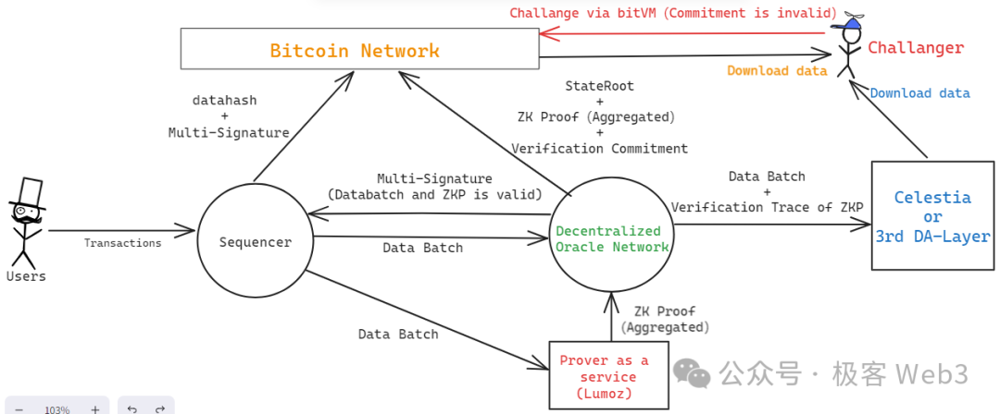

ETH Plasma = BTC 状态通道

ETH Validium = BTC 侧链

ETH Rollup = BTC 客户端验证

## Lightning network (闪电网络)

## Stacks

## Rootstock  (RSK, EVM 兼容侧链)

## LiquidNetwork (侧链)

## Dovi

## MapProtocol

## MerlinChain

是通过实现 BTC-ETH 跨链桥，将 BTC 的原生资产（BTC、BRC20），如 BTC 转为 MBTC，再基于 ETH Layer2 生态来间接实现比特币的 Layer2:

基于 Taproot 的聚合零知识证明 和 Rollup 

Merlin Chain 的资产均由 Cobo 的 MPC 钱包解决方案来管理，确保所有在 Merlin Chain 跨链/锁仓的资金非托管且安全。
 (Cobo 是知名的数字资产托管服务商，其 MPC 钱包解决方案利用先进的 MPC 技术实施阈值签名方案，确保私钥分片在安全环境中生成、加密并在多方之间分发。)

当用户使用 Merlin Chain 的跨链/锁仓时，转入跨链桥的比特币一层网络资金将进入 Cobo 与 Merlin Chain 共管的 MPC 托管地址妥善保管，任何交易均需 Cobo 和 Merlin Chain 双方共同执行 Merlin Chain 预定义的安全风控策略才能签名放行，任何单方的风险都不会导致资产的泄漏。

采用了分布式 Oracle 网络。序列节点负责收集和批量处理交易，生成压缩的交易数据、ZK 状态根和证明。这些数据由 Oracle 网络执行电路编译并上传到比特币主网的 Taproot 中，使其对整个网络公开可访问。 [oracle 做了很多事]

(梅林的技术实现方式大致如下：与 Particle Network 合作，推出了 BTC Connect 组件，通过账户抽象协议，实现通过比特币钱包控制 EVM 链上资产。Rollup层（交易处理层）与 Polygon 合作采用 zkEVM 方案，将多笔交易证明进行压缩，与零知识证明一起传输至去中心化 Oracle 网络，最终上传到比特币一层的 Taproot 中，确保数据不可篡改。)

(去中心化 Oracle 网络节点需要质押 BTC。挑战者可以基于压缩数据、零知识证明等发起对 zkRollup 的挑战。成功挑战将导致回滚到上一验证通过状态，并罚没 Oracle 节点质押的 BTC 资产。)

跨链Channel账户模型:  所有人都可以申请注册提供跨链Channel功能，收取1.5%的交易手续费，但是需要作1.5倍的超额抵押。   用户在比特币网络上发起交易，将比特币转入跨链channel。跨链channel同步比特币交易数据并转换对应的MBTC。 (channel 是 oracle 的一个组件?????)

Data Availability Committee (DAC) ： 每一个 Oracle 节点都是 DAC 节点 (通过  BTC、MERL 甚至是 BRC-20 质押才能成为 DAC 节点)，采用 POS 形式为 Layer2 数据提交到 L1 开放准入权限。 (以太坊使用的是 POA , 不够去中心化)

zkProver: 利用 SNARK 技术生成零知识证明，证明交易的有效性和正确性。

使用  Bridge-in 机制实现 BTC 到 Layer2 的转移(MBTC) ；使用 Bridge-out 机制实现 MBTC 到 BTC 的赎回。

具体工作流程如下： 

1. 排序器 Seqiencer 接受大量交易请求后，将其汇总产生  data batch，传给 zkProver 节点和 Oracle 节点 (DAC 节点)。

2. zkProver 接收到多个 data batch 后，会产生对应的 zkp，之后 zkp 会被发送给 Oracle 节点去校验。

3. Oracle 节点校验 zkp 是否和 Sequencer 发来的 data batch 相对应。如果对应 且不包含其他错误则验证成功。此过程中，Oracle 节点会通过 门限签名产生多签，对外声明一 Sequencer 完整发出了 DA 数据，且对应的 zkp 是有效的。

4. Sequencer 从 Oracle 节收集多签结果，当结果满足阈值时，将签名信息发布到 BTC 上，并附带 data batch 的 dataHash，交由外界读取big确认。

提供幽灵BTC机制做到类似 aave 的闪电贷：

## Bison (ZK-Rollup)

## BitVM

## BEVM

## RGB & RGB+ & RGB++

## B² Network  (ZK-Rollup)